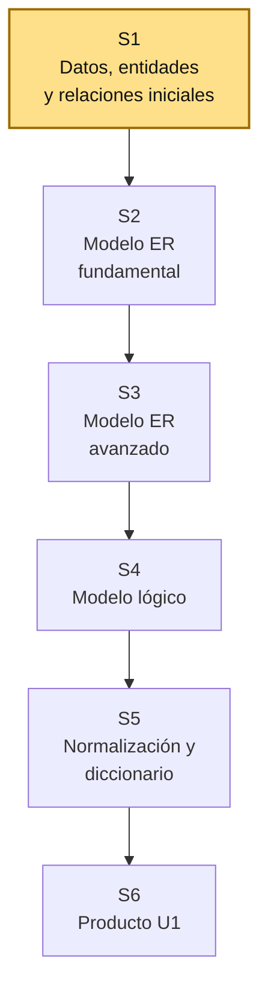
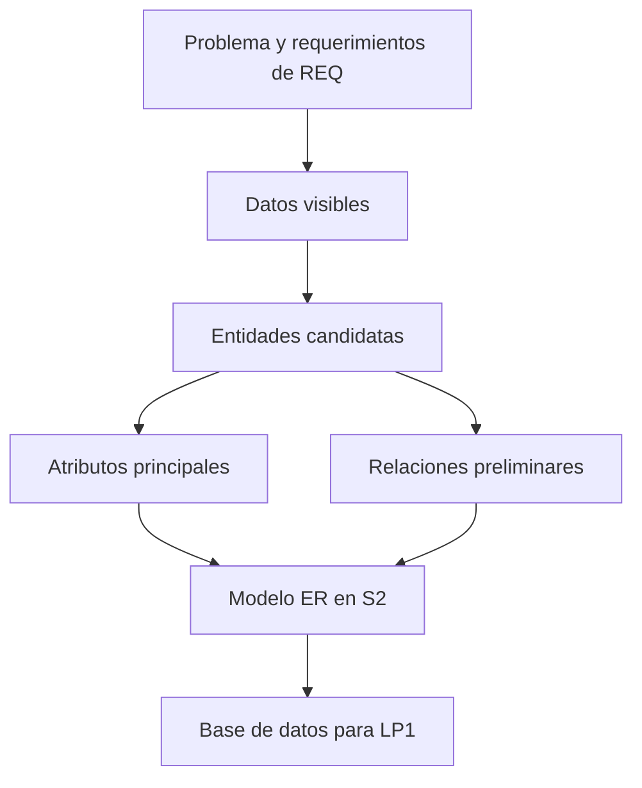

# S1 - Fundamentos de Bases de Datos

## 1. Introducción

Tiempo: 20 min.

### 1.1 Propósito

Comprender el rol de la base de datos en el proyecto integrador, reconocer datos, entidades y relaciones iniciales, y preparar el inventario de información que luego se convertirá en modelo ER, modelo lógico y base implementada.

### 1.2 Resultado de aprendizaje

El estudiante diferencia dato, información, entidad, atributo y relación, identifica datos relevantes desde un problema de negocio y explica cómo una base de datos relacional sostiene el sistema web MVC del proyecto integrador.

### 1.3 Producto de sesión

Inventario inicial de datos, entidades candidatas y relaciones preliminares del dominio.

### 1.4 Motivación de la sesión

#### 1.4.1 Caso: datos del proceso de negocio

Todo sistema necesita almacenar información de manera ordenada. Si el equipo trabaja un sistema de ventas, reservas, inventario, citas, biblioteca o pedidos, aparecerán datos como productos, clientes, fechas, cantidades, estados, responsables y operaciones.

Preguntas para los estudiantes:

1. ¿Qué datos aparecen en el proceso descrito por REQ?
2. ¿Qué datos deben conservarse y no solo mostrarse?
3. ¿Qué elementos del dominio parecen entidades?
4. ¿Qué relación existe entre esas entidades?
5. ¿Qué pasaría si esos datos se guardan sin estructura?

### 1.5 Ubicación en el curso

- Unidad: U1 - Diseño Conceptual y Lógico de Bases de Datos.
- Producto de unidad: modelo conceptual, modelo lógico y diccionario de datos.
- Producto del curso: base de datos relacional implementada y validada.
- Avance del producto en esta sesión: inventario inicial de datos y entidades candidatas.

Roadmap del producto de la unidad:



## 2. Explica

Tiempo: 25 min.

### 2.1 Conceptos clave

Una base de datos no es solo un conjunto de tablas. Es una forma organizada de representar datos del negocio para consultarlos, protegerlos y mantener su consistencia.

Conceptos de la sesión:

- Dato e información.
- Base de datos relacional.
- Entidad.
- Atributo.
- Registro.
- Relación.
- Clave candidata.
- Integridad de datos.
- Dato persistente.
- Relación entre requerimientos y modelo de datos.

Alcance metodológico de S1:

```text
En S1 todavía no se construye el modelo ER completo.
Se reconocen datos, entidades candidatas y relaciones preliminares.

El modelo ER formal, las cardinalidades, la transformación al modelo
lógico y la normalización se desarrollan en las siguientes sesiones.
```

### 2.2 Arquitectura de la sesión



Lectura del diagrama:

- REQ permite reconocer qué información se necesita.
- BD1 organiza esa información como entidades y relaciones.
- LP1 usará esa base para registrar, consultar y validar datos.

### 2.3 Flujo de trabajo

1. Leer el problema inicial trabajado en REQ.
2. Subrayar sustantivos importantes del dominio.
3. Identificar datos que deben guardarse.
4. Separar datos temporales de datos persistentes.
5. Proponer entidades candidatas.
6. Listar atributos por entidad.
7. Reconocer relaciones preliminares.
8. Registrar dudas de modelado.
9. Preparar insumos para el modelo ER de S2.

### 2.4 Errores frecuentes y diagnóstico

| Problema | Causa probable | Solución |
|---|---|---|
| Todo se considera entidad | No se diferenció entidad de atributo | Preguntar si tiene identidad propia y varios datos asociados |
| Se modelan pantallas como tablas | Se confundió interfaz con datos | Volver al proceso y extraer información persistente |
| Faltan datos importantes | No se revisaron requerimientos | Leer RF iniciales y detectar entradas, salidas y consultas |
| Los atributos son ambiguos | No se definió significado | Agregar descripción breve al inventario |
| No se reconocen relaciones | Se miran entidades aisladas | Preguntar cómo interactúan dentro del proceso |
| Se empieza con SQL demasiado pronto | Se saltó el diseño conceptual | Primero inventario y modelo; luego implementación |

## 3. Aplica: actividad práctica guiada

Tiempo: 2h.

### 3.1 Revisar el problema del proyecto

**Producto del paso:** contexto de datos identificado.

| Elemento | Respuesta |
|---|---|
| Dominio del proyecto | |
| Proceso principal | |
| Usuario principal | |
| Operaciones esperadas | |

### 3.2 Identificar datos visibles

**Producto del paso:** lista inicial de datos.

| Dato observado | ¿Dónde aparece? | ¿Debe guardarse? | Motivo |
|---|---|---|---|
| | | Sí/No | |
| | | Sí/No | |

### 3.3 Proponer entidades candidatas

**Producto del paso:** entidades iniciales.

| Entidad candidata | Descripción | Evidencia desde REQ |
|---|---|---|
| | | |
| | | |

Ejemplo:

| Entidad candidata | Descripción | Evidencia desde REQ |
|---|---|---|
| Producto | Bien o artículo que se registra y consulta | RF: registrar y buscar productos |

### 3.4 Listar atributos iniciales

**Producto del paso:** atributos por entidad.

| Entidad | Atributos iniciales |
|---|---|
| Producto | código, nombre, precio, stock |
| Cliente | nombres, documento, teléfono |

### 3.5 Reconocer relaciones preliminares

**Producto del paso:** relaciones candidatas.

| Entidad A | Relación | Entidad B | Explicación |
|---|---|---|---|
| Cliente | realiza | Pedido | Un cliente puede realizar pedidos |
| Pedido | contiene | Producto | Un pedido puede incluir productos |

### 3.6 Registrar reglas o restricciones de datos

**Producto del paso:** restricciones iniciales.

| Regla o restricción | Dato afectado | Justificación |
|---|---|---|
| El stock no debe ser negativo | Producto.stock | Control de inventario |
| El documento no debe repetirse | Cliente.documento | Identificación única |

### 3.7 Preparar insumo para S2

**Producto del paso:** inventario listo para modelo ER.

Checklist:

- Entidades candidatas identificadas.
- Atributos iniciales por entidad.
- Relaciones preliminares.
- Reglas de datos iniciales.
- Dudas de modelado para validar.

## 4. Crea: actividad autónoma

Tiempo: 2h fuera del aula.

Cada estudiante consolida el inventario de datos del proyecto y prepara evidencia individual.

### 4.1 Plantilla de evidencia individual

Entrega un PDF con el siguiente nombre:

```text
S01_BD1_Equipo##_ApellidoNombre.pdf
```

#### 4.1.1 Datos del estudiante

- Nombre:
- Equipo:
- Sesión: S01 - Fundamentos de Bases de Datos
- Rol o aporte realizado:
- Link de GitHub:

#### 4.1.2 Trabajo autónomo realizado

Completa y evidencia estas tareas:

1. Revisar el problema inicial del proyecto.
2. Identificar al menos diez datos visibles del proceso.
3. Separar datos que deben guardarse de datos temporales.
4. Proponer al menos tres entidades candidatas.
5. Listar atributos iniciales por entidad.
6. Proponer relaciones preliminares.
7. Registrar reglas o restricciones de datos.

#### 4.1.3 Evidencia técnica

Incluye:

- Tabla de datos visibles.
- Tabla de entidades candidatas.
- Tabla de atributos por entidad.
- Tabla de relaciones preliminares.
- Reglas o restricciones iniciales.
- Dudas para revisar en el modelo ER.

#### 4.1.4 Error o hallazgo

Describe al menos un error o hallazgo: qué dato o entidad generó duda, cómo lo analizaste, qué decisión tomaste y qué falta validar con REQ.

#### 4.1.5 Reflexión técnica breve

Responde en 5 a 8 líneas:

```text
¿Por qué no conviene crear tablas sin identificar primero entidades, atributos y relaciones?
```

### 4.2 Criterios mínimos de aceptación

La evidencia individual se considera completa si:

- El archivo respeta el nombre solicitado.
- Incluye datos visibles del proceso.
- Diferencia datos persistentes y temporales.
- Propone entidades candidatas coherentes.
- Lista atributos por entidad.
- Propone relaciones preliminares.
- Incluye reglas o restricciones de datos.
- Cada evidencia tiene una descripción breve.

## 5. Cierre evaluativo

Tiempo: 20 min.

### 5.1 Resultados esperados

Al finalizar la sesión, el estudiante debe demostrar que:

- Diferencia dato, información, entidad, atributo y relación.
- Reconoce datos persistentes del dominio.
- Propone entidades candidatas a partir de requerimientos.
- Lista atributos iniciales coherentes.
- Reconoce relaciones preliminares.
- Explica cómo BD1 aporta al sistema web MVC de LP1.

### 5.2 Evidencia del producto de sesión

Cada estudiante entrega un PDF individual siguiendo la plantilla de la sección 4.1.

Nombre del archivo:

```text
S01_BD1_Equipo##_ApellidoNombre.pdf
```

### 5.3 Preguntas de defensa y reflexión

1. ¿Cuál es la diferencia entre dato e información?
2. ¿Qué entidad candidata es más importante en tu dominio?
3. ¿Qué atributo podría servir como identificador?
4. ¿Qué relación aparece entre dos entidades?
5. ¿Qué dato no debería guardarse y por qué?
6. ¿Qué dato necesita LP1 para construir un formulario inicial?

### 5.4 Rúbrica de evaluación

| Dimensión | Peso | 3 - Logro destacado | 2 - Logro | 1 - Proceso | 0 - Inicio | Puntuación obtenida |
|---|---:|---|---|---|---|---:|
| 1. Datos del proceso | 2 | Identifica datos relevantes, persistentes y justificados. | Identifica datos principales. | Presenta datos incompletos o poco claros. | No identifica datos útiles. | |
| 2. Entidades candidatas | 2 | Propone entidades coherentes y sustentadas en requerimientos. | Propone entidades principales. | Confunde entidades con atributos o pantallas. | No propone entidades. | |
| 3. Atributos | 2 | Lista atributos claros y relacionados con cada entidad. | Lista atributos principales. | Atributos incompletos o ambiguos. | No presenta atributos. | |
| 4. Relaciones y reglas | 2 | Reconoce relaciones y restricciones iniciales con justificación. | Propone relaciones o reglas básicas. | Relaciones o reglas poco claras. | No presenta relaciones ni reglas. | |
| 5. Hallazgo técnico | 1 | Analiza una duda de modelado y propone validación. | Presenta una duda o decisión. | Menciona una duda sin análisis. | No presenta hallazgo. | |
| 6. Orden y reflexión | 1 | Evidencia ordenada, legible y reflexión técnica clara. | Evidencia suficiente y reflexión comprensible. | Evidencia incompleta o reflexión superficial. | Evidencia desordenada o sin reflexión. | |

Puntuación acumulada = suma de (`Peso` * `Puntuación obtenida`) = ____.

Nota final = (`Puntuación acumulada` / 30) * 20 = ____.