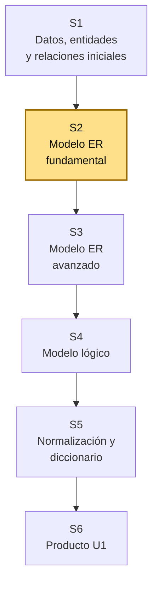
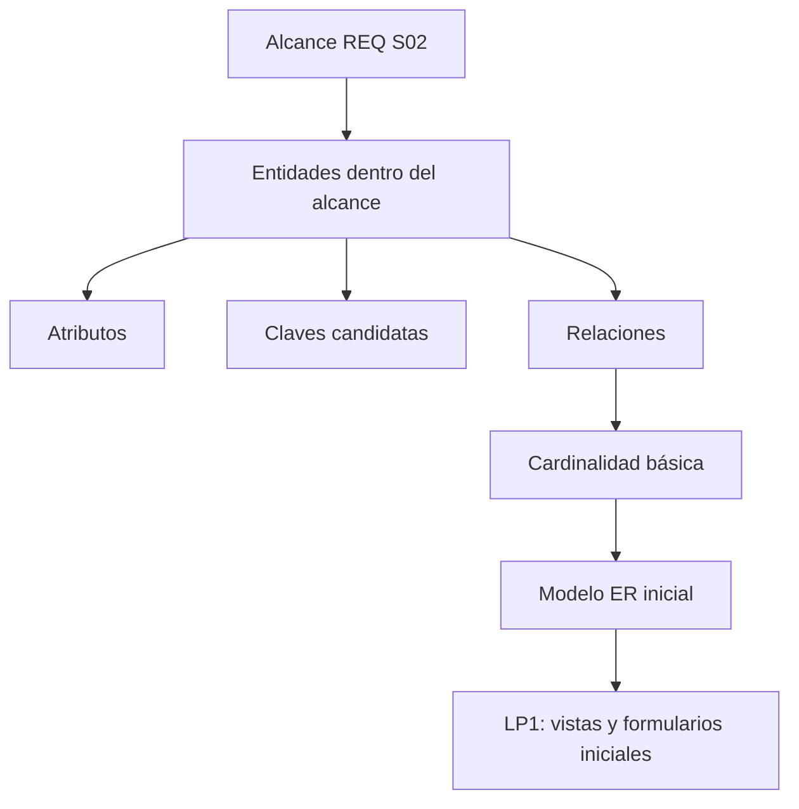
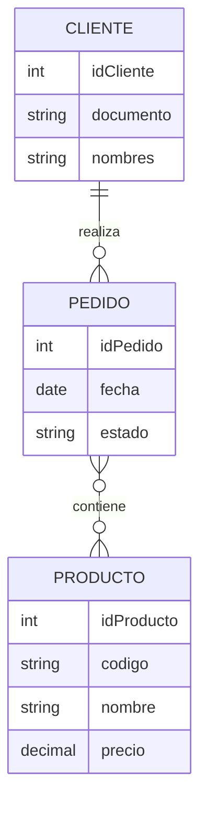

# S2 - Modelo Entidad-Relación Fundamental

## 1. Introducción

Tiempo: 20 min.

### 1.1 Propósito

Construir el primer modelo Entidad-Relación del proyecto integrador a partir del alcance definido en REQ, identificando entidades, atributos, claves candidatas, relaciones y cardinalidades básicas.

### 1.2 Resultado de aprendizaje

El estudiante diferencia entidad, atributo, clave y relación; representa un modelo ER inicial y justifica que las entidades modeladas pertenecen al alcance del proyecto.

### 1.3 Producto de sesión

Modelo ER inicial con entidades principales, atributos, claves candidatas, relaciones y cardinalidad básica.

### 1.4 Motivación de la sesión

#### 1.4.1 Caso: del alcance al modelo de datos

En REQ S02 el equipo decidió qué entra y qué queda fuera del sistema. BD1 S02 convierte esas decisiones en un modelo de datos inicial. Si una entidad no aparece en el alcance, no debe entrar al modelo principal todavía.

Preguntas para los estudiantes:

1. ¿Cuáles son las entidades del proceso principal definido en el alcance?
2. ¿Qué datos describen a esa entidad?
3. ¿Qué otra entidad se relaciona con ella?
4. ¿Qué dato podría identificar cada entidad?
5. ¿Qué relación necesitará LP1 para construir sus vistas iniciales?

### 1.5 Ubicación en el curso

- Unidad: U1 - Diseño Conceptual y Lógico de Bases de Datos.
- Producto de unidad: modelo conceptual, modelo lógico y diccionario de datos.
- Producto del curso: base de datos relacional implementada y validada.
- Avance del producto en esta sesión: modelo ER fundamental alineado al alcance del proyecto.

Roadmap del producto de la unidad:



## 2. Explica

Tiempo: 25 min.

### 2.1 Conceptos clave

El modelo Entidad-Relación representa datos del negocio antes de crear tablas. Permite discutir el significado de la información sin depender todavía de SQL.

Conceptos de la sesión:

- Entidad.
- Atributo.
- Atributo identificador.
- Clave candidata.
- Relación.
- Cardinalidad básica: 1:1, 1:N y N:M.
- Opcionalidad inicial.
- Regla de negocio asociada al dato.
- Modelo conceptual.
- Coherencia con el alcance.

Alcance metodológico de S2:

```text
En S2 se trabaja el modelo ER fundamental.
No se transforma todavía a tablas ni se normaliza formalmente.

Las relaciones complejas, entidades asociativas y ajustes avanzados
se revisan en S3. El modelo lógico se trabaja en S4.
```

### 2.2 Arquitectura de la sesión



Lectura del diagrama:

- El alcance de REQ filtra qué entidades modelar.
- BD1 define estructura de datos inicial.
- LP1 usa entidades y relaciones para decidir vistas, formularios y navegación.

### 2.3 Flujo de trabajo

1. Revisar el alcance definido en REQ S02.
2. Seleccionar entidades dentro del alcance.
3. Describir cada entidad.
4. Listar atributos por entidad.
5. Proponer claves candidatas.
6. Identificar relaciones entre entidades.
7. Definir cardinalidad básica.
8. Revisar si alguna entidad está fuera del alcance.
9. Dibujar el modelo ER inicial.

### 2.4 Errores frecuentes y diagnóstico

| Problema | Causa probable | Solución |
|---|---|---|
| Se modelan entidades fuera del alcance | No se revisó REQ S02 | Comparar cada entidad con la tabla dentro/fuera del alcance |
| Se confunde atributo con entidad | El dato tiene pocos elementos propios | Preguntar si el concepto tiene identidad y operaciones propias |
| No hay claves candidatas | No se pensó en identificación | Buscar código, documento, número o identificador generado |
| Todas las relaciones son N:M | No se analizó cardinalidad real | Preguntar cuántos registros de A se asocian con B y viceversa |
| El modelo replica pantallas | Se diseñó desde la interfaz | Volver al proceso y a los datos persistentes |
| LP1 no sabe qué formulario crear | El modelo no distingue entidades del proceso principal | Marcar entidades maestras y transaccionales con sus operaciones asociadas |

## 3. Aplica: actividad práctica guiada

Tiempo: 2h.

### 3.1 Revisar el alcance de REQ

**Producto del paso:** entidades filtradas por alcance.

| Elemento de alcance | Dato o entidad relacionada | ¿Se modela en BD1? | Justificación |
|---|---|---|---|
| | | Sí/No | |
| | | Sí/No | |

### 3.2 Definir entidades principales

**Producto del paso:** entidades del modelo ER inicial.

| Entidad | Descripción | Pertenece al alcance porque... |
|---|---|---|
| | | |
| | | |

Ejemplo:

| Entidad | Descripción | Pertenece al alcance porque... |
|---|---|---|
| Producto | Artículo que se registra y consulta | El alcance incluye gestión básica de productos |

### 3.3 Listar atributos por entidad

**Producto del paso:** atributos iniciales.

| Entidad | Atributos |
|---|---|
| Producto | idProducto, código, nombre, precio, stock |
| Cliente | idCliente, documento, nombres, teléfono |

### 3.4 Proponer claves candidatas

**Producto del paso:** identificadores iniciales.

| Entidad | Clave candidata | Motivo |
|---|---|---|
| Producto | código | Identifica un producto en el negocio |
| Cliente | documento | Identifica a una persona o cliente |

### 3.5 Definir relaciones y cardinalidad

**Producto del paso:** relaciones básicas.

| Entidad A | Relación | Entidad B | Cardinalidad inicial | Justificación |
|---|---|---|---|---|
| Cliente | realiza | Pedido | 1:N | Un cliente puede realizar varios pedidos |
| Pedido | contiene | Producto | N:M | Un pedido puede incluir varios productos y un producto puede estar en varios pedidos |

### 3.6 Dibujar el modelo ER inicial

**Producto del paso:** primer diagrama ER.

Puede elaborarse en una herramienta visual o en Mermaid para documentar la idea inicial.

Ejemplo Mermaid:



### 3.7 Derivar insumos para LP1

**Producto del paso:** guía para vistas o formularios.

| Entidad o relación | Vista o formulario sugerido para LP1 |
|---|---|
| Entidad principal | Vista de listado y formulario de registro |
| Relación principal | Vista de selección o detalle |
| Atributos obligatorios | Campos del formulario inicial |

## 4. Crea: actividad autónoma

Tiempo: 2h fuera del aula.

Cada estudiante consolida el modelo ER inicial del proyecto y prepara evidencia individual.

### 4.1 Plantilla de evidencia individual

Entrega un PDF con el siguiente nombre:

```text
S02_BD1_Equipo##_ApellidoNombre.pdf
```

#### 4.1.1 Datos del estudiante

- Nombre:
- Equipo:
- Sesión: S02 - Modelo Entidad-Relación Fundamental
- Rol o aporte realizado:
- Link de GitHub:

#### 4.1.2 Trabajo autónomo realizado

Completa y evidencia estas tareas:

1. Revisar el alcance de REQ S02.
2. Seleccionar entidades dentro del alcance.
3. Listar atributos por entidad.
4. Proponer claves candidatas.
5. Definir relaciones con cardinalidad básica.
6. Dibujar el modelo ER inicial.
7. Explicar qué vistas o formularios orienta para LP1.

#### 4.1.3 Evidencia técnica

Incluye:

- Tabla de entidades dentro del alcance.
- Atributos por entidad.
- Claves candidatas.
- Relaciones y cardinalidades.
- Diagrama ER inicial.
- Tabla de impacto en LP1.

#### 4.1.4 Error o hallazgo

Describe una decisión de modelado: entidad descartada, atributo corregido, cardinalidad discutida o clave candidata ajustada.

#### 4.1.5 Reflexión técnica breve

Responde en 5 a 8 líneas:

```text
¿Por qué el modelo ER debe respetar el alcance definido en requerimientos?
```

### 4.2 Criterios mínimos de aceptación

La evidencia individual se considera completa si:

- El archivo respeta el nombre solicitado.
- Entidades corresponden al alcance.
- Atributos son coherentes con cada entidad.
- Incluye claves candidatas.
- Incluye relaciones con cardinalidad básica.
- Presenta diagrama ER legible.
- Explica impacto en LP1.
- Cada evidencia tiene una descripción breve.

## 5. Cierre evaluativo

Tiempo: 20 min.

### 5.1 Resultados esperados

Al finalizar la sesión, el estudiante debe demostrar que:

- Diferencia entidad, atributo, clave y relación.
- Modela entidades dentro del alcance.
- Propone atributos y claves candidatas.
- Define relaciones con cardinalidad básica.
- Dibuja un modelo ER inicial.
- Explica cómo el modelo orienta formularios y vistas de LP1.

### 5.2 Evidencia del producto de sesión

Cada estudiante entrega un PDF individual siguiendo la plantilla de la sección 4.1.

Nombre del archivo:

```text
S02_BD1_Equipo##_ApellidoNombre.pdf
```

### 5.3 Preguntas de defensa y reflexión

1. ¿Cuáles son las entidades maestras y transaccionales de tu modelo y por qué?
2. ¿Qué atributo podría identificar esa entidad?
3. ¿Qué relación es más importante para el proceso?
4. ¿Qué cardinalidad tiene y cómo la justificas?
5. ¿Qué entidad descartaste por estar fuera del alcance?
6. ¿Qué formulario inicial debería construir LP1 según tu modelo?

### 5.4 Rúbrica de evaluación

| Dimensión | Peso | 3 - Logro destacado | 2 - Logro | 1 - Proceso | 0 - Inicio | Puntuación obtenida |
|---|---:|---|---|---|---|---:|
| 1. Entidades | 2 | Entidades claras, dentro del alcance y justificadas. | Entidades principales coherentes. | Entidades incompletas o confusas. | No define entidades. | |
| 2. Atributos y claves | 2 | Atributos y claves candidatas bien sustentadas. | Atributos y claves básicas. | Atributos o claves incompletas. | No presenta atributos ni claves. | |
| 3. Relaciones | 2 | Relaciones y cardinalidades correctas y justificadas. | Relaciones principales comprensibles. | Relaciones ambiguas o sin cardinalidad clara. | No presenta relaciones. | |
| 4. Diagrama ER | 2 | Diagrama legible, consistente y alineado al alcance. | Diagrama funcional. | Diagrama incompleto o poco claro. | No presenta diagrama. | |
| 5. Integración con LP1 | 1 | Explica vistas/formularios derivados del modelo. | Relaciona el modelo con LP1. | Relación débil o genérica. | No explica integración. | |
| 6. Orden y reflexión | 1 | Evidencia ordenada, legible y reflexión técnica clara. | Evidencia suficiente y reflexión comprensible. | Evidencia incompleta o reflexión superficial. | Evidencia desordenada o sin reflexión. | |

Puntuación acumulada = suma de (`Peso` * `Puntuación obtenida`) = ____.

Nota final = (`Puntuación acumulada` / 30) * 20 = ____.
