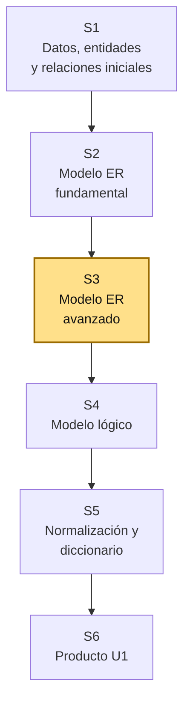
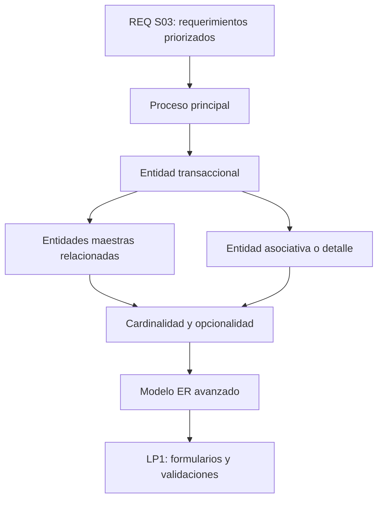
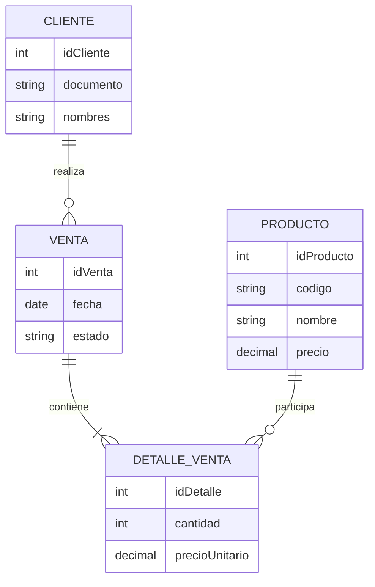

# S3 - Modelo Entidad-Relación avanzado

## 1. Introducción

Tiempo: 20 min.

### 1.1 Propósito

Refinar el modelo ER inicial incorporando cardinalidad, opcionalidad, entidades asociativas, entidades débiles y restricciones semánticas según los requerimientos priorizados en REQ.

### 1.2 Resultado de aprendizaje

El estudiante ajusta un modelo ER para representar procesos transaccionales, justifica relaciones avanzadas y prepara un modelo conceptual más sólido para su transformación al modelo lógico.

### 1.3 Producto de sesión

Modelo ER avanzado ajustado al primer incremento funcional del proyecto integrador.

### 1.4 Motivación de la sesión

#### 1.4.1 Caso: las transacciones necesitan más que catálogos

Un sistema comercial no vive solo de entidades maestras como producto, cliente o categoría. También necesita entidades transaccionales como pedido, venta, compra, reserva, cita, matrícula o atención. Esas entidades conectan actores, fechas, estados, detalles y reglas.

Preguntas para los estudiantes:

1. ¿Qué operación priorizó REQ para el primer incremento?
2. ¿Qué entidad transaccional representa esa operación?
3. ¿Qué entidades maestras participan?
4. ¿La relación requiere una entidad asociativa o detalle?
5. ¿Qué restricciones deben respetarse para que el modelo sea coherente?

### 1.5 Ubicación en el curso

- Unidad: U1 - Diseño Conceptual y Lógico de Bases de Datos.
- Producto de unidad: modelo conceptual, modelo lógico y diccionario de datos.
- Producto del curso: base de datos relacional implementada y validada.
- Avance del producto en esta sesión: modelo ER avanzado con relaciones, cardinalidades y restricciones del proceso principal.

Roadmap del producto de la unidad:



## 2. Explica

Tiempo: 25 min.

### 2.1 Conceptos clave

El modelo ER avanzado permite representar mejor las reglas del dominio. En proyectos con procesos transaccionales, muchas relaciones necesitan detalles: cantidades, precios, fechas, estados, observaciones o responsables.

Conceptos de la sesión:

- Entidad maestra.
- Entidad transaccional.
- Entidad asociativa o detalle.
- Entidad débil.
- Cardinalidad mínima y máxima.
- Opcionalidad.
- Atributo multivaluado.
- Atributo derivado.
- Restricción semántica.
- Regla de negocio reflejada en el modelo.

Alcance metodológico de S3:

```text
En S3 se refina el modelo conceptual.
No se crea todavía el modelo lógico relacional completo.

La transformación a tablas, claves foráneas y resolución formal de
relaciones se trabaja en S4.
```

### 2.2 Arquitectura de la sesión



Lectura del diagrama:

- El requerimiento Must define el proceso que se modela primero.
- El proceso suele necesitar una entidad transaccional.
- LP1 usará esa estructura para campos, listas y validaciones.

### 2.3 Flujo de trabajo

1. Revisar requerimientos Must definidos por REQ S03.
2. Identificar la transacción principal del proceso.
3. Diferenciar entidades maestras y transaccionales.
4. Detectar relaciones N:M que requieren entidad asociativa.
5. Definir cardinalidad mínima y máxima.
6. Revisar opcionalidad.
7. Identificar atributos derivados o multivaluados.
8. Registrar restricciones semánticas.
9. Actualizar el diagrama ER avanzado.

### 2.4 Errores frecuentes y diagnóstico

| Problema | Causa probable | Solución |
|---|---|---|
| Solo hay catálogos en el modelo | No se identificó la operación principal | Buscar ventas, pedidos, citas, reservas, compras u otra transacción |
| La relación N:M no tiene detalle | Falta entidad asociativa | Crear entidad detalle cuando existan cantidad, precio, fecha o estado propio |
| Cardinalidad genérica | No se analizó el proceso real | Preguntar mínimo y máximo por cada lado de la relación |
| Atributos multivaluados como texto | Se evita modelar correctamente | Separar entidad o relación cuando el dato se repite |
| Total almacenado sin criterio | No se distingue derivado de persistente | Marcar atributo derivado o justificar almacenamiento |
| LP1 no sabe validar | BD1 no documentó restricciones | Registrar reglas de datos que luego LP1 validará |

## 3. Aplica: actividad práctica guiada

Tiempo: 2h.

### 3.1 Tomar requerimientos priorizados de REQ

**Producto del paso:** requerimientos que afectan el modelo.

| Requerimiento Must | Proceso afectado | Entidades involucradas |
|---|---|---|
| | | |
| | | |

### 3.2 Clasificar entidades maestras y transaccionales

**Producto del paso:** clasificación del modelo.

| Entidad | Tipo | Justificación |
|---|---|---|
| Producto | Maestra | Describe un elemento estable del catálogo |
| Venta | Transaccional | Registra una operación del negocio |
| DetalleVenta | Asociativa/detalle | Une venta y producto con cantidad y precio |

### 3.3 Refinar cardinalidad y opcionalidad

**Producto del paso:** relaciones precisas.

| Relación | Cardinalidad mínima/máxima | Opcionalidad | Justificación |
|---|---|---|---|
| Cliente realiza Venta | Cliente 0..N, Venta 1..1 | Venta requiere cliente | Una venta pertenece a un cliente |
| Venta contiene Producto | Venta 1..N, Producto 0..N | Se resuelve con detalle | Una venta tiene uno o más productos |

### 3.4 Identificar entidades asociativas o detalle

**Producto del paso:** relaciones N:M resueltas conceptualmente.

| Relación N:M | Entidad asociativa | Atributos propios |
|---|---|---|
| Venta - Producto | DetalleVenta | cantidad, precioUnitario, subtotal |
| Pedido - Producto | DetallePedido | cantidad, observación |

### 3.5 Revisar atributos derivados y multivaluados

**Producto del paso:** decisión sobre atributos especiales.

| Atributo | Tipo | Decisión de modelado |
|---|---|---|
| totalVenta | Derivado | Se calcula desde detalles o se almacena con justificación |
| teléfonosCliente | Multivaluado | Crear entidad TeléfonoCliente si se requiere más de uno |

### 3.6 Registrar restricciones semánticas

**Producto del paso:** reglas de datos para LP1.

| Restricción | Entidad o relación afectada | Impacto en LP1 |
|---|---|---|
| La cantidad debe ser mayor que cero | DetalleVenta.cantidad | Validar campo cantidad |
| Una venta debe tener al menos un detalle | Venta - DetalleVenta | No permitir guardar venta vacía |

### 3.7 Actualizar diagrama ER avanzado

**Producto del paso:** modelo ER avanzado.

Ejemplo Mermaid:



## 4. Crea: actividad autónoma

Tiempo: 2h fuera del aula.

Cada estudiante consolida el modelo ER avanzado y prepara evidencia individual.

### 4.1 Plantilla de evidencia individual

Entrega un PDF con el siguiente nombre:

```text
S03_BD1_Equipo##_ApellidoNombre.pdf
```

#### 4.1.1 Datos del estudiante

- Nombre:
- Equipo:
- Sesión: S03 - Modelo Entidad-Relación avanzado
- Rol o aporte realizado:
- Link de GitHub:

#### 4.1.2 Trabajo autónomo realizado

Completa y evidencia estas tareas:

1. Revisar requerimientos Must de REQ S03.
2. Identificar entidades maestras y transaccionales.
3. Refinar cardinalidades y opcionalidad.
4. Resolver relaciones N:M con entidades asociativas si corresponde.
5. Revisar atributos derivados o multivaluados.
6. Registrar restricciones semánticas.
7. Actualizar el diagrama ER avanzado.
8. Explicar impacto en formularios o validaciones de LP1.

#### 4.1.3 Evidencia técnica

Incluye:

- Tabla de entidades maestras, transaccionales y asociativas.
- Relaciones con cardinalidad y opcionalidad.
- Decisiones sobre atributos especiales.
- Restricciones semánticas.
- Diagrama ER avanzado.
- Tabla de impacto en LP1.

#### 4.1.4 Error o hallazgo

Describe una relación que cambió respecto a S02 y explica la razón.

#### 4.1.5 Reflexión técnica breve

Responde en 5 a 8 líneas:

```text
¿Por qué un proceso transaccional suele necesitar entidades detalle o asociativas?
```

### 4.2 Criterios mínimos de aceptación

La evidencia individual se considera completa si:

- El archivo respeta el nombre solicitado.
- Distingue entidades maestras y transaccionales.
- Define cardinalidad y opcionalidad.
- Resuelve relaciones N:M cuando corresponda.
- Registra restricciones semánticas.
- Presenta diagrama ER avanzado legible.
- Explica impacto en LP1.
- Cada evidencia tiene una descripción breve.

## 5. Cierre evaluativo

Tiempo: 20 min.

### 5.1 Resultados esperados

Al finalizar la sesión, el estudiante debe demostrar que:

- Reconoce entidades transaccionales del proceso.
- Diferencia entidad maestra, transaccional y asociativa.
- Justifica cardinalidades y opcionalidad.
- Representa restricciones semánticas.
- Actualiza el modelo ER avanzado.
- Explica cómo el modelo orienta formularios y validaciones de LP1.

### 5.2 Evidencia del producto de sesión

Cada estudiante entrega un PDF individual siguiendo la plantilla de la sección 4.1.

Nombre del archivo:

```text
S03_BD1_Equipo##_ApellidoNombre.pdf
```

### 5.3 Preguntas de defensa y reflexión

1. ¿Cuál es la entidad transaccional principal de tu modelo?
2. ¿Qué entidades maestras participan en esa transacción?
3. ¿Qué relación necesitó entidad asociativa o detalle?
4. ¿Qué cardinalidad cambió desde S02?
5. ¿Qué restricción semántica debe validar LP1?
6. ¿Qué parte del modelo se transformará primero en S4?

### 5.4 Rúbrica de evaluación

| Dimensión | Peso | 3 - Logro destacado | 2 - Logro | 1 - Proceso | 0 - Inicio | Puntuación obtenida |
|---|---:|---|---|---|---|---:|
| 1. Entidades avanzadas | 2 | Distingue maestras, transaccionales y asociativas con precisión. | Clasifica entidades principales. | Clasificación parcial o confusa. | No clasifica entidades. | |
| 2. Cardinalidad y opcionalidad | 2 | Cardinalidades y opcionalidad justificadas por el proceso. | Relaciones principales comprensibles. | Cardinalidad incompleta o débil. | No define cardinalidad. | |
| 3. Restricciones y atributos | 2 | Restricciones, derivados y multivaluados tratados con criterio. | Presenta restricciones básicas. | Restricciones poco claras. | No registra restricciones. | |
| 4. Diagrama avanzado | 2 | Diagrama consistente, legible y alineado a requerimientos priorizados. | Diagrama funcional. | Diagrama incompleto o ambiguo. | No presenta diagrama. | |
| 5. Integración con LP1 | 1 | Explica validaciones y formularios derivados del modelo. | Relaciona modelo con LP1. | Relación débil o genérica. | No evidencia integración. | |
| 6. Orden y reflexión | 1 | Evidencia ordenada, legible y reflexión técnica clara. | Evidencia suficiente y reflexión comprensible. | Evidencia incompleta o reflexión superficial. | Evidencia desordenada o sin reflexión. | |

Puntuación acumulada = suma de (`Peso` * `Puntuación obtenida`) = ____.

Nota final = (`Puntuación acumulada` / 30) * 20 = ____.