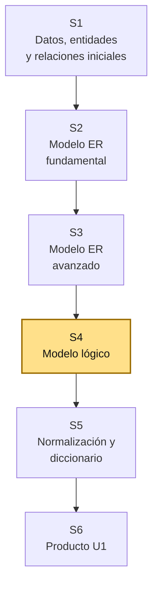
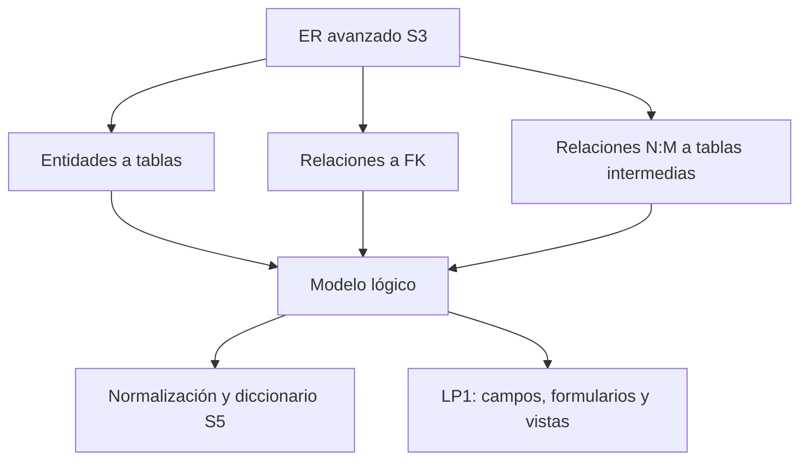
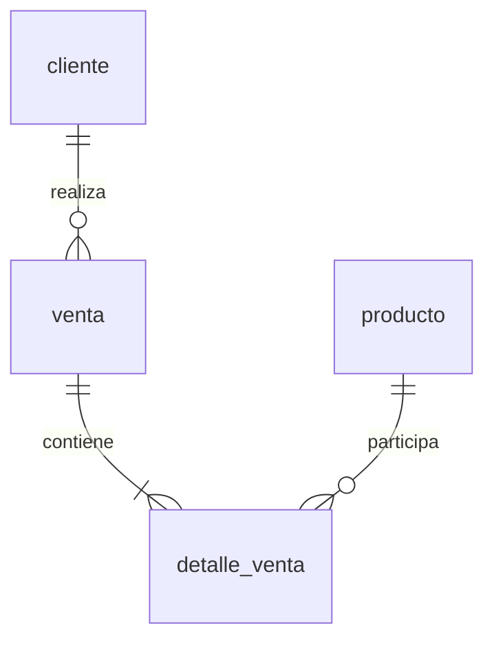

# S4 - Transformación al modelo lógico

## 1. Introducción

Tiempo: 20 min.

### 1.1 Propósito

Transformar el modelo ER avanzado del proyecto en un modelo lógico relacional con tablas, claves primarias, claves foráneas y reglas de integridad, manteniendo coherencia con los requerimientos priorizados y los prototipos iniciales.

### 1.2 Resultado de aprendizaje

El estudiante transforma entidades y relaciones en tablas relacionales, resuelve relaciones 1:1, 1:N y N:M, define claves primarias y foráneas, y justifica cómo el modelo lógico soporta el primer incremento funcional.

### 1.3 Producto de sesión

Modelo lógico relacional con tablas, PK, FK, relaciones resueltas y reglas de integridad iniciales.

### 1.4 Motivación de la sesión

#### 1.4.1 Caso: del diagrama conceptual a tablas reales

El modelo ER ayuda a entender el dominio, pero una base de datos relacional necesita tablas. La transformación debe cuidar que las transacciones, detalles, claves y relaciones del proceso principal se puedan implementar después con SQL.

Preguntas para los estudiantes:

1. ¿Qué entidades se convierten en tablas?
2. ¿Qué relación necesita clave foránea?
3. ¿Qué relación N:M se convierte en tabla intermedia?
4. ¿Qué campo será PK en cada tabla?
5. ¿Qué campos necesita LP1 para sus formularios y listados?

### 1.5 Ubicación en el curso

- Unidad: U1 - Diseño Conceptual y Lógico de Bases de Datos.
- Producto de unidad: modelo conceptual, modelo lógico y diccionario de datos.
- Producto del curso: base de datos relacional implementada y validada.
- Avance del producto en esta sesión: modelo lógico inicial listo para normalización y diccionario.

Roadmap del producto de la unidad:



## 2. Explica

Tiempo: 25 min.

### 2.1 Conceptos clave

El modelo lógico relacional traduce el modelo conceptual en una estructura cercana a la implementación. Todavía no es necesariamente SQL final, pero ya define tablas, columnas y claves.

Conceptos de la sesión:

- Tabla.
- Columna.
- Clave primaria (PK).
- Clave foránea (FK).
- Clave única.
- Integridad referencial.
- Transformación de entidad a tabla.
- Transformación de relación 1:1.
- Transformación de relación 1:N.
- Transformación de relación N:M.
- Tabla intermedia o detalle.
- Relación con formularios y reportes.

Alcance metodológico de S4:

```text
En S4 se transforma el modelo ER avanzado a modelo lógico.
No se implementan todavía scripts DDL completos.

La normalización y el diccionario de datos se trabajan en S5.
La implementación física con SQL inicia en S7.
```

### 2.2 Arquitectura de la sesión



Lectura del diagrama:

- El ER avanzado es la fuente del modelo lógico.
- Las claves sostienen la integridad del proceso.
- LP1 se beneficia porque los campos quedan más claros.

### 2.3 Flujo de trabajo

1. Revisar ER avanzado de S3.
2. Convertir entidades fuertes en tablas.
3. Convertir entidades transaccionales en tablas.
4. Convertir entidades asociativas o detalle en tablas intermedias.
5. Definir PK por tabla.
6. Definir FK según relaciones.
7. Resolver relaciones 1:1, 1:N y N:M.
8. Agregar restricciones iniciales.
9. Revisar coherencia con prototipos de REQ y formularios de LP1.

### 2.4 Errores frecuentes y diagnóstico

| Problema | Causa probable | Solución |
|---|---|---|
| Falta tabla para detalle de transacción | No se resolvió relación N:M | Crear tabla intermedia con FK y atributos propios |
| FK en tabla incorrecta | No se analizó cardinalidad | En 1:N, la FK va del lado N |
| PK poco clara | No se definió identificador | Usar ID técnico o clave natural justificada |
| Se pierden atributos del ER | Transformación incompleta | Revisar entidad por entidad |
| Tabla con datos repetidos | Falta normalización posterior | Marcar para revisar en S5 |
| LP1 no puede armar formularios | Campos y relaciones no son claros | Documentar columnas y relaciones necesarias para cada vista |

## 3. Aplica: actividad práctica guiada

Tiempo: 2h.

### 3.1 Listar entidades del ER avanzado

**Producto del paso:** entidades que serán tablas.

| Entidad ER | Tipo | ¿Será tabla? | Observación |
|---|---|---|---|
| Cliente | Maestra | Sí | |
| Venta | Transaccional | Sí | |
| DetalleVenta | Asociativa/detalle | Sí | Resuelve Venta-Producto |

### 3.2 Definir tablas y columnas iniciales

**Producto del paso:** estructura lógica preliminar.

| Tabla | Columnas iniciales |
|---|---|
| cliente | id_cliente, documento, nombres, telefono |
| venta | id_venta, id_cliente, fecha, estado |
| detalle_venta | id_detalle, id_venta, id_producto, cantidad, precio_unitario |

### 3.3 Definir claves primarias

**Producto del paso:** PK por tabla.

| Tabla | PK | Justificación |
|---|---|---|
| cliente | id_cliente | Identificador técnico único |
| venta | id_venta | Identificador de la transacción |
| detalle_venta | id_detalle | Identificador de cada línea de detalle |

### 3.4 Definir claves foráneas

**Producto del paso:** relaciones implementables.

| Tabla hija | FK | Tabla padre | Relación |
|---|---|---|---|
| venta | id_cliente | cliente | Un cliente realiza ventas |
| detalle_venta | id_venta | venta | Una venta tiene detalles |
| detalle_venta | id_producto | producto | Un producto participa en detalles |

### 3.5 Resolver relaciones según cardinalidad

**Producto del paso:** reglas de transformación.

| Relación ER | Transformación lógica |
|---|---|
| 1:N | Agregar FK en la tabla del lado N |
| 1:1 | Agregar FK en una tabla según dependencia y obligatoriedad |
| N:M | Crear tabla intermedia con FK hacia ambas tablas |

### 3.6 Revisar coherencia con prototipo y formularios

**Producto del paso:** validación cruzada REQ-BD1-LP1.

| Pantalla o formulario | Tabla relacionada | Columnas necesarias |
|---|---|---|
| Registro de venta | venta, detalle_venta | id_cliente, fecha, id_producto, cantidad |
| Consulta de ventas | venta, cliente | fecha, cliente, estado |

### 3.7 Elaborar modelo lógico documentado

**Producto del paso:** modelo lógico listo para S5.

Puede representarse en tabla, diagrama relacional o Mermaid.

Ejemplo:



## 4. Crea: actividad autónoma

Tiempo: 2h fuera del aula.

Cada estudiante consolida el modelo lógico del proyecto y prepara evidencia individual.

### 4.1 Plantilla de evidencia individual

Entrega un PDF con el siguiente nombre:

```text
S04_BD1_Equipo##_ApellidoNombre.pdf
```

#### 4.1.1 Datos del estudiante

- Nombre:
- Equipo:
- Sesión: S04 - Transformación al modelo lógico
- Rol o aporte realizado:
- Link de GitHub:

#### 4.1.2 Trabajo autónomo realizado

Completa y evidencia estas tareas:

1. Revisar el ER avanzado de S3.
2. Convertir entidades en tablas.
3. Definir columnas iniciales.
4. Definir PK por tabla.
5. Definir FK y relaciones.
6. Resolver relaciones 1:1, 1:N y N:M.
7. Relacionar tablas con pantallas o formularios de REQ/LP1.
8. Preparar observaciones para normalización en S5.

#### 4.1.3 Evidencia técnica

Incluye:

- Tabla entidad-tabla.
- Tabla de columnas por tabla.
- PK por tabla.
- FK por tabla.
- Diagrama lógico o relacional.
- Tabla de relación con prototipos/formularios.

#### 4.1.4 Error o hallazgo

Describe una relación que cambió al transformarse al modelo lógico y explica la decisión tomada.

#### 4.1.5 Reflexión técnica breve

Responde en 5 a 8 líneas:

```text
¿Por qué una relación N:M necesita una tabla intermedia en el modelo lógico relacional?
```

### 4.2 Criterios mínimos de aceptación

La evidencia individual se considera completa si:

- El archivo respeta el nombre solicitado.
- Entidades se transforman en tablas coherentes.
- Cada tabla tiene PK.
- Las FK reflejan relaciones del ER.
- Las relaciones N:M están resueltas.
- El modelo lógico se relaciona con formularios o prototipos.
- Incluye observaciones para S5.
- Cada evidencia tiene una descripción breve.

## 5. Cierre evaluativo

Tiempo: 20 min.

### 5.1 Resultados esperados

Al finalizar la sesión, el estudiante debe demostrar que:

- Transforma entidades en tablas.
- Define claves primarias y foráneas.
- Resuelve relaciones 1:1, 1:N y N:M.
- Mantiene integridad referencial inicial.
- Relaciona modelo lógico con prototipos y formularios.
- Prepara el modelo para normalización y diccionario.

### 5.2 Evidencia del producto de sesión

Cada estudiante entrega un PDF individual siguiendo la plantilla de la sección 4.1.

Nombre del archivo:

```text
S04_BD1_Equipo##_ApellidoNombre.pdf
```

### 5.3 Preguntas de defensa y reflexión

1. ¿Qué tabla representa la transacción principal?
2. ¿Qué tabla representa el detalle o entidad asociativa?
3. ¿Dónde colocaste la FK en una relación 1:N?
4. ¿Cómo resolviste una relación N:M?
5. ¿Qué columna necesita LP1 para un formulario específico?
6. ¿Qué parte revisarás en normalización S5?

### 5.4 Rúbrica de evaluación

| Dimensión | Peso | 3 - Logro destacado | 2 - Logro | 1 - Proceso | 0 - Inicio | Puntuación obtenida |
|---|---:|---|---|---|---|---:|
| 1. Transformación entidad-tabla | 2 | Transforma entidades de forma completa y justificada. | Transforma entidades principales. | Transformación parcial o confusa. | No transforma entidades. | |
| 2. PK y FK | 2 | Define claves correctas y coherentes con el modelo. | Define claves principales. | Claves incompletas o mal ubicadas. | No define claves. | |
| 3. Resolución de relaciones | 2 | Resuelve 1:1, 1:N y N:M con criterio relacional. | Resuelve relaciones principales. | Resolución parcial o ambigua. | No resuelve relaciones. | |
| 4. Integración | 2 | Relaciona tablas y columnas con prototipos y formularios. | Relación general con REQ y LP1. | Relación parcial o débil. | No evidencia integración. | |
| 5. Hallazgo técnico | 1 | Analiza una decisión de transformación y su impacto. | Presenta una decisión básica. | Menciona decisión sin análisis. | No presenta hallazgo. | |
| 6. Orden y reflexión | 1 | Evidencia ordenada, legible y reflexión técnica clara. | Evidencia suficiente y reflexión comprensible. | Evidencia incompleta o reflexión superficial. | Evidencia desordenada o sin reflexión. | |

Puntuación acumulada = suma de (`Peso` * `Puntuación obtenida`) = ____.

Nota final = (`Puntuación acumulada` / 30) * 20 = ____.