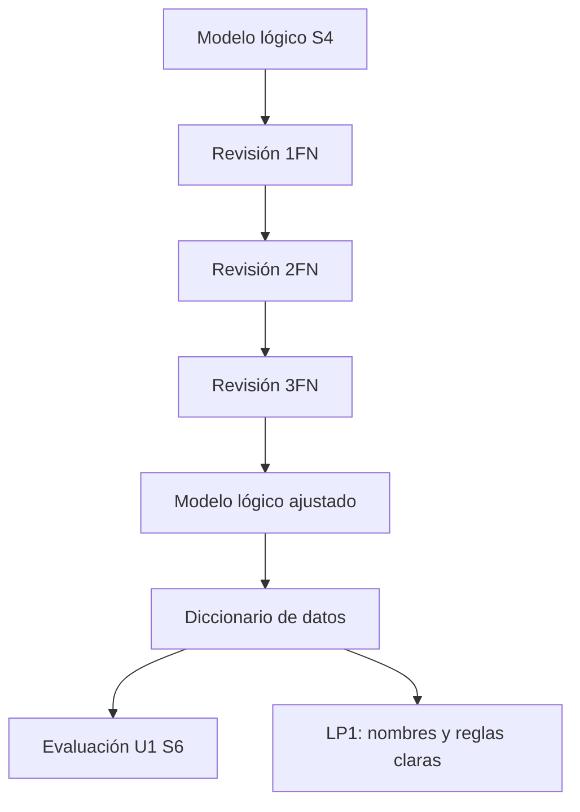

# S5 - Normalización y diccionario de datos

## 1. Introducción

Tiempo: 20 min.

### 1.1 Propósito

Revisar el modelo lógico del proyecto aplicando normalización inicial y documentar el diccionario de datos para asegurar claridad, consistencia y preparación para la evaluación U1.

### 1.2 Resultado de aprendizaje

El estudiante identifica redundancias, dependencias y problemas básicos de diseño; aplica 1FN, 2FN y 3FN cuando corresponde; y documenta tablas, columnas, claves, tipos esperados y reglas del modelo.

### 1.3 Producto de sesión

Modelo lógico revisado, normalizado y documentado mediante diccionario de datos inicial.

### 1.4 Motivación de la sesión

El modelo lógico puede parecer correcto, pero si contiene datos repetidos, columnas ambiguas o reglas sin documentar, luego el SQL y la aplicación MVC tendrán errores difíciles de corregir.

Preguntas para los estudiantes:

1. ¿Hay datos repetidos en alguna tabla?
2. ¿Cada columna depende de la clave de su tabla?
3. ¿Los nombres de tablas y columnas son claros para LP1?
4. ¿Qué restricciones debe conocer el programador?
5. ¿El modelo soporta el prototipo validado por REQ?

### 1.5 Ubicación en el curso

- Unidad: U1 - Diseño Conceptual y Lógico de Bases de Datos.
- Producto de unidad: modelo conceptual, modelo lógico y diccionario de datos.
- Avance de sesión: modelo de datos listo para evaluación U1.

## 2. Explica

Tiempo: 25 min.

### 2.1 Conceptos clave

Normalizar ayuda a reducir redundancia y anomalías. El diccionario de datos documenta el significado técnico y de negocio de cada elemento del modelo.

Conceptos de la sesión:

- Dependencia funcional.
- Primera forma normal (1FN).
- Segunda forma normal (2FN).
- Tercera forma normal (3FN).
- Redundancia.
- Anomalía de inserción, actualización o eliminación.
- Diccionario de datos.
- Tipo de dato esperado.
- Restricción.
- Regla de integridad.

### 2.2 Arquitectura de la sesión



### 2.3 Flujo de trabajo

1. Revisar tablas, PK y FK de S4.
2. Detectar grupos repetidos o atributos multivaluados.
3. Revisar dependencias parciales.
4. Revisar dependencias transitivas.
5. Ajustar tablas si corresponde.
6. Definir nombres consistentes.
7. Documentar diccionario de datos.
8. Relacionar columnas con formularios de LP1.
9. Preparar evidencia para evaluación U1.

### 2.4 Errores frecuentes y diagnóstico

| Problema | Causa probable | Solución |
|---|---|---|
| Columna con varios valores | No cumple 1FN | Separar en filas o tabla relacionada |
| Datos del cliente repetidos en venta | Dependencia mal ubicada | Mantener datos del cliente en tabla cliente |
| Campo calculado sin justificación | No se distinguió derivado | Documentar si se calcula o se almacena |
| Diccionario incompleto | Se documentó solo nombres | Agregar descripción, tipo, clave, nulidad y regla |
| LP1 usa nombres distintos | Falta estándar de nombres | Alinear diccionario con etiquetas y campos del formulario |

## 3. Aplica: actividad práctica guiada

Tiempo: 2h.

### 3.1 Revisar formas normales

| Tabla | Problema detectado | Forma normal afectada | Ajuste propuesto |
|---|---|---|---|
| | | 1FN / 2FN / 3FN | |

### 3.2 Ajustar modelo lógico

| Tabla original | Cambio realizado | Justificación |
|---|---|---|
| | | |

### 3.3 Construir diccionario de datos

| Tabla | Columna | Tipo esperado | PK | FK | Nulo | Descripción | Regla |
|---|---|---|---|---|---|---|---|
| cliente | id_cliente | entero | Sí | No | No | Identificador del cliente | Autogenerado |
| venta | id_cliente | entero | No | Sí | No | Cliente asociado a la venta | Debe existir en cliente |

### 3.4 Relacionar diccionario con LP1

| Campo en LP1 | Tabla.Columna | Validación o regla |
|---|---|---|
| Cliente | venta.id_cliente | Debe seleccionarse un cliente existente |
| Cantidad | detalle_venta.cantidad | Mayor que cero |

### 3.5 Preparar carpeta de evidencias U1

Checklist:

- Modelo ER fundamental.
- Modelo ER avanzado.
- Modelo lógico.
- Tabla de normalización.
- Diccionario de datos.
- Relación con prototipo/formularios.

## 4. Crea: actividad autónoma

Tiempo: 2h fuera del aula.

### 4.1 Plantilla de evidencia individual

```text
S05_BD1_Equipo##_ApellidoNombre.pdf
```

#### 4.1.1 Datos del estudiante

- Nombre:
- Equipo:
- Sesión: S05 - Normalización y diccionario de datos
- Rol o aporte realizado:
- Link de GitHub:

#### 4.1.2 Trabajo autónomo realizado

1. Revisar el modelo lógico.
2. Detectar al menos un posible problema de normalización.
3. Documentar ajustes o justificar que no aplica.
4. Completar diccionario de datos.
5. Relacionar columnas con formularios de LP1.
6. Preparar evidencias para S6.

#### 4.1.3 Evidencia técnica

- Modelo lógico ajustado.
- Revisión 1FN/2FN/3FN.
- Diccionario de datos.
- Tabla de relación con LP1.
- Observaciones para evaluación.

#### 4.1.4 Error o hallazgo

Describe un problema de diseño encontrado y cómo se corrigió.

#### 4.1.5 Reflexión técnica breve

```text
¿Por qué el diccionario de datos ayuda a que LP1 implemente formularios y validaciones correctamente?
```

### 4.2 Criterios mínimos de aceptación

- PDF con nombre correcto.
- Revisión de normalización.
- Modelo lógico ajustado o justificado.
- Diccionario de datos completo.
- Relación con LP1.
- Evidencia ordenada.

## 5. Cierre evaluativo

Tiempo: 20 min.

### 5.1 Resultados esperados

- Modelo lógico revisado.
- Normalización inicial aplicada.
- Diccionario de datos documentado.
- Evidencia lista para evaluación U1.

### 5.2 Evidencia del producto de sesión

```text
S05_BD1_Equipo##_ApellidoNombre.pdf
```

### 5.3 Preguntas de defensa y reflexión

1. ¿Qué problema de normalización detectaste?
2. ¿Qué tabla cambió y por qué?
3. ¿Qué columna es clave primaria?
4. ¿Qué columna es clave foránea?
5. ¿Qué regla debe validar LP1?

### 5.4 Rúbrica de evaluación

| Dimensión | Peso | 3 - Logro destacado | 2 - Logro | 1 - Proceso | 0 - Inicio | Puntuación obtenida |
|---|---:|---|---|---|---|---:|
| 1. Normalización | 2 | Revisión clara y ajustes justificados. | Revisión funcional. | Revisión parcial. | No revisa. | |
| 2. Modelo lógico | 2 | Modelo consistente y preparado para implementación. | Modelo comprensible. | Modelo incompleto. | No presenta modelo. | |
| 3. Diccionario | 2 | Documenta columnas, claves, tipos y reglas con precisión. | Diccionario suficiente. | Diccionario incompleto. | No presenta diccionario. | |
| 4. Integración | 2 | Relaciona datos con formularios y validaciones de LP1. | Relación general. | Relación débil. | No integra. | |
| 5. Hallazgo | 1 | Analiza problema y corrección. | Presenta hallazgo básico. | Hallazgo superficial. | No presenta. | |
| 6. Orden y reflexión | 1 | Evidencia clara y reflexión técnica. | Evidencia suficiente. | Evidencia incompleta. | No evidencia. | |

Puntuación acumulada = suma de (`Peso` * `Puntuación obtenida`) = ____.

Nota final = (`Puntuación acumulada` / 30) * 20 = ____.