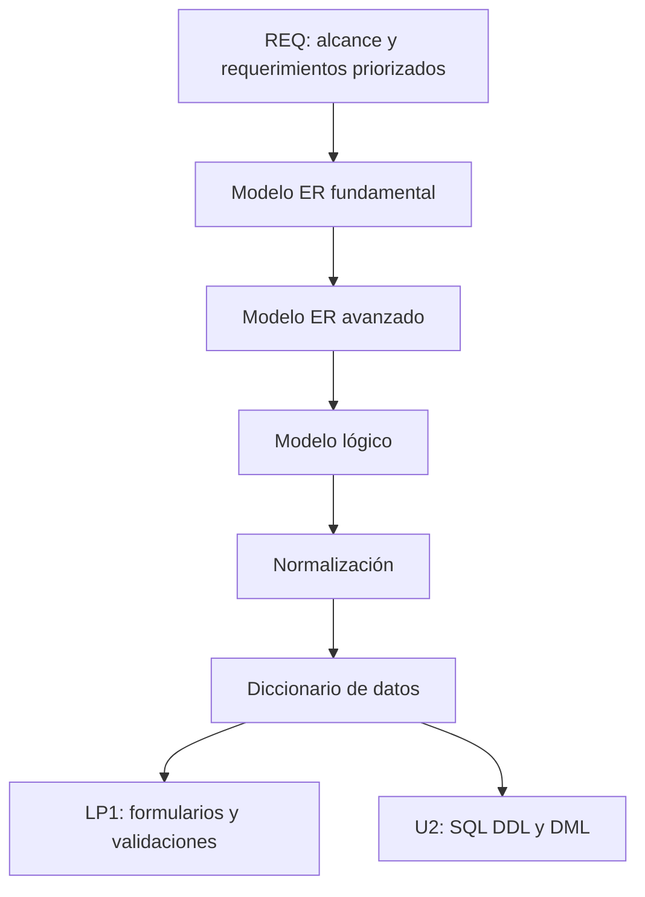

# S6 - Evaluación Unidad 1: modelo conceptual y lógico de datos

## 1. Introducción

Tiempo: 20 min.

### 1.1 Propósito

Evaluar el producto de la Unidad 1: modelo ER fundamental, modelo ER avanzado, modelo lógico, normalización inicial y diccionario de datos, alineados al problema, alcance y prototipo del proyecto integrador.

### 1.2 Resultado de aprendizaje

El estudiante demuestra que puede modelar información de un dominio, transformar el modelo conceptual en modelo lógico y documentar datos para soportar la futura implementación SQL y la aplicación web.

### 1.3 Producto de sesión

Producto U1 integrado: modelo conceptual, modelo lógico y diccionario de datos documentado.

### 1.4 Motivación de la sesión

La evaluación no revisa diagramas aislados. Revisa si el modelo de datos representa el proceso principal, respeta los requerimientos validados y puede sostener los formularios e interacciones de LP1.

Preguntas para los estudiantes:

1. ¿Qué proceso principal modela la base de datos?
2. ¿Qué entidad transaccional sostiene ese proceso?
3. ¿Qué tablas y claves garantizan integridad?
4. ¿Qué campos necesita LP1?
5. ¿Qué ajuste se hizo por normalización o validación?

### 1.5 Ubicación en el curso

- Unidad: U1 - Diseño Conceptual y Lógico de Bases de Datos.
- Producto de unidad: modelo conceptual, modelo lógico y diccionario de datos.
- Avance de sesión: evaluación integradora antes de SQL DDL y DML.

## 2. Explica

Tiempo: 15 min.

### 2.1 Conceptos clave

- Integración: modelo conceptual, lógico y diccionario forman un solo diseño.
- Evidencia individual: aporte verificable en el modelado.
- Defensa técnica: explicación de entidades, claves, relaciones y normalización.
- Preparación SQL: el modelo debe poder convertirse en DDL.

### 2.2 Arquitectura del producto U1



### 2.3 Criterios mínimos de revisión

- Entidades dentro del alcance.
- Entidades maestras y transaccionales identificadas.
- Relaciones y cardinalidades justificadas.
- Modelo lógico con tablas, PK y FK.
- Relaciones N:M resueltas.
- Normalización revisada.
- Diccionario de datos documentado.
- Relación con REQ y LP1.
- Evidencia individual.

## 3. Aplica: evaluación práctica

Tiempo: 3h.

### 3.1 Preparar demostración

1. Presentar alcance y proceso modelado.
2. Mostrar modelo ER fundamental.
3. Mostrar modelo ER avanzado.
4. Mostrar modelo lógico.
5. Explicar PK, FK y relaciones N:M.
6. Mostrar revisión de normalización.
7. Mostrar diccionario de datos.
8. Explicar impacto en LP1.

### 3.2 Ejecutar revisión base

El estudiante demuestra:

1. Una entidad maestra.
2. Una entidad transaccional.
3. Una relación con cardinalidad justificada.
4. Una tabla con PK.
5. Una FK y su integridad referencial.
6. Una regla documentada en diccionario.
7. Una columna usada por LP1.

### 3.3 Demostración individual

Cada integrante debe poder responder:

- Qué parte del modelo construyó.
- Qué relación ajustó.
- Qué tabla documentó.
- Qué decisión técnica defendió.

## 4. Crea: evidencia individual

Tiempo: 4h fuera del aula.

### 4.1 Plantilla de evidencia individual

```text
S06_BD1_Equipo##_ApellidoNombre.pdf
```

#### 4.1.1 Datos del estudiante

- Nombre:
- Equipo:
- Sesión: S06 - Evaluación Unidad 1
- Rol o aporte realizado:
- Link de GitHub:

#### 4.1.2 Trabajo autónomo realizado

1. Ordenar evidencias de S1-S5.
2. Corregir observaciones finales.
3. Preparar defensa individual.
4. Documentar aporte personal.
5. Registrar diagramas, tablas y decisiones.

#### 4.1.3 Evidencia técnica

- Inventario de datos.
- Modelo ER fundamental.
- Modelo ER avanzado.
- Modelo lógico.
- Revisión de normalización.
- Diccionario de datos.
- Relación con REQ y LP1.
- Aporte individual.

#### 4.1.4 Error o hallazgo

Describe un problema de modelado encontrado en U1 y cómo se corrigió.

#### 4.1.5 Reflexión técnica breve

Explica cómo el modelo de datos permitirá implementar SQL y formularios web en las siguientes sesiones.

### 4.2 Criterios mínimos de aceptación

- PDF con nombre correcto.
- Evidencia del producto U1.
- Modelos y diccionario incluidos.
- Evidencia de integración con REQ y LP1.
- Evidencia de aporte individual.
- Defensa técnica preparada.

## 5. Cierre evaluativo

Tiempo: 20 min.

### 5.1 Resultados esperados

- Modelo ER sustentado.
- Modelo lógico sustentado.
- Diccionario de datos sustentado.
- Base lista para SQL DDL y DML en U2.

### 5.2 Evidencia del producto de sesión

```text
S06_BD1_Equipo##_ApellidoNombre.pdf
```

### 5.3 Preguntas de defensa y reflexión

1. ¿Qué entidad transaccional sostiene el proceso?
2. ¿Qué relación N:M resolviste?
3. ¿Dónde está la FK y por qué?
4. ¿Qué tabla cambió por normalización?
5. ¿Qué columna necesita LP1?
6. ¿Qué se implementará primero en SQL?

### 5.4 Rúbrica de evaluación

| Dimensión | Peso | 3 - Logro destacado | 2 - Logro | 1 - Proceso | 0 - Inicio | Puntuación obtenida |
|---|---:|---|---|---|---|---:|
| 1. Modelo conceptual | 2 | ER claro, completo y alineado al alcance. | ER funcional. | ER parcial. | No presenta ER. | |
| 2. Modelo lógico | 2 | Tablas, PK, FK y relaciones resueltas correctamente. | Modelo lógico suficiente. | Modelo incompleto. | No presenta modelo lógico. | |
| 3. Normalización y diccionario | 2 | Revisión y documentación precisas. | Documentación suficiente. | Documentación parcial. | No documenta. | |
| 4. Integración | 2 | Relación clara con REQ y LP1. | Relación general. | Relación débil. | No integra. | |
| 5. Evidencia individual | 1 | Evidencia clara, ordenada y verificable. | Evidencia suficiente. | Evidencia incompleta. | No entrega evidencia. | |
| 6. Defensa técnica | 1 | Responde con precisión y criterio. | Responde adecuadamente. | Responde parcialmente. | No sustenta. | |

Puntuación acumulada = suma de (`Peso` * `Puntuación obtenida`) = ____.

Nota final = (`Puntuación acumulada` / 30) * 20 = ____.