# Integración Curricular del Ciclo 3 - 2026-2

# Proyecto Integrador del Ciclo

El Ciclo 3 integra **Ingeniería de Requerimientos (REQ)**, **Administración de Base de Datos I (BD1)** y **Lenguaje de Programación I (LP1)** alrededor de un mismo sistema web empresarial.

La integración curricular se organiza así:

```text
REQ -> BD1 -> LP1
```

REQ define el problema y documenta los requerimientos. BD1 transforma esos requerimientos en una base de datos relacional. LP1 implementa una aplicación web MVC usando los requerimientos y la base de datos construida.

---

# Producto Integrador del Ciclo

**Sistema Web MVC Empresarial con SRS y Base de Datos Relacional Validada.**

El producto integrador incluye:

- Especificación de Requerimientos de Software (SRS).
- Modelo Entidad-Relación.
- Modelo lógico relacional.
- Diccionario de datos.
- Base de datos implementada con scripts DDL y DML.
- Consultas SQL y reportes.
- Aplicación web MVC con persistencia.
- Control de acceso, validaciones y consultas.
- Evidencias de integración entre requerimientos, base de datos y aplicación.

---

# Cursos Integrados

## REQ - Ingeniería de Requerimientos

Analiza necesidades organizacionales y define requerimientos de software mediante técnicas de elicitación, modelado, validación y documentación.

**Producto final:** Especificación de Requerimientos de Software (SRS) documentada.

| Unidad | Enfoque | Producto |
|---|---|---|
| Unidad 1 | Descubrimiento, elicitación y análisis del problema. | Requerimientos iniciales priorizados y prototipos validados. |
| Unidad 2 | Análisis funcional y requerimientos no funcionales. | Modelo funcional y requerimientos documentados con trazabilidad. |
| Unidad 3 | Proyecto de especificación de requerimientos. | SRS documentado y validado. |

## BD1 - Administración de Base de Datos I

Diseña e implementa bases de datos relacionales a partir de los requerimientos del negocio, aplicando modelado conceptual, diseño lógico, normalización, SQL e integridad de datos.

**Producto final:** Base de datos relacional implementada y validada.

| Unidad | Enfoque | Producto |
|---|---|---|
| Unidad 1 | Diseño conceptual y lógico de bases de datos. | Modelo de datos conceptual y lógico documentado. |
| Unidad 2 | Implementación y consulta de bases de datos. | Base de datos relacional implementada con consultas funcionales. |
| Unidad 3 | Proyecto de base de datos relacional. | Base de datos relacional implementada y validada. |

## LP1 - Lenguaje de Programación I

Desarrolla aplicaciones web MVC aplicando arquitectura web, formularios, persistencia, relaciones, consultas, control de acceso, validaciones y buenas prácticas de desarrollo.

**Producto final:** Sistema Web MVC Empresarial.

| Unidad | Enfoque | Producto |
|---|---|---|
| Unidad 1 | Fundamentos del desarrollo web. | Página web interactiva con plantillas y formularios. |
| Unidad 2 | Desarrollo de aplicaciones web MVC. | Aplicación web MVC con persistencia, relaciones, seguridad y consultas. |
| Unidad 3 | Proyecto integrador web MVC. | Sistema Web MVC Empresarial sustentado. |

---

# Arquitectura Inicial

La arquitectura inicial del Ciclo 3 organiza el trabajo en tres responsabilidades conectadas: **requerimientos**, **base de datos relacional** e **implementación web MVC**.

REQ produce el SRS y los prototipos funcionales. BD1 transforma esos requerimientos en un modelo de datos y una base relacional implementada. LP1 usa los prototipos y la base de datos para construir la aplicación web MVC.

```mermaid
flowchart TB
    subgraph Proyecto["Proyecto integrador del Ciclo 3"]
        subgraph REQ["REQ - Requerimientos"]
            Problema["Problema, contexto y alcance"]
            Stakeholders["Stakeholders y restricciones"]
            Reqs["RF, RNF y reglas de negocio"]
            Prototipos["Prototipos y validación"]
            SRS["SRS documentado"]
        end

        subgraph BD1["BD1 - Base de Datos Relacional"]
            ER["Modelo entidad-relación"]
            Logico["Modelo lógico relacional"]
            Diccionario["Diccionario de datos"]
            Scripts["Scripts DDL / DML"]
            Consultas["Consultas SQL y reportes"]
            BD["Base de datos relacional validada"]
        end

        subgraph LP1["LP1 - Aplicación Web MVC"]
            UI["Plantillas, formularios e interacción web"]
            MVC["Rutas, controladores y servicios"]
            ORM["ORM / repositorios"]
            Seguridad["Autenticación, autorización y sesiones"]
            Validaciones["Validaciones, errores y consultas"]
            App["Sistema Web MVC empresarial"]
        end
    end

    Problema --> Stakeholders --> Reqs --> Prototipos --> SRS
    SRS --> ER --> Logico --> Diccionario --> Scripts --> Consultas --> BD
    Prototipos --> UI
    BD --> ORM
    UI --> MVC --> ORM --> Seguridad --> Validaciones --> App
    Consultas --> Validaciones
    SRS --> App
```



La integración se valida cuando los requerimientos documentados, el modelo de datos y la aplicación web pertenecen al mismo dominio y pueden trazarse entre sí.

---
# Hitos Transversales

## Hito 1 - Evaluación Unidad 1

| Curso | Sesión | Evidencia esperada |
|---|---:|---|
| REQ | S6 | Requerimientos iniciales priorizados y prototipos validados. |
| BD1 | S6 | Modelo de datos conceptual y lógico documentado. |
| LP1 | S5 | Página web interactiva con plantillas y formularios. |

## Hito 2 - Evaluación Unidad 2

| Curso | Sesión | Evidencia esperada |
|---|---:|---|
| REQ | S12 | Modelo funcional y requerimientos documentados con trazabilidad. |
| BD1 | S12 | Base de datos relacional implementada con consultas funcionales. |
| LP1 | S12 | Aplicación Web MVC con persistencia, relaciones, seguridad y validaciones. |

## Hito 3 - Sustentación del Proyecto

| Curso | Sesión | Evidencia esperada |
|---|---:|---|
| REQ | S15 | Sustentación del SRS. |
| BD1 | S15 | Sustentación de la base de datos relacional. |
| LP1 | S15 | Sustentación del Sistema Web MVC Empresarial. |

## Cierre Final

| Curso | Sesión | Evidencia esperada |
|---|---:|---|
| REQ | S16 | Evaluación final y cierre académico. |
| BD1 | S16 | Evaluación final y cierre académico. |
| LP1 | S16 | Evaluación final y cierre académico. |

---

# Proyección

El producto del Ciclo 3 sirve como base para el Ciclo 4, donde la solución evoluciona hacia diseño técnico profesional, base de datos Oracle administrada y aplicación full-stack empresarial.

```text
Sistema Web MVC -> Diseño técnico + Oracle empresarial + API REST + SPA
```