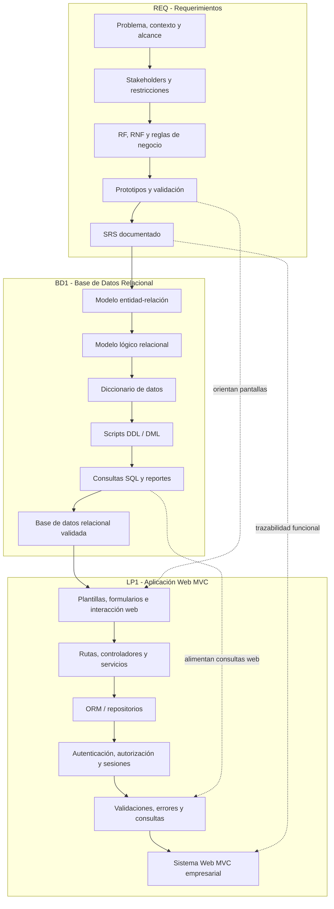

# Integración Curricular del Ciclo 3 - 2026-2

# Vista General

El Ciclo 3 integra **Ingeniería de Requerimientos (REQ)**, **Administración de Base de Datos I (BD1)** y **Lenguaje de Programación I (LP1)** alrededor de un mismo sistema web empresarial.

La secuencia curricular del ciclo es:

```text
REQ -> BD1 -> LP1
```

REQ define el problema y documenta los requerimientos. BD1 transforma esos requerimientos en una base de datos relacional. LP1 implementa una aplicación web MVC usando los requerimientos y la base de datos construida.

Para el detalle metodológico del proyecto, revisa:

[Proyecto Integrador del Ciclo 3](proyecto-integrador/index.md)

---

# Producto Integrador del Ciclo

**Sistema Web MVC Empresarial con SRS y Base de Datos Relacional Validada.**

Este producto constituye la evidencia integradora del ciclo y articula tres productos parciales:

| Curso | Producto principal |
|---|---|
| REQ | Especificación de Requerimientos de Software (SRS) documentada. |
| BD1 | Base de datos relacional implementada y validada. |
| LP1 | Sistema Web MVC Empresarial. |

---

# Cursos Integrados

| Curso | Enfoque | Producto final |
|---|---|---|
| REQ | Descubrimiento, análisis, documentación y validación de requerimientos. | SRS documentado y validado. |
| BD1 | Diseño conceptual/lógico, normalización, SQL, consultas e integridad. | Base de datos relacional implementada y validada. |
| LP1 | Desarrollo web MVC, formularios, persistencia, seguridad, consultas y validaciones. | Sistema Web MVC Empresarial. |

---

# Arquitectura Inicial

La arquitectura inicial del Ciclo 3 organiza el trabajo en tres responsabilidades conectadas: **requerimientos**, **base de datos relacional** e **implementación web MVC**.

REQ produce el SRS y los prototipos funcionales. BD1 transforma esos requerimientos en un modelo de datos y una base relacional implementada. LP1 usa los prototipos y la base de datos para construir la aplicación web MVC.



---

# Navegación Recomendada

- [Proyecto Integrador](proyecto-integrador/index.md): alineamiento por sesiones, hitos, criterios de integración y metodología.
- [REQ](req/index.md): contenido final de Ingeniería de Requerimientos.
- [BD1](bd1/index.md): contenido final de Administración de Base de Datos I.
- [LP1](lp1/index.md): contenido final de Lenguaje de Programación I.

---

# Proyección

El producto del Ciclo 3 sirve como base para el Ciclo 4, donde la solución evoluciona hacia diseño técnico profesional, base de datos Oracle administrada y aplicación full-stack empresarial.

```text
Sistema Web MVC -> Diseño técnico + Oracle empresarial + API REST + SPA
```