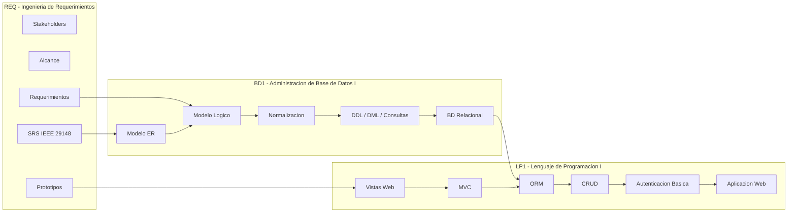

# Integracion Curricular del Ciclo 3 - 2026-2

# Proyecto Integrador del Ciclo

## BOM START

[BOM START](https://github.com/262ciclo3/bomstart) es una plantilla academica para desarrollar una aplicacion web empresarial inicial mediante tres cursos articulados: Ingenieria de Requerimientos, Administracion de Base de Datos I y Lenguaje de Programacion I.

Repositorio de la plantilla:

```text
https://github.com/262ciclo3/bomstart
```

El proyecto busca que cada equipo construya una solucion funcional conectando:

* Una especificacion de requerimientos de software.
* Una base de datos relacional implementada y validada.
* Una aplicacion web server-side con arquitectura MVC.

---

# Cursos Integrados

## REQ - Ingenieria de Requerimientos

Analiza necesidades organizacionales y define requerimientos mediante tecnicas de elicitacion, modelado, validacion y documentacion.

**Producto final:** Especificacion de Requerimientos de Software (SRS) documentada.

## BD1 - Administracion de Base de Datos I

Disena e implementa bases de datos relacionales a partir de los requerimientos del negocio, aplicando modelado conceptual, diseno logico, normalizacion, SQL e integridad de datos.

**Producto final:** Base de datos relacional implementada y validada.

## LP1 - Lenguaje de Programacion I

Desarrolla aplicaciones web server-side aplicando MVC, ORM, validaciones, autenticacion basica y buenas practicas de desarrollo.

**Producto final:** Aplicacion web server-side completa.

---

# Flujo de Integracion



---

# Hitos Transversales

## Hito 1 - Evaluacion Unidad 1

### Sesiones de evaluacion

* REQ: Sesion 6.
* BD1: Sesion 6.
* LP1: Sesion 6.

### Evidencia esperada

* REQ: Requerimientos iniciales priorizados y prototipos validados.
* BD1: Modelo de datos conceptual y logico documentado.
* LP1: Vistas web dinamicas y formularios funcionales.

---

## Hito 2 - Evaluacion Unidad 2

### Sesiones de evaluacion

* REQ: Sesion 12.
* BD1: Sesion 12.
* LP1: Sesion 12.

### Evidencia esperada

* REQ: Modelo funcional y requerimientos documentados con trazabilidad.
* BD1: Base de datos relacional implementada con consultas funcionales.
* LP1: Aplicacion MVC con persistencia de datos y funcionalidades CRUD.

---

## Hito 3 - Sustentacion del Proyecto

### Sesiones de sustentacion

* REQ: Sesion 15.
* BD1: Sesion 15.
* LP1: Sesion 15.

### Evidencia esperada

* REQ: Sustentacion del SRS.
* BD1: Sustentacion de la base de datos relacional.
* LP1: Sustentacion de la aplicacion web.

---

## Cierre Final

### Sesiones de cierre

* REQ: Sesion 16.
* BD1: Sesion 16.
* LP1: Sesion 16.

### Evidencia esperada

* Evaluacion individual.
* Recuperacion de sustentaciones pendientes.
* Correccion de observaciones.
* Cierre academico del proyecto.

---

# Producto Integrador del Ciclo

**Aplicacion web server-side completa, basada en un SRS documentado, conectada a una base de datos relacional implementada y validada.**

Este producto constituye la evidencia integradora del Ciclo 3 y servira como base para cursos posteriores como Analisis y Diseno de Sistemas de Informacion, Administracion de Base de Datos II y Lenguaje de Programacion II.
