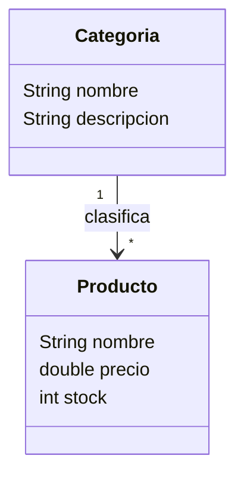

# LP1 - Lenguaje de Programación I

## Producto del curso

**Sistema Web MVC Empresarial.**

Aplicación web monolítica con JDBC, DAO, CRUD, objetos relacionados, operación cabecera–detalle, consultas, reportes y control de acceso.

---

# UNIDAD 1 - Fundamentos del Desarrollo Web

### Resultado de aprendizaje

Construye interfaces web interactivas mediante arquitectura web, plantillas reutilizables, formularios, JavaScript, DOM, eventos y validación del lado del cliente.

### Producto de la unidad

**Página web interactiva (plantillas + formularios).**

Artefacto de referencia para el Proyecto Integrador: [LP1 - Producto de Unidad 1](../proyecto-integrador/u1/lp1-demo.md).

### Continuidad desde Programación Orientada a Objetos

LP1 no reinicia el dominio. Toma como punto de partida el modelo construido en POO, donde ya existen `Venta`, `DetalleVenta`, `Producto` y `Usuario`.

- En **S1**, `Producto` (`nombre`, `precio` y `stock`) se convierte en el primer recurso representado en la aplicación web.
- En **S2**, se incorpora `Categoria` y se establece que una categoría agrupa muchos productos, mientras cada producto pertenece a una categoría.
- En U1 la relación se representa en la interfaz; su persistencia y tratamiento mediante MVC corresponden a U2.

| Sesión | Tema | Producto de sesión |
|--------|------|--------------------|
| **S1** | Arquitectura Web, HTTP y estructura de aplicaciones cliente-servidor | Proyecto web inicial y flujo HTTP del recurso `Producto`, recuperado del modelo desarrollado en POO. |
| **S2** | Interfaces web con HTML, CSS y plantillas reutilizables (Bootstrap) | Interfaz responsive de productos y categorías, con representación de la relación `Categoria 1 : * Producto`. |
| **S3** | Interactividad web con JavaScript, DOM, eventos y validación de formularios | Formulario interactivo con validación del lado del cliente y manejo de eventos. |
| **S4** | Formularios, procesamiento de datos e interacción web, compilados | Página web interactiva integrada con formularios, plantillas y procesamiento básico de datos. |
| **S5** | Evaluación U1 | **Producto U1:** página web interactiva integrada, probada y sustentada. |

---

# UNIDAD 2 - Desarrollo de Aplicaciones Web MVC

### Resultado de aprendizaje

Desarrolla una aplicación web MVC empresarial aplicando rutas, controladores, servicios, JDBC, DAO, CRUD, validaciones, manejo de errores, objetos relacionados, operaciones del dominio con cabecera–detalle, consultas y reportes.

### Producto de la unidad

**Aplicación Web MVC con persistencia mediante JDBC y DAO, CRUD validado, objetos relacionados, una operación del dominio con cabecera–detalle, consultas y reportes.**

Artefacto de referencia para el Proyecto Integrador: [LP1 - Producto de Unidad 2](../proyecto-integrador/u2/lp1-demo.md).

| Sesión | Tema | Producto de sesión |
|--------|------|--------------------|
| **S6** | Creación del proyecto Web MVC y primer listado | Proyecto MVC ejecutable, conectado mediante JDBC y con listado de `Producto` desde la base de datos. |
| **S7** | Modelo, DAO y CRUD Web MVC | CRUD completo de `Producto` mediante JDBC, DAO, servicios, controladores, formularios y vistas. |
| **S8** | Validación, manejo de errores y presentación del CRUD MVC | CRUD de `Producto` validado, con errores controlados, mensajes, layout y hojas de estilos. |
| **S9** | Gestión de objetos relacionados en MVC | Módulo de `Categoria–Producto`, con asignación, navegación y presentación de objetos relacionados. |
| **S10** | Procesamiento de operaciones del dominio con cabecera–detalle | Registro y consulta de `Venta–DetalleVenta`, con cálculos, control de stock y persistencia atómica. |
| **S11** | Consultas del dominio y reportes web | Consultas parametrizadas, filtros, ordenamiento, agregaciones y reportes sobre `Producto`, `Categoria`, `Venta` y `DetalleVenta`. |
| **S12** | Evaluación U2 | **Producto U2:** aplicación Web MVC con `Producto`, `Categoria–Producto`, `Venta–DetalleVenta`, consultas y reportes. |

---

# UNIDAD 3 - Proyecto Integrador Web MVC

### Resultado de aprendizaje

Integra seguridad, módulos funcionales, pruebas, correcciones y sustentación técnica para consolidar un sistema web MVC empresarial alineado al proyecto integrador del ciclo.

### Producto de la unidad

**Sistema Web MVC Empresarial.**

Artefacto de referencia para el Proyecto Integrador: [LP1 - Producto de Unidad 3](../proyecto-integrador/u3/lp1-producto.md).

| Sesión | Tema | Producto de sesión |
|--------|------|--------------------|
| **S13** | Autenticación, autorización y gestión de sesiones | Sistema MVC protegido mediante `Usuario`, sesiones, roles y rutas autorizadas. |
| **S14** | Integración, pruebas y refinamiento del sistema | Módulos integrados, consultas y reportes protegidos, incidencias corregidas y versión candidata validada. |
| **S15** | Sustentación técnica del proyecto | **Producto final:** Sistema Web MVC Empresarial sustentado técnicamente. |
| **S16** | Evaluación final | Evaluación final teórico-práctica. |

---

# Evolución del proyecto

## Unidad 1
- Arquitectura web y flujo HTTP.
- Estructura cliente-servidor.
- Continuidad del dominio de POO mediante `Producto`.
- Incorporación de `Categoria` y su relación uno a muchos con `Producto`.
- Interfaces con HTML, CSS y Bootstrap.
- Plantillas reutilizables.
- JavaScript, DOM, eventos y validaciones.
- Formularios integrados, refinamiento y evaluación del producto web.

## Unidad 2
- Proyecto Web MVC ejecutable y conectado mediante JDBC.
- Primer listado de `Producto` como corte vertical de la arquitectura.
- DAO y CRUD Web MVC completo de `Producto`.
- Validaciones, manejo de errores y hojas de estilos.
- Gestión de `Categoria–Producto` como objetos relacionados.
- Procesamiento de `Venta–DetalleVenta` como operación del dominio.
- Consultas del dominio y reportes web.

## Unidad 3
- Autenticación, autorización y sesiones.
- Protección de consultas y reportes construidos en U2.
- Integración, pruebas y refinamiento transversal del producto.
- Sustentación técnica.
- Evaluación final.

---

# Integración Curricular

LP1 continúa el dominio desarrollado en POO y lo convierte progresivamente en una aplicación web MVC funcional. Para el caso de referencia, recupera `Producto` en S1 y agrega `Categoria` en S2; REQ precisa el alcance y BD1 formaliza el modelo de datos que se persistirá después. Desde las primeras sesiones, la interfaz debe reflejar las entidades y reglas ya trabajadas, sin rehacer el análisis ni adelantar persistencia antes de U2.
