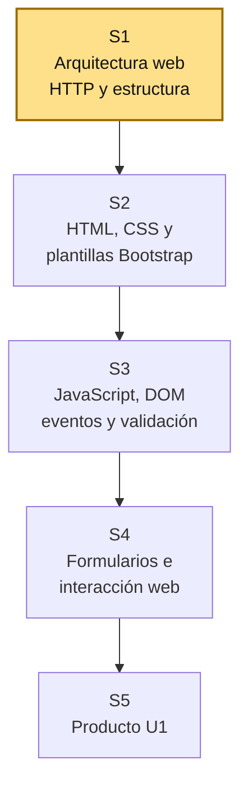
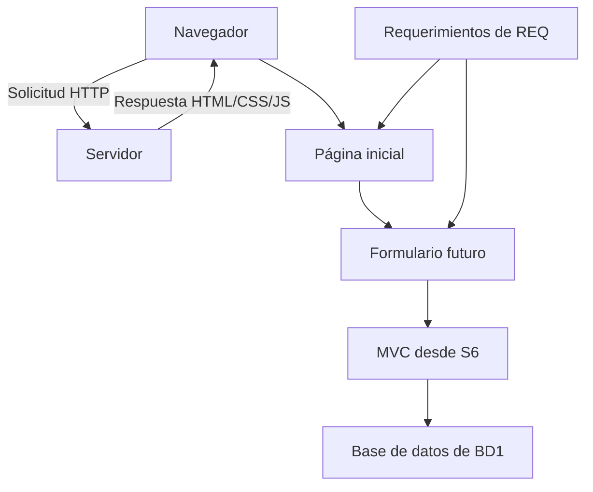

# S1 - Arquitectura Web, HTTP y estructura de aplicaciones cliente-servidor

## 1. Introducción

Tiempo: 20 min.

### 1.1 Propósito

Comprender cómo funciona una aplicación web cliente-servidor, reconocer el rol de HTTP y crear la estructura inicial del proyecto web que evolucionará hacia un Sistema Web MVC Empresarial.

### 1.2 Resultado de aprendizaje

El estudiante explica el flujo básico de una solicitud web, diferencia cliente y servidor, reconoce recursos web iniciales y prepara la estructura base del proyecto que será usado durante el curso.

### 1.3 Producto de sesión

Estructura inicial de la aplicación web y descripción del flujo cliente-servidor mediante una página base ejecutable.

### 1.4 Motivación de la sesión

#### 1.4.1 Caso: primera versión visible del sistema

El equipo ya empieza a definir un problema desde REQ y datos iniciales desde BD1. LP1 debe convertir ese dominio en una experiencia web progresiva: primero una página base, luego formularios, después MVC, persistencia, seguridad y consultas.

Preguntas para los estudiantes:

1. ¿Qué ve el usuario cuando entra al sistema?
2. ¿Qué información debe solicitar el navegador?
3. ¿Qué responde el servidor?
4. ¿Qué recurso es HTML, CSS o JavaScript?
5. ¿Cómo se relaciona esta página inicial con el proyecto integrador?

### 1.5 Ubicación en el curso

- Unidad: U1 - Fundamentos del Desarrollo Web.
- Producto de unidad: página web interactiva con plantillas y formularios.
- Producto del curso: Sistema Web MVC Empresarial.
- Avance del producto en esta sesión: estructura inicial del proyecto web y primera página base.

Roadmap del producto de la unidad:



## 2. Explica

Tiempo: 25 min.

### 2.1 Conceptos clave

Una aplicación web funciona mediante la interacción entre cliente y servidor. El navegador solicita recursos y el servidor responde con documentos, estilos, scripts o datos.

Conceptos de la sesión:

- Cliente web.
- Servidor web.
- HTTP.
- Solicitud y respuesta.
- URL.
- Recurso web.
- HTML, CSS y JavaScript.
- Estructura de proyecto web.
- Página inicial.
- Relación entre interfaz, datos y requerimientos.

Alcance metodológico de S1:

```text
En S1 no se construye todavía una aplicación MVC completa.
Se entiende el flujo web y se crea una estructura base.

Las plantillas visuales se fortalecen en S2, la interacción con
JavaScript en S3, los formularios en S4 y MVC inicia en S6.
```

### 2.2 Arquitectura de la sesión



Lectura del diagrama:

- El navegador representa el cliente.
- El servidor entrega recursos.
- La página inicial debe estar conectada con el dominio del proyecto.
- En S6 esta base crecerá hacia MVC.

### 2.3 Flujo de trabajo

1. Identificar el dominio del equipo.
2. Crear la carpeta del proyecto web.
3. Crear estructura inicial de archivos.
4. Crear una página `index.html`.
5. Agregar una hoja de estilos.
6. Agregar un archivo JavaScript básico.
7. Abrir la página en el navegador.
8. Inspeccionar una solicitud o recurso desde DevTools.
9. Registrar evidencia y explicar el flujo cliente-servidor.

### 2.4 Errores frecuentes y diagnóstico

| Problema | Causa probable | Solución |
|---|---|---|
| La página no abre | Ruta incorrecta o archivo mal nombrado | Revisar ubicación y nombre de `index.html` |
| No carga el CSS | Enlace incorrecto | Verificar `href` y carpeta `css` |
| No ejecuta JavaScript | Enlace incorrecto o error de consola | Revisar `src` y consola del navegador |
| La página no tiene relación con el proyecto | Se hizo una página genérica | Usar el dominio definido por el equipo |
| No se entiende cliente-servidor | Solo se abrió el archivo sin analizar flujo | Revisar recursos desde DevTools |
| Se intenta hacer MVC desde S1 | Se adelantó contenido | Mantener S1 como estructura base y flujo HTTP |

## 3. Aplica: actividad práctica guiada

Tiempo: 2h.

### 3.1 Crear la estructura inicial

**Producto del paso:** carpeta base del proyecto web.

Estructura recomendada:

```text
lp1-proyecto/
├── index.html
├── css/
│   └── styles.css
├── js/
│   └── app.js
└── img/
```

### 3.2 Crear la página inicial

**Producto del paso:** `index.html` funcional.

Ejemplo base:

```html
<!doctype html>
<html lang="es">
<head>
    <meta charset="utf-8">
    <meta name="viewport" content="width=device-width, initial-scale=1">
    <title>Proyecto LP1</title>
    <link rel="stylesheet" href="css/styles.css">
</head>
<body>
    <header>
        <h1>Sistema Web MVC Empresarial</h1>
        <p>Dominio del proyecto: completar según el equipo.</p>
    </header>

    <main>
        <section>
            <h2>Problema inicial</h2>
            <p>Resumen breve del problema definido en REQ.</p>
        </section>
    </main>

    <script src="js/app.js"></script>
</body>
</html>
```

### 3.3 Agregar estilos básicos

**Producto del paso:** página con presentación mínima.

Archivo `css/styles.css`:

```css
body {
    font-family: Arial, sans-serif;
    margin: 0;
    padding: 24px;
    background: #f5f7fb;
    color: #1f2937;
}

header {
    border-bottom: 1px solid #d0d7de;
    margin-bottom: 24px;
}
```

### 3.4 Agregar JavaScript básico

**Producto del paso:** archivo `app.js` conectado.

Archivo `js/app.js`:

```javascript
console.log("Proyecto LP1 iniciado");
```

### 3.5 Verificar recursos en el navegador

**Producto del paso:** evidencia del flujo web.

1. Abrir `index.html`.
2. Abrir DevTools.
3. Revisar la pestaña Network o Red.
4. Identificar `index.html`, `styles.css` y `app.js`.
5. Explicar qué solicitó el navegador y qué recurso recibió.

### 3.6 Relacionar la página con REQ y BD1

**Producto del paso:** página contextualizada.

| Elemento | Fuente |
|---|---|
| Nombre del proyecto | Equipo |
| Problema inicial | REQ |
| Datos visibles | BD1 |
| Módulo futuro | LP1 |

### 3.7 Preparar el avance hacia S2

**Producto del paso:** base lista para plantillas.

Checklist:

- Existe `index.html`.
- Existe carpeta `css`.
- Existe carpeta `js`.
- La página tiene relación con el dominio.
- Se registró evidencia de ejecución.
- Se explicó el flujo cliente-servidor.

## 4. Crea: actividad autónoma

Tiempo: 2h fuera del aula.

Cada estudiante consolida la estructura inicial del proyecto web y prepara evidencia individual.

### 4.1 Plantilla de evidencia individual

Entrega un PDF con el siguiente nombre:

```text
S01_LP1_Equipo##_ApellidoNombre.pdf
```

#### 4.1.1 Datos del estudiante

- Nombre:
- Equipo:
- Sesión: S01 - Arquitectura Web, HTTP y estructura de aplicaciones cliente-servidor
- Rol o aporte realizado:
- Link de GitHub:

#### 4.1.2 Trabajo autónomo realizado

Completa y evidencia estas tareas:

1. Crear la estructura inicial del proyecto web.
2. Implementar `index.html`.
3. Implementar `css/styles.css`.
4. Implementar `js/app.js`.
5. Personalizar la página con el dominio del equipo.
6. Verificar recursos desde el navegador.
7. Explicar el flujo cliente-servidor.

#### 4.1.3 Evidencia técnica

Incluye:

- Captura de la estructura de carpetas.
- Código de `index.html`.
- Código de `styles.css`.
- Código de `app.js`.
- Captura de la página ejecutándose.
- Captura o explicación de recursos vistos en DevTools.

#### 4.1.4 Error o hallazgo

Describe al menos un error o hallazgo: qué recurso no cargaba o qué problema apareció, cómo lo diagnosticaste, cómo lo corregiste y qué aprendiste sobre rutas, navegador o recursos web.

#### 4.1.5 Reflexión técnica breve

Responde en 5 a 8 líneas:

```text
¿Por qué una aplicación web necesita separar estructura, estilo y comportamiento?
```

### 4.2 Criterios mínimos de aceptación

La evidencia individual se considera completa si:

- El archivo respeta el nombre solicitado.
- Incluye estructura de carpetas.
- `index.html`, `styles.css` y `app.js` están conectados.
- La página se relaciona con el dominio del proyecto.
- Se evidencia ejecución en navegador.
- Se explica el flujo cliente-servidor.
- Incluye error o hallazgo técnico.
- Cada evidencia tiene una descripción breve.

## 5. Cierre evaluativo

Tiempo: 20 min.

### 5.1 Resultados esperados

Al finalizar la sesión, el estudiante debe demostrar que:

- Diferencia cliente y servidor.
- Explica solicitud y respuesta HTTP.
- Reconoce recursos HTML, CSS y JavaScript.
- Crea una estructura inicial de proyecto web.
- Ejecuta una página base en navegador.
- Relaciona la página inicial con REQ y BD1.

### 5.2 Evidencia del producto de sesión

Cada estudiante entrega un PDF individual siguiendo la plantilla de la sección 4.1.

Nombre del archivo:

```text
S01_LP1_Equipo##_ApellidoNombre.pdf
```

### 5.3 Preguntas de defensa y reflexión

1. ¿Cuál es la diferencia entre cliente y servidor?
2. ¿Qué recurso solicita primero el navegador?
3. ¿Para qué sirve HTTP?
4. ¿Qué hace HTML, qué hace CSS y qué hace JavaScript?
5. ¿Cómo se relaciona tu página con el problema definido en REQ?
6. ¿Qué datos de BD1 podrían aparecer luego en un formulario?

### 5.4 Rúbrica de evaluación

| Dimensión | Peso | 3 - Logro destacado | 2 - Logro | 1 - Proceso | 0 - Inicio | Puntuación obtenida |
|---|---:|---|---|---|---|---:|
| 1. Flujo web | 2 | Explica claramente cliente, servidor, solicitud, respuesta y recursos. | Explica el flujo básico. | Explicación parcial o confusa. | No explica el flujo web. | |
| 2. Estructura del proyecto | 2 | Organiza correctamente archivos y carpetas. | Presenta estructura funcional. | Estructura incompleta o desordenada. | No presenta estructura funcional. | |
| 3. Página base | 2 | Página ejecutable, contextualizada y conectada con CSS y JS. | Página ejecutable con recursos principales. | Página incompleta o poco contextualizada. | No ejecuta una página funcional. | |
| 4. Evidencia técnica | 2 | Evidencia ejecución, recursos y diagnóstico con claridad. | Presenta evidencias suficientes. | Evidencias incompletas o poco claras. | No presenta evidencia técnica. | |
| 5. Error o hallazgo | 1 | Analiza un problema real y explica diagnóstico y solución. | Presenta un problema y solución. | Menciona problema sin análisis. | No presenta hallazgo. | |
| 6. Orden y reflexión | 1 | PDF ordenado, legible y reflexión técnica clara. | Evidencia suficiente y reflexión comprensible. | Evidencia incompleta o reflexión superficial. | Evidencia desordenada o sin reflexión. | |

Puntuación acumulada = suma de (`Peso` * `Puntuación obtenida`) = ____.

Nota final = (`Puntuación acumulada` / 30) * 20 = ____.