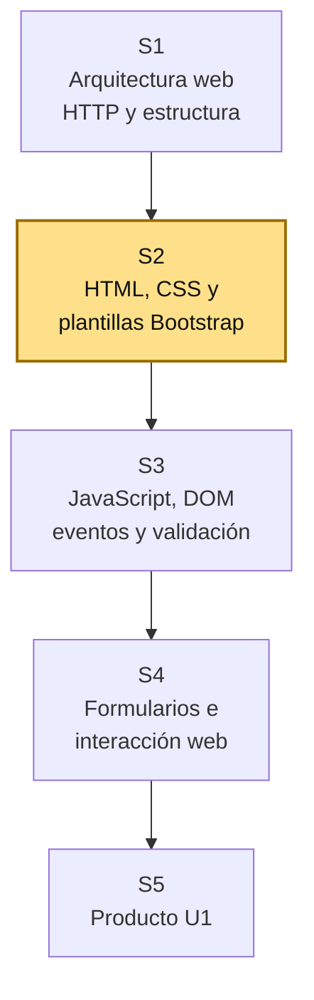
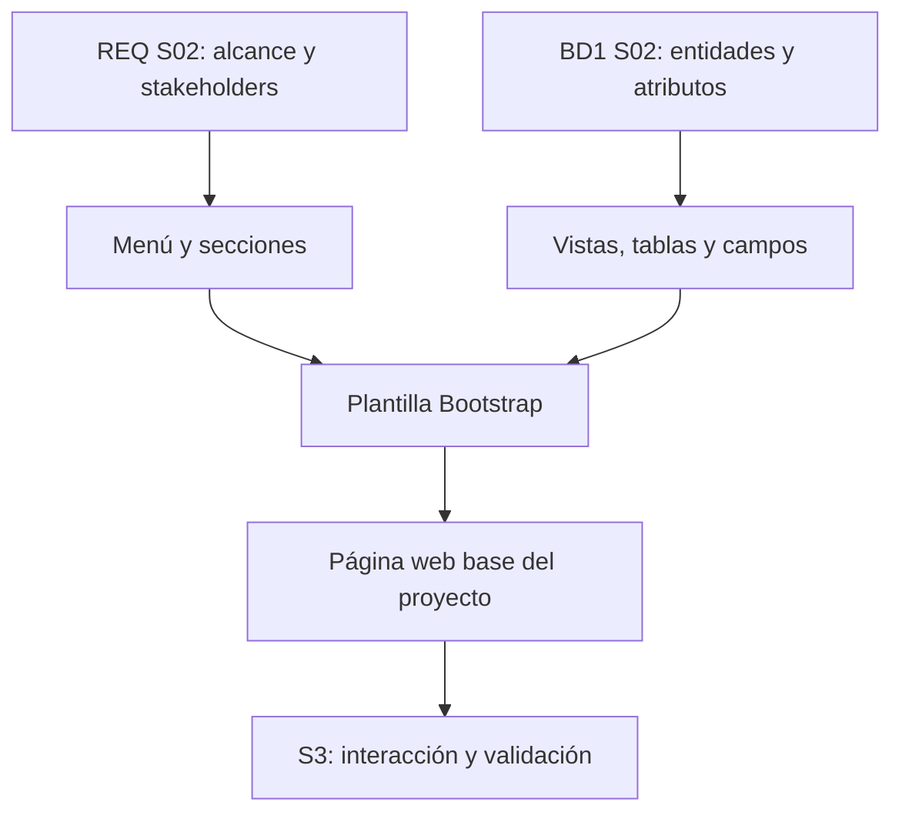

# S2 - Interfaces web con HTML, CSS y plantillas reutilizables (Bootstrap)

## 1. Introducción

Tiempo: 20 min.

### 1.1 Propósito

Construir una interfaz web base con HTML, CSS y Bootstrap, alineada al alcance definido en REQ y a las entidades iniciales modeladas en BD1.

### 1.2 Resultado de aprendizaje

El estudiante construye una plantilla web reutilizable, organiza navegación inicial y representa visualmente el dominio del proyecto mediante páginas o secciones coherentes con stakeholders, alcance y datos principales.

### 1.3 Producto de sesión

Plantilla web base con navegación, layout reutilizable y vistas iniciales del proyecto integrador.

### 1.4 Motivación de la sesión

#### 1.4.1 Caso: del alcance a la primera interfaz

En S1 se creó una página base. En S2 la página deja de ser genérica y empieza a parecerse al sistema real. La navegación debe responder al alcance de REQ y los formularios futuros deben considerar las entidades identificadas por BD1.

Preguntas para los estudiantes:

1. ¿Qué opciones debe tener el menú según el alcance?
2. ¿Qué vista necesita el stakeholder principal?
3. ¿Qué entidad de BD1 aparecerá primero en pantalla?
4. ¿Qué datos deberían verse como campos o columnas?
5. ¿Qué elementos visuales se repetirán en todo el sistema?

### 1.5 Ubicación en el curso

- Unidad: U1 - Fundamentos del Desarrollo Web.
- Producto de unidad: página web interactiva con plantillas y formularios.
- Producto del curso: Sistema Web MVC Empresarial.
- Avance del producto en esta sesión: plantilla base, navegación y vistas iniciales alineadas al dominio.

Roadmap del producto de la unidad:



## 2. Explica

Tiempo: 25 min.

### 2.1 Conceptos clave

Una interfaz web no es solo decoración. Debe permitir que el usuario entienda qué puede hacer, dónde está y cómo avanzar en el flujo del sistema.

Conceptos de la sesión:

- HTML semántico.
- CSS.
- Bootstrap.
- Layout.
- Navbar.
- Container, row y column.
- Card, table y form.
- Plantilla reutilizable.
- Navegación inicial.
- Coherencia visual con el dominio.

Alcance metodológico de S2:

```text
En S2 se construye una plantilla navegable y vistas iniciales.
No se implementa todavía lógica fuerte de JavaScript ni persistencia.

La interacción con DOM y validaciones se trabaja en S3.
Los formularios más completos se trabajan en S4.
MVC inicia en S6.
```

### 2.2 Arquitectura de la sesión



Lectura del diagrama:

- REQ define qué debe aparecer en la navegación.
- BD1 sugiere qué datos se mostrarán en tablas o formularios.
- LP1 convierte esas decisiones en una interfaz inicial.

### 2.3 Flujo de trabajo

1. Revisar alcance y stakeholder principal de REQ S02.
2. Revisar entidades del proceso principal y atributos de BD1 S02.
3. Diseñar navegación mínima.
4. Integrar Bootstrap.
5. Crear layout base.
6. Crear una vista de inicio contextualizada.
7. Crear vistas iniciales para entidades del proceso principal.
8. Preparar espacio para formulario futuro.
9. Registrar evidencia de ejecución.

### 2.4 Errores frecuentes y diagnóstico

| Problema | Causa probable | Solución |
|---|---|---|
| La interfaz parece genérica | No se usó el dominio del proyecto | Incluir problema, actor y entidades del proceso principal |
| Menú con demasiadas opciones | No se respetó el alcance de REQ | Mantener solo vistas necesarias para el primer incremento |
| La tabla no coincide con BD1 | No se revisaron atributos | Usar nombres de atributos del modelo ER inicial |
| Bootstrap no carga | CDN mal copiado o sin conexión | Verificar enlace y consola del navegador |
| Todo está en una sola sección | Falta diseño de navegación | Separar inicio, entidades del proceso y consulta inicial |
| Se intenta conectar base de datos | Se adelantó contenido de S6 | En S2 solo se maqueta la interfaz |

## 3. Aplica: actividad práctica guiada

Tiempo: 2h.

### 3.1 Revisar insumos de integración

**Producto del paso:** decisiones para la interfaz.

| Insumo | Fuente | Decisión para LP1 |
|---|---|---|
| Stakeholder principal | REQ S02 | |
| Alcance principal | REQ S02 | |
| Entidad principal | BD1 S02 | |
| Atributos visibles | BD1 S02 | |

### 3.2 Integrar Bootstrap

**Producto del paso:** página con Bootstrap disponible.

Agregar en `index.html`:

```html
<link href="https://cdn.jsdelivr.net/npm/bootstrap@5.3.3/dist/css/bootstrap.min.css" rel="stylesheet">
```

Antes de cerrar `body`:

```html
<script src="https://cdn.jsdelivr.net/npm/bootstrap@5.3.3/dist/js/bootstrap.bundle.min.js"></script>
```

### 3.3 Crear navegación inicial

**Producto del paso:** menú alineado al alcance.

Ejemplo:

```html
<nav class="navbar navbar-expand-lg bg-body-tertiary border-bottom">
    <div class="container">
        <a class="navbar-brand" href="#">BOMstart</a>
        <button class="navbar-toggler" type="button" data-bs-toggle="collapse" data-bs-target="#menuPrincipal">
            <span class="navbar-toggler-icon"></span>
        </button>
        <div class="collapse navbar-collapse" id="menuPrincipal">
            <ul class="navbar-nav ms-auto">
                <li class="nav-item"><a class="nav-link" href="#inicio">Inicio</a></li>
                <li class="nav-item"><a class="nav-link" href="#entidad">Entidad principal</a></li>
                <li class="nav-item"><a class="nav-link" href="#consulta">Consulta</a></li>
            </ul>
        </div>
    </div>
</nav>
```

### 3.4 Crear vista de inicio

**Producto del paso:** portada funcional del sistema.

```html
<section id="inicio" class="container py-4">
    <h1 class="h3">Sistema Web MVC Empresarial</h1>
    <p class="text-muted">Describe aquí el problema definido en REQ y el valor esperado para el usuario.</p>
</section>
```

### 3.5 Crear vista de entidades del proceso principal

**Producto del paso:** tabla o tarjeta basada en BD1.

```html
<section id="entidad" class="container py-4">
    <h2 class="h4">Entidad principal</h2>
    <div class="table-responsive">
        <table class="table table-bordered table-hover align-middle">
            <thead class="table-light">
                <tr>
                    <th>Código</th>
                    <th>Nombre</th>
                    <th>Estado</th>
                </tr>
            </thead>
            <tbody>
                <tr>
                    <td>E001</td>
                    <td>Registro de ejemplo</td>
                    <td>Activo</td>
                </tr>
            </tbody>
        </table>
    </div>
</section>
```

### 3.6 Preparar espacio para formulario futuro

**Producto del paso:** formulario maqueta para S3-S4.

```html
<section id="consulta" class="container py-4">
    <h2 class="h4">Consulta inicial</h2>
    <form class="row g-3">
        <div class="col-md-8">
            <label class="form-label">Buscar</label>
            <input type="text" class="form-control" placeholder="Ingrese texto de búsqueda">
        </div>
        <div class="col-md-4 d-flex align-items-end">
            <button class="btn btn-primary w-100" type="button">Buscar</button>
        </div>
    </form>
</section>
```

### 3.7 Verificar coherencia con REQ y BD1

**Producto del paso:** checklist de integración.

| Pregunta | Respuesta |
|---|---|
| ¿El menú respeta el alcance de REQ? | |
| ¿Las entidades del proceso principal aparecen en una vista? | |
| ¿Los campos visibles vienen de BD1? | |
| ¿La página puede evolucionar a formulario en S3-S4? | |

## 4. Crea: actividad autónoma

Tiempo: 2h fuera del aula.

Cada estudiante consolida la plantilla web y prepara evidencia individual.

### 4.1 Plantilla de evidencia individual

Entrega un PDF con el siguiente nombre:

```text
S02_LP1_Equipo##_ApellidoNombre.pdf
```

#### 4.1.1 Datos del estudiante

- Nombre:
- Equipo:
- Sesión: S02 - Interfaces web con HTML, CSS y plantillas reutilizables
- Rol o aporte realizado:
- Link de GitHub:

#### 4.1.2 Trabajo autónomo realizado

Completa y evidencia estas tareas:

1. Integrar Bootstrap en el proyecto.
2. Crear navegación inicial según alcance de REQ.
3. Crear vista de inicio contextualizada.
4. Crear vistas de entidades del proceso principal usando atributos de BD1.
5. Preparar una maqueta de búsqueda o formulario inicial.
6. Revisar responsividad básica.
7. Explicar cómo la interfaz usa REQ y BD1.

#### 4.1.3 Evidencia técnica

Incluye:

- Captura de la página ejecutándose.
- Código de navegación.
- Código de vista de inicio.
- Código de tabla o tarjeta de entidades del proceso principal.
- Código de maqueta de formulario o búsqueda.
- Tabla de coherencia REQ-BD1-LP1.

#### 4.1.4 Error o hallazgo

Describe un problema visual o técnico: Bootstrap no cargaba, menú no respondía, tabla se veía mal en móvil o campos no coincidían con BD1.

#### 4.1.5 Reflexión técnica breve

Responde en 5 a 8 líneas:

```text
¿Por qué la interfaz inicial debe respetar el alcance de REQ y el modelo de datos de BD1?
```

### 4.2 Criterios mínimos de aceptación

La evidencia individual se considera completa si:

- El archivo respeta el nombre solicitado.
- Integra Bootstrap correctamente.
- Incluye navegación inicial.
- La interfaz refleja el dominio del proyecto.
- La vista de entidad usa datos de BD1.
- Incluye maqueta de consulta o formulario.
- Explica integración con REQ y BD1.
- Cada evidencia tiene una descripción breve.

## 5. Cierre evaluativo

Tiempo: 20 min.

### 5.1 Resultados esperados

Al finalizar la sesión, el estudiante debe demostrar que:

- Usa HTML semántico y Bootstrap básico.
- Construye una navegación inicial.
- Organiza una plantilla reutilizable.
- Representa entidades del proceso principal en vistas iniciales.
- Relaciona campos visibles con atributos de BD1.
- Explica cómo la interfaz responde al alcance de REQ.

### 5.2 Evidencia del producto de sesión

Cada estudiante entrega un PDF individual siguiendo la plantilla de la sección 4.1.

Nombre del archivo:

```text
S02_LP1_Equipo##_ApellidoNombre.pdf
```

### 5.3 Preguntas de defensa y reflexión

1. ¿Qué opción del menú responde directamente al alcance de REQ?
2. ¿Qué entidad de BD1 aparece en tu interfaz?
3. ¿Qué atributos de BD1 se muestran como campos o columnas?
4. ¿Qué parte de la plantilla será reutilizable?
5. ¿Qué se debe mejorar en S3 con JavaScript?
6. ¿Qué pantalla no incluiste porque está fuera del alcance?

### 5.4 Rúbrica de evaluación

| Dimensión | Peso | 3 - Logro destacado | 2 - Logro | 1 - Proceso | 0 - Inicio | Puntuación obtenida |
|---|---:|---|---|---|---|---:|
| 1. Estructura HTML | 2 | Usa estructura semántica clara, ordenada y contextualizada. | Presenta estructura funcional. | Estructura parcial o desordenada. | No presenta HTML funcional. | |
| 2. Bootstrap y diseño | 2 | Integra Bootstrap y logra una interfaz limpia y responsiva. | Usa Bootstrap de forma funcional. | Uso limitado o con errores visuales. | No integra Bootstrap. | |
| 3. Navegación y plantilla | 2 | Menú y layout responden al alcance y son reutilizables. | Presenta navegación funcional. | Navegación incompleta o poco alineada. | No presenta navegación. | |
| 4. Integración REQ-BD1 | 2 | Vistas y campos reflejan alcance, entidad y atributos correctamente. | Relación general con REQ y BD1. | Relación parcial o poco clara. | No evidencia integración. | |
| 5. Hallazgo técnico | 1 | Analiza problema visual/técnico y explica solución. | Presenta problema y solución. | Menciona problema sin análisis. | No presenta hallazgo. | |
| 6. Orden y reflexión | 1 | Evidencia ordenada, legible y reflexión técnica clara. | Evidencia suficiente y reflexión comprensible. | Evidencia incompleta o reflexión superficial. | Evidencia desordenada o sin reflexión. | |

Puntuación acumulada = suma de (`Peso` * `Puntuación obtenida`) = ____.

Nota final = (`Puntuación acumulada` / 30) * 20 = ____.
