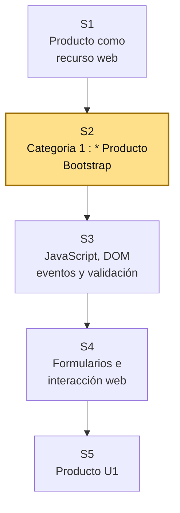
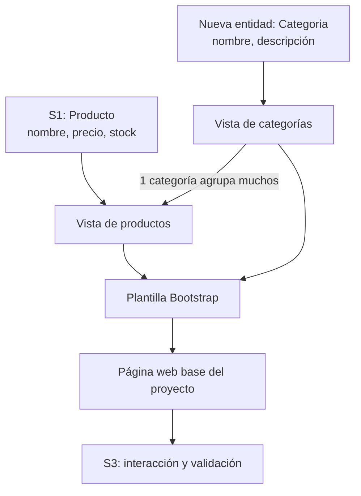

# S2 - Interfaces web con HTML, CSS y plantillas reutilizables (Bootstrap)

## 1. Introducción

Tiempo: 20 min.

### 1.1 Propósito

Ampliar la interfaz de productos construida en S1 mediante HTML, CSS y Bootstrap, incorporando `Categoria` y representando la relación `Categoria 1 : * Producto`.

### 1.2 Resultado de aprendizaje

El estudiante construye una plantilla web reutilizable, organiza la navegación de productos y categorías, y muestra que cada producto pertenece a una categoría y que una categoría puede agrupar muchos productos.

### 1.3 Producto de sesión

Plantilla web responsive con navegación y vistas iniciales de productos y categorías; el listado de productos muestra la categoría correspondiente.

### 1.4 Motivación de la sesión

#### 1.4.1 Caso: del alcance a la primera interfaz

En S1 se recuperó `Producto` del modelo de POO y se representó como recurso web. En S2 el dominio crece con una entidad necesaria para organizar el catálogo: `Categoria`. Este incremento debe verse en el menú, en las vistas y en la asociación mostrada para cada producto.

Preguntas para los estudiantes:

1. ¿Qué opciones debe tener el menú según el alcance?
2. ¿Qué vista necesita el stakeholder principal?
3. ¿Por qué Categoria debe ser una entidad y no un texto repetido sin control?
4. ¿Cómo se muestra la categoría a la que pertenece cada producto?
5. ¿Qué elementos visuales se repetirán en todo el sistema?

### 1.5 Ubicación en el curso

- Unidad: U1 - Fundamentos del Desarrollo Web.
- Producto de unidad: página web interactiva con plantillas y formularios.
- Producto del curso: Sistema Web MVC Empresarial.
- Avance del producto en esta sesión: plantilla base, navegación y vistas de `Producto` y la nueva entidad `Categoria`.

Roadmap del producto de la unidad:



## 2. Explica

Tiempo: 25 min.

### 2.1 Conceptos clave

Una interfaz web no es solo decoración. Debe permitir que el usuario entienda qué puede hacer, dónde está y cómo avanzar en el flujo del sistema.

Conceptos de la sesión:

- HTML semántico.
- CSS.
- Bootstrap.
- Layout.
- Navbar.
- Container, row y column.
- Card, table y form.
- Plantilla reutilizable.
- Navegación inicial.
- Coherencia visual con el dominio.
- Representación visual de una relación uno a muchos.

Alcance metodológico de S2:

```text
En S2 se construye una plantilla navegable para Producto y Categoria.
No se implementa todavía lógica fuerte de JavaScript ni persistencia.

La interacción con DOM y validaciones se trabaja en S3.
Los formularios más completos se trabajan en S4.
MVC inicia en S6.
```

### 2.2 Arquitectura de la sesión



Lectura del diagrama:

- `Producto` mantiene los datos trabajados en POO y representados en S1.
- `Categoria` se incorpora como nuevo incremento de LP1.
- La interfaz expresa la asociación, aunque la persistencia se implemente posteriormente.

### 2.3 Flujo de trabajo

1. Revisar `Producto` y sus atributos recuperados de POO en S1.
2. Definir `Categoria` con nombre y descripción y establecer la relación `1 : *` con `Producto`.
3. Diseñar navegación mínima.
4. Integrar Bootstrap.
5. Crear layout base.
6. Crear una vista de inicio contextualizada.
7. Crear vistas iniciales de categorías y productos.
8. Preparar un formulario de producto con selección de categoría.
9. Registrar evidencia de ejecución.

### 2.4 Errores frecuentes y diagnóstico

| Problema | Causa probable | Solución |
|---|---|---|
| La interfaz parece genérica | No se usó el dominio del proyecto | Incluir problema, actor y entidades del proceso principal |
| Menú con demasiadas opciones | No se respetó el alcance de REQ | Mantener solo vistas necesarias para el primer incremento |
| Producto no muestra categoría | La nueva relación no llegó a la interfaz | Agregar la columna y el selector de Categoria |
| Bootstrap no carga | CDN mal copiado o sin conexión | Verificar enlace y consola del navegador |
| Categoria se guarda como texto libre repetido | No se representó como entidad | Usar una vista de categorías y seleccionar una al mostrar o registrar el producto |
| Se intenta conectar base de datos | Se adelantó contenido de S6 | En S2 solo se maqueta la interfaz |

## 3. Aplica: actividad práctica guiada

Tiempo: 2h.

### 3.1 Revisar insumos de integración

**Producto del paso:** decisiones para la interfaz.

| Insumo | Fuente | Decisión para LP1 |
|---|---|---|
| Stakeholder principal | REQ S02 | |
| Alcance principal | REQ S02 | |
| `Producto`: nombre, precio y stock | POO / LP1 S1 | |
| `Categoria`: nombre y descripción | LP1 S2 | |
| Relación `Categoria 1 : * Producto` | LP1 S2 / validación con BD1 | |

### 3.2 Integrar Bootstrap

**Producto del paso:** página con Bootstrap disponible.

Agregar en `index.html`:

```html
<link href="https://cdn.jsdelivr.net/npm/bootstrap@5.3.3/dist/css/bootstrap.min.css" rel="stylesheet">
```

Antes de cerrar `body`:

```html
<script src="https://cdn.jsdelivr.net/npm/bootstrap@5.3.3/dist/js/bootstrap.bundle.min.js"></script>
```

### 3.3 Crear navegación inicial

**Producto del paso:** menú alineado al alcance.

Ejemplo:

```html
<nav class="navbar navbar-expand-lg bg-body-tertiary border-bottom">
    <div class="container">
        <a class="navbar-brand" href="#">BOMstart</a>
        <button class="navbar-toggler" type="button" data-bs-toggle="collapse" data-bs-target="#menuPrincipal">
            <span class="navbar-toggler-icon"></span>
        </button>
        <div class="collapse navbar-collapse" id="menuPrincipal">
            <ul class="navbar-nav ms-auto">
                <li class="nav-item"><a class="nav-link" href="#inicio">Inicio</a></li>
                <li class="nav-item"><a class="nav-link" href="#productos">Productos</a></li>
                <li class="nav-item"><a class="nav-link" href="#categorias">Categorías</a></li>
            </ul>
        </div>
    </div>
</nav>
```

### 3.4 Crear vista de inicio

**Producto del paso:** portada funcional del sistema.

```html
<section id="inicio" class="container py-4">
    <h1 class="h3">Sistema Web MVC Empresarial</h1>
    <p class="text-muted">Describe aquí el problema definido en REQ y el valor esperado para el usuario.</p>
</section>
```

### 3.5 Crear las vistas de productos y categorías

**Producto del paso:** representación visible de la relación `Categoria 1 : * Producto`.

```html
<section id="productos" class="container py-4">
    <h2 class="h4">Productos</h2>
    <div class="table-responsive">
        <table class="table table-bordered table-hover align-middle">
            <thead class="table-light">
                <tr>
                    <th>Nombre</th>
                    <th>Precio</th>
                    <th>Stock</th>
                    <th>Categoría</th>
                </tr>
            </thead>
            <tbody>
                <tr>
                    <td>Teclado mecánico</td>
                    <td>S/ 120.00</td>
                    <td>10</td>
                    <td>Periféricos</td>
                </tr>
            </tbody>
        </table>
    </div>
</section>

<section id="categorias" class="container py-4">
    <h2 class="h4">Categorías</h2>
    <article class="card card-body">
        <h3 class="h5">Periféricos</h3>
        <p class="mb-0">Dispositivos complementarios para computadoras.</p>
    </article>
</section>
```

### 3.6 Preparar el formulario de producto con categoría

**Producto del paso:** formulario maqueta para S3-S4 con selección de una categoría existente.

```html
<section id="nuevo-producto" class="container py-4">
    <h2 class="h4">Nuevo producto</h2>
    <form class="row g-3">
        <div class="col-md-6">
            <label class="form-label" for="nombreProducto">Nombre</label>
            <input id="nombreProducto" type="text" class="form-control">
        </div>
        <div class="col-md-6">
            <label class="form-label" for="categoriaProducto">Categoría</label>
            <select id="categoriaProducto" class="form-select">
                <option value="">Seleccione</option>
                <option>Periféricos</option>
            </select>
        </div>
    </form>
</section>
```

### 3.7 Verificar coherencia con REQ y BD1

**Producto del paso:** checklist de integración.

| Pregunta | Respuesta |
|---|---|
| ¿El menú respeta el alcance de REQ? | |
| ¿Producto conserva nombre, precio y stock del modelo de POO? | |
| ¿Categoria tiene una vista propia? | |
| ¿Cada producto muestra o selecciona una categoría? | |
| ¿La página puede evolucionar a formulario en S3-S4? | |

## 4. Crea: actividad autónoma

Tiempo: 2h fuera del aula.

Cada estudiante consolida la plantilla web y prepara evidencia individual.

### 4.1 Plantilla de evidencia individual

Entrega un PDF con el siguiente nombre:

```text
S02_LP1_Equipo##_ApellidoNombre.pdf
```

#### 4.1.1 Datos del estudiante

- Nombre:
- Equipo:
- Sesión: S02 - Interfaces web con HTML, CSS y plantillas reutilizables
- Rol o aporte realizado:
- Link de GitHub:

#### 4.1.2 Trabajo autónomo realizado

Completa y evidencia estas tareas:

1. Integrar Bootstrap en el proyecto.
2. Crear navegación inicial según alcance de REQ.
3. Crear vista de inicio contextualizada.
4. Crear vistas de `Producto` y `Categoria`.
5. Mostrar la categoría de cada producto y preparar un selector de categoría.
6. Revisar responsividad básica.
7. Explicar la continuidad POO–LP1 y cómo BD1 formalizará la relación para su persistencia posterior.

#### 4.1.3 Evidencia técnica

Incluye:

- Captura de la página ejecutándose.
- Código de navegación.
- Código de vista de inicio.
- Código de tabla o tarjeta de entidades del proceso principal.
- Código de maqueta de formulario o búsqueda.
- Tabla de coherencia REQ-BD1-LP1.

#### 4.1.4 Error o hallazgo

Describe un problema visual o técnico: Bootstrap no cargaba, menú no respondía, tabla se veía mal en móvil o campos no coincidían con BD1.

#### 4.1.5 Reflexión técnica breve

Responde en 5 a 8 líneas:

```text
¿Cómo demuestra la interfaz que LP1 continúa Producto desde POO y agrega Categoria sin adelantar persistencia?
```

### 4.2 Criterios mínimos de aceptación

La evidencia individual se considera completa si:

- El archivo respeta el nombre solicitado.
- Integra Bootstrap correctamente.
- Incluye navegación inicial.
- La interfaz refleja el dominio del proyecto.
- La vista de Producto conserva nombre, precio y stock.
- Existe una vista de Categoria y cada producto muestra o selecciona una categoría.
- Incluye maqueta de consulta o formulario.
- Explica integración con REQ y BD1.
- Cada evidencia tiene una descripción breve.

## 5. Cierre evaluativo

Tiempo: 20 min.

### 5.1 Resultados esperados

Al finalizar la sesión, el estudiante debe demostrar que:

- Usa HTML semántico y Bootstrap básico.
- Construye una navegación inicial.
- Organiza una plantilla reutilizable.
- Representa `Producto`, `Categoria` y su relación uno a muchos en vistas iniciales.
- Relaciona campos visibles con atributos de BD1.
- Explica cómo la interfaz responde al alcance de REQ.

### 5.2 Evidencia del producto de sesión

Cada estudiante entrega un PDF individual siguiendo la plantilla de la sección 4.1.

Nombre del archivo:

```text
S02_LP1_Equipo##_ApellidoNombre.pdf
```

### 5.3 Preguntas de defensa y reflexión

1. ¿Qué opción del menú responde directamente al alcance de REQ?
2. ¿Qué atributos de Producto provienen del trabajo realizado en POO?
3. ¿Cómo se representa que una categoría agrupa muchos productos?
4. ¿Qué parte de la plantilla será reutilizable?
5. ¿Qué se debe mejorar en S3 con JavaScript?
6. ¿Qué pantalla no incluiste porque está fuera del alcance?

### 5.4 Rúbrica de evaluación

| Dimensión | Peso | 3 - Logro destacado | 2 - Logro | 1 - Proceso | 0 - Inicio | Puntuación obtenida |
|---|---:|---|---|---|---|---:|
| 1. Estructura HTML | 2 | Usa estructura semántica clara, ordenada y contextualizada. | Presenta estructura funcional. | Estructura parcial o desordenada. | No presenta HTML funcional. | |
| 2. Bootstrap y diseño | 2 | Integra Bootstrap y logra una interfaz limpia y responsiva. | Usa Bootstrap de forma funcional. | Uso limitado o con errores visuales. | No integra Bootstrap. | |
| 3. Navegación y plantilla | 2 | Menú y layout responden al alcance y son reutilizables. | Presenta navegación funcional. | Navegación incompleta o poco alineada. | No presenta navegación. | |
| 4. Continuidad del dominio | 2 | Producto conserva el modelo de POO y la interfaz representa claramente `Categoria 1 : * Producto`. | Presenta productos, categorías y su asociación. | La relación es parcial o poco clara. | No evidencia continuidad ni relación. | |
| 5. Hallazgo técnico | 1 | Analiza problema visual/técnico y explica solución. | Presenta problema y solución. | Menciona problema sin análisis. | No presenta hallazgo. | |
| 6. Orden y reflexión | 1 | Evidencia ordenada, legible y reflexión técnica clara. | Evidencia suficiente y reflexión comprensible. | Evidencia incompleta o reflexión superficial. | Evidencia desordenada o sin reflexión. | |

Puntuación acumulada = suma de (`Peso` * `Puntuación obtenida`) = ____.

Nota final = (`Puntuación acumulada` / 30) * 20 = ____.
