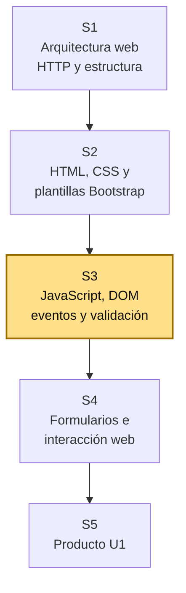
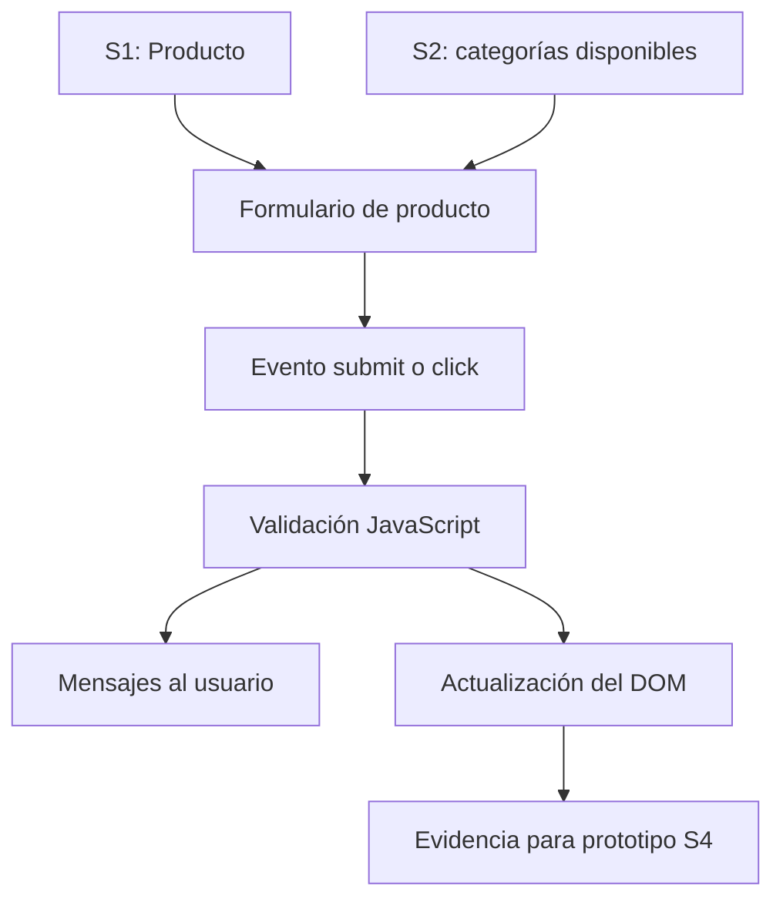

# S3 - JavaScript, DOM, eventos y validación de formularios

## 1. Introducción

Tiempo: 20 min.

### 1.1 Propósito

Agregar interactividad mediante JavaScript, DOM, eventos y validaciones al formulario de `Producto` construido sobre las vistas de productos y categorías de S2.

### 1.2 Resultado de aprendizaje

El estudiante manipula el DOM, captura eventos y valida nombre, precio, stock y categoría del producto, mostrando retroalimentación clara al usuario.

### 1.3 Producto de sesión

Formulario interactivo de Producto con selección de Categoria, validaciones en el navegador, mensajes y listado temporal.

### 1.4 Motivación de la sesión

#### 1.4.1 Caso: la interfaz debe responder al usuario

En S2 la interfaz ya mostró productos, categorías y su relación. En S3 deja de ser solo maqueta: el usuario registra temporalmente un producto, selecciona una categoría y recibe validaciones sin esperar todavía una base de datos real.

Preguntas para los estudiantes:

1. ¿Qué requerimiento Must de REQ necesita interacción primero?
2. ¿Cómo se evita ingresar una categoría inexistente?
3. ¿Qué reglas corresponden a nombre, precio y stock?
4. ¿Qué reglas deben validarse antes de enviar datos?
5. ¿Qué mensaje debe ver el usuario si algo está mal?

### 1.5 Ubicación en el curso

- Unidad: U1 - Fundamentos del Desarrollo Web.
- Producto de unidad: página web interactiva con plantillas y formularios.
- Producto del curso: Sistema Web MVC Empresarial.
- Avance del producto en esta sesión: formulario interactivo y validaciones iniciales conectadas al dominio.

Roadmap del producto de la unidad:



## 2. Explica

Tiempo: 25 min.

### 2.1 Conceptos clave

JavaScript permite que la página responda a acciones del usuario. El DOM representa la estructura de la página y puede modificarse mediante código.

Conceptos de la sesión:

- JavaScript en el navegador.
- DOM.
- Selector.
- Evento.
- Listener.
- Validación del lado del cliente.
- Mensaje de error.
- Mensaje de confirmación.
- Clase CSS dinámica.
- Datos temporales en memoria.
- Relación entre regla de negocio y validación.

Alcance metodológico de S3:

```text
En S3 se valida en el navegador y se manipula la interfaz.
No se guarda todavía en base de datos ni se implementa MVC.

El procesamiento integrado de formularios continúa en S4.
MVC con persistencia inicia en S6.
```

### 2.2 Arquitectura de la sesión



Lectura del diagrama:

- REQ define qué flujo se valida primero.
- BD1 define campos y restricciones.
- LP1 implementa interacción y retroalimentación visual.

### 2.3 Flujo de trabajo

1. Recuperar `Producto` de S1 y las categorías incorporadas en S2.
2. Definir reglas: nombre obligatorio, precio y stock no negativos, y categoría seleccionada.
3. Crear o ajustar formulario en HTML.
4. Seleccionar elementos del DOM.
5. Capturar evento `submit` o `click`.
6. Validar campos obligatorios, formato y reglas básicas.
7. Mostrar errores o confirmación.
8. Actualizar una tabla o lista en pantalla.
9. Registrar evidencia de pruebas válidas e inválidas.

### 2.4 Errores frecuentes y diagnóstico

| Problema | Causa probable | Solución |
|---|---|---|
| JavaScript no ejecuta | Archivo no enlazado o error de consola | Revisar `script src` y DevTools |
| El formulario recarga la página | No se usó `preventDefault()` | Capturar evento `submit` y prevenir envío por defecto |
| Valida campos que no existen en BD1 | No se revisó modelo ER | Usar atributos y restricciones del modelo avanzado |
| Mensajes poco claros | Se piensa solo en código | Redactar mensajes para el usuario final |
| Todo se valida igual | No se diferencian reglas | Aplicar validaciones según tipo de dato y restricción |
| Se simula base de datos | Se adelantó persistencia | Usar datos temporales solo para evidencia visual |

## 3. Aplica: actividad práctica guiada

Tiempo: 2h.

### 3.1 Revisar insumos REQ-BD1

**Producto del paso:** reglas para el formulario.

| Insumo | Fuente | Aplicación en LP1 |
|---|---|---|
| `Producto` | POO / LP1 S1 | Nombre, precio y stock |
| `Categoria` | LP1 S2 | Opciones válidas del selector |
| Restricciones | Validación con BD1 | Nombre obligatorio; precio y stock no negativos |
| Criterio de aceptación | REQ | Resultado esperado para el usuario |

### 3.2 Crear formulario base

**Producto del paso:** formulario asociado al proceso principal.

Ejemplo:

```html
<form id="formProducto" class="row g-3">
    <div class="col-md-6">
        <label class="form-label">Nombre</label>
        <input id="nombre" type="text" class="form-control">
        <div class="invalid-feedback">Ingrese el nombre.</div>
    </div>
    <div class="col-md-3">
        <label class="form-label">Precio</label>
        <input id="precio" type="number" min="0" step="0.01" class="form-control">
    </div>
    <div class="col-md-3">
        <label class="form-label">Stock</label>
        <input id="stock" type="number" min="0" step="1" class="form-control">
    </div>
    <div class="col-md-6">
        <label class="form-label">Categoría</label>
        <select id="categoria" class="form-select">
            <option value="">Seleccione</option>
            <option value="1">Útiles</option>
            <option value="2">Accesorios</option>
        </select>
    </div>
    <div class="col-md-3 d-flex align-items-end">
        <button class="btn btn-primary w-100" type="submit">Registrar</button>
    </div>
</form>

<div id="mensaje" class="mt-3"></div>
```

### 3.3 Seleccionar elementos del DOM

**Producto del paso:** referencias JavaScript.

```javascript
const formProducto = document.querySelector("#formProducto");
const nombre = document.querySelector("#nombre");
const precio = document.querySelector("#precio");
const stock = document.querySelector("#stock");
const categoria = document.querySelector("#categoria");
const mensaje = document.querySelector("#mensaje");
```

### 3.4 Capturar evento y prevenir recarga

**Producto del paso:** formulario controlado con JavaScript.

```javascript
formProducto.addEventListener("submit", function (event) {
    event.preventDefault();
    validarFormulario();
});
```

### 3.5 Validar campos y reglas básicas

**Producto del paso:** validación inicial.

```javascript
function validarFormulario() {
    let valido = true;

    if (nombre.value.trim() === "") {
        nombre.classList.add("is-invalid");
        valido = false;
    } else {
        nombre.classList.remove("is-invalid");
    }

    if (precio.value === "" || Number(precio.value) < 0) {
        precio.classList.add("is-invalid");
        valido = false;
    } else {
        precio.classList.remove("is-invalid");
    }

    if (stock.value === "" || !Number.isInteger(Number(stock.value)) || Number(stock.value) < 0) {
        stock.classList.add("is-invalid");
        valido = false;
    } else {
        stock.classList.remove("is-invalid");
    }

    if (categoria.value === "") {
        categoria.classList.add("is-invalid");
        valido = false;
    } else {
        categoria.classList.remove("is-invalid");
    }

    if (valido) {
        mensaje.innerHTML = `<div class="alert alert-success">Registro validado correctamente.</div>`;
    } else {
        mensaje.innerHTML = `<div class="alert alert-danger">Revise los campos marcados.</div>`;
    }
}
```

### 3.6 Actualizar una lista o tabla temporal

**Producto del paso:** evidencia visual de interacción.

```html
<table class="table mt-4">
    <thead>
        <tr>
            <th>Producto</th>
            <th>Precio</th>
            <th>Stock</th>
            <th>Categoría</th>
        </tr>
    </thead>
    <tbody id="tablaTemporal"></tbody>
</table>
```

```javascript
const tablaTemporal = document.querySelector("#tablaTemporal");

function agregarFilaTemporal() {
    tablaTemporal.innerHTML += `
        <tr>
            <td>${nombre.value}</td>
            <td>${precio.value}</td>
            <td>${stock.value}</td>
            <td>${categoria.options[categoria.selectedIndex].text}</td>
        </tr>
    `;
}
```

La función puede llamarse cuando `valido` sea verdadero.

### 3.7 Verificar casos de prueba

**Producto del paso:** pruebas válidas e inválidas.

| Caso | Entrada | Resultado esperado |
|---|---|---|
| Nombre vacío | nombre vacío | Mensaje de error |
| Precio o stock inválido | valor negativo o stock decimal | Mensaje de error |
| Categoría vacía | no seleccionar categoría | Mensaje de error |
| Datos válidos | nombre, precio, stock y categoría válidos | Confirmación y fila temporal |

## 4. Crea: actividad autónoma

Tiempo: 2h fuera del aula.

Cada estudiante consolida la interactividad y validación del formulario del proyecto.

### 4.1 Plantilla de evidencia individual

Entrega un PDF con el siguiente nombre:

```text
S03_LP1_Equipo##_ApellidoNombre.pdf
```

#### 4.1.1 Datos del estudiante

- Nombre:
- Equipo:
- Sesión: S03 - JavaScript, DOM, eventos y validación de formularios
- Rol o aporte realizado:
- Link de GitHub:

#### 4.1.2 Trabajo autónomo realizado

Completa y evidencia estas tareas:

1. Elegir un requerimiento Must de REQ S03.
2. Usar campos derivados de BD1 S03.
3. Implementar formulario HTML.
4. Seleccionar elementos con JavaScript.
5. Capturar evento `submit` o `click`.
6. Validar al menos dos reglas.
7. Mostrar mensajes de error o confirmación.
8. Actualizar una tabla o lista temporal.
9. Probar casos válidos e inválidos.

#### 4.1.3 Evidencia técnica

Incluye:

- Código HTML del formulario.
- Código JavaScript de selección DOM.
- Código de eventos.
- Código de validaciones.
- Capturas de caso inválido.
- Capturas de caso válido.
- Tabla de relación REQ-BD1-LP1.

#### 4.1.4 Error o hallazgo

Describe un error técnico: evento no ejecutaba, validación fallaba, clase CSS no se aplicaba o tabla no se actualizaba.

#### 4.1.5 Reflexión técnica breve

Responde en 5 a 8 líneas:

```text
¿Por qué una validación de formulario debe relacionarse con un requerimiento y una regla de datos?
```

### 4.2 Criterios mínimos de aceptación

La evidencia individual se considera completa si:

- El archivo respeta el nombre solicitado.
- El formulario corresponde a un requerimiento priorizado.
- Los campos se relacionan con BD1.
- Usa DOM y eventos.
- Valida al menos dos reglas.
- Muestra mensajes al usuario.
- Incluye pruebas válidas e inválidas.
- Cada evidencia tiene una descripción breve.

## 5. Cierre evaluativo

Tiempo: 20 min.

### 5.1 Resultados esperados

Al finalizar la sesión, el estudiante debe demostrar que:

- Selecciona elementos del DOM.
- Captura eventos del usuario.
- Aplica validaciones del lado cliente.
- Muestra retroalimentación clara.
- Actualiza la página dinámicamente.
- Relaciona validaciones con REQ y BD1.

### 5.2 Evidencia del producto de sesión

Cada estudiante entrega un PDF individual siguiendo la plantilla de la sección 4.1.

Nombre del archivo:

```text
S03_LP1_Equipo##_ApellidoNombre.pdf
```

### 5.3 Preguntas de defensa y reflexión

1. ¿Qué requerimiento priorizado estás validando?
2. ¿Qué campos vienen del modelo de BD1?
3. ¿Qué evento estás capturando?
4. ¿Qué hace `preventDefault()`?
5. ¿Qué regla de datos se valida en JavaScript?
6. ¿Qué caso inválido probaste y qué resultado mostró?

### 5.4 Rúbrica de evaluación

| Dimensión | Peso | 3 - Logro destacado | 2 - Logro | 1 - Proceso | 0 - Inicio | Puntuación obtenida |
|---|---:|---|---|---|---|---:|
| 1. DOM y eventos | 2 | Selecciona elementos y controla eventos con claridad. | Usa DOM y eventos funcionales. | Uso parcial o con errores. | No usa DOM ni eventos. | |
| 2. Validación | 2 | Valida reglas relevantes derivadas de REQ y BD1. | Valida campos principales. | Validación incompleta o genérica. | No valida. | |
| 3. Retroalimentación | 2 | Muestra mensajes claros y actualiza la interfaz correctamente. | Presenta mensajes funcionales. | Mensajes poco claros o incompletos. | No hay retroalimentación. | |
| 4. Integración | 2 | Relaciona formulario, campos y reglas con REQ y BD1. | Relación general con el proyecto. | Relación parcial o débil. | No evidencia integración. | |
| 5. Pruebas y hallazgo | 1 | Presenta pruebas válidas e inválidas y analiza un error. | Presenta pruebas básicas. | Evidencia limitada. | No presenta pruebas. | |
| 6. Orden y reflexión | 1 | Evidencia ordenada, legible y reflexión técnica clara. | Evidencia suficiente y reflexión comprensible. | Evidencia incompleta o reflexión superficial. | Evidencia desordenada o sin reflexión. | |

Puntuación acumulada = suma de (`Peso` * `Puntuación obtenida`) = ____.

Nota final = (`Puntuación acumulada` / 30) * 20 = ____.
