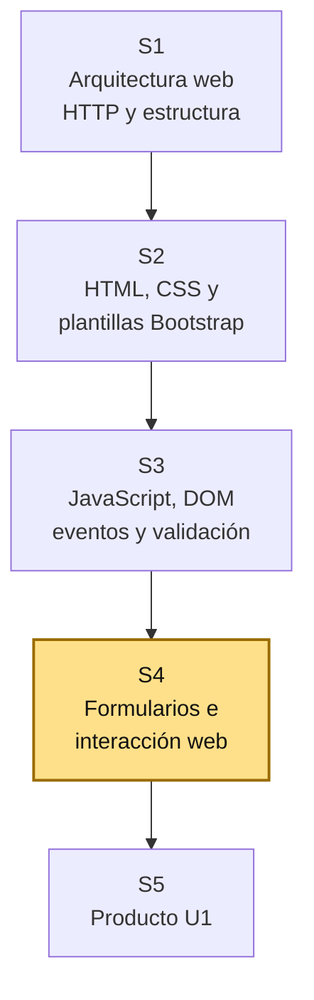
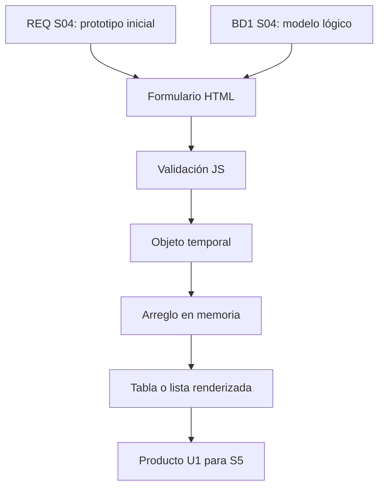

# S4 - Formularios, procesamiento de datos e interacción web

## 1. Introducción

Tiempo: 20 min.

### 1.1 Propósito

Consolidar una página web interactiva con formularios, procesamiento básico de datos en el navegador, mensajes y visualización temporal, alineada al prototipo inicial de REQ y al modelo lógico de BD1.

### 1.2 Resultado de aprendizaje

El estudiante integra formularios HTML, validación JavaScript, procesamiento básico de datos y actualización dinámica de la interfaz para representar el primer incremento funcional del proyecto.

### 1.3 Producto de sesión

Página web interactiva integrada con formularios, validaciones, mensajes y listado temporal del proceso principal.

### 1.4 Motivación de la sesión

#### 1.4.1 Caso: una maqueta que ya se puede probar

En S2 se creó la interfaz base y en S3 se agregaron eventos y validaciones. En S4 se consolida una versión interactiva del flujo priorizado: el usuario llena datos, el sistema valida, muestra mensajes y actualiza una vista temporal.

Para mantener la continuidad, el proceso utiliza productos ya asociados a categorías; no vuelve a capturar la categoría como texto libre.

Preguntas para los estudiantes:

1. ¿Qué prototipo de REQ se implementará en HTML?
2. ¿Qué campos vienen del modelo lógico de BD1?
3. ¿Qué validaciones ya deben funcionar?
4. ¿Qué resultado temporal verá el usuario?
5. ¿Qué parte quedará lista para evolucionar a MVC en S6?

### 1.5 Ubicación en el curso

- Unidad: U1 - Fundamentos del Desarrollo Web.
- Producto de unidad: página web interactiva con plantillas y formularios.
- Producto del curso: Sistema Web MVC Empresarial.
- Avance del producto en esta sesión: página interactiva integrada para evaluación U1.

Roadmap del producto de la unidad:



## 2. Explica

Tiempo: 25 min.

### 2.1 Conceptos clave

Un formulario web permite capturar datos del usuario. Antes de conectar con una base de datos, se puede procesar información temporal en el navegador para validar el flujo y la experiencia.

Conceptos de la sesión:

- Formulario HTML.
- Campo obligatorio.
- Validación del lado cliente.
- Procesamiento básico de datos.
- Arreglo temporal.
- Objeto literal en JavaScript.
- Renderizado de tabla.
- Mensaje de confirmación.
- Mensaje de error.
- Limpieza de formulario.
- Flujo de interacción.
- Preparación para MVC.

Alcance metodológico de S4:

```text
En S4 se consolida una página interactiva de U1.
Los datos se manejan temporalmente en el navegador.

La persistencia real, rutas, controladores y servicios se trabajan
desde S6 en la unidad MVC.
```

### 2.2 Arquitectura de la sesión



Lectura del diagrama:

- REQ define flujo y pantalla.
- BD1 define campos y relaciones.
- LP1 implementa interacción temporal para probar la experiencia.

### 2.3 Flujo de trabajo

1. Revisar prototipo de REQ S04.
2. Revisar tablas y columnas del modelo lógico BD1 S04.
3. Ajustar formulario HTML.
4. Capturar evento del formulario.
5. Validar campos obligatorios y reglas básicas.
6. Crear objeto temporal con los datos.
7. Agregar el objeto a un arreglo temporal.
8. Renderizar tabla o lista en pantalla.
9. Limpiar formulario y mostrar mensajes.
10. Preparar evidencia para evaluación U1.

### 2.4 Errores frecuentes y diagnóstico

| Problema | Causa probable | Solución |
|---|---|---|
| El formulario no representa el prototipo | No se revisó REQ S04 | Comparar pantalla implementada con wireframe |
| Campos no coinciden con BD1 | No se revisó modelo lógico | Usar columnas necesarias como guía |
| Los datos desaparecen sin explicación | Se espera persistencia real | Aclarar que en U1 se usan datos temporales |
| La tabla no se actualiza | No se renderizó después de agregar | Llamar función de renderizado luego de guardar temporalmente |
| Se permite guardar datos inválidos | Validación incompleta | Validar antes de crear el objeto temporal |
| Código repetido | No se usan funciones | Separar validar, agregar, renderizar y limpiar |

## 3. Aplica: actividad práctica guiada

Tiempo: 2h.

### 3.1 Revisar insumos de integración

**Producto del paso:** formulario definido por REQ y BD1.

| Insumo | Fuente | Uso en LP1 |
|---|---|---|
| Pantalla del prototipo | REQ S04 | Estructura del formulario |
| Campo o columna | BD1 S04 | Input, select o tabla |
| Criterio de aceptación | REQ S03/S04 | Resultado esperado |
| Restricción de datos | BD1 S03/S04 | Validación JavaScript |

### 3.2 Crear estructura HTML del formulario

**Producto del paso:** formulario completo del primer incremento.

```html
<form id="formRegistro" class="row g-3">
    <div class="col-md-6">
        <label class="form-label">Cliente</label>
        <input id="cliente" class="form-control" type="text">
    </div>
    <div class="col-md-3">
        <label class="form-label">Producto</label>
        <select id="producto" class="form-select">
            <option value="">Seleccione</option>
            <option value="Pack escolar" data-categoria="Útiles">Pack escolar</option>
            <option value="Mochila urbana" data-categoria="Accesorios">Mochila urbana</option>
        </select>
    </div>
    <div class="col-md-3">
        <label class="form-label">Categoría</label>
        <input id="categoria" class="form-control" type="text" readonly>
    </div>
    <div class="col-md-3">
        <label class="form-label">Cantidad</label>
        <input id="cantidad" class="form-control" type="number">
    </div>
    <div class="col-12">
        <button class="btn btn-primary" type="submit">Registrar</button>
    </div>
</form>

<div id="mensaje" class="mt-3"></div>
```

### 3.3 Crear arreglo temporal

**Producto del paso:** almacenamiento temporal en navegador.

```javascript
const registros = [];
```

### 3.4 Capturar y validar datos

**Producto del paso:** procesamiento controlado.

```javascript
const formRegistro = document.querySelector("#formRegistro");
const cliente = document.querySelector("#cliente");
const producto = document.querySelector("#producto");
const categoria = document.querySelector("#categoria");
const cantidad = document.querySelector("#cantidad");
const mensaje = document.querySelector("#mensaje");

producto.addEventListener("change", function () {
    const opcion = producto.options[producto.selectedIndex];
    categoria.value = opcion.dataset.categoria || "";
});

formRegistro.addEventListener("submit", function (event) {
    event.preventDefault();

    if (cliente.value.trim() === "" || producto.value === "" || categoria.value === "" || Number(cantidad.value) <= 0) {
        mensaje.innerHTML = `<div class="alert alert-danger">Complete los datos correctamente.</div>`;
        return;
    }

    const registro = {
        cliente: cliente.value.trim(),
        producto: producto.value.trim(),
        categoria: categoria.value,
        cantidad: Number(cantidad.value)
    };

    registros.push(registro);
    renderizarRegistros();
    formRegistro.reset();
    categoria.value = "";
    mensaje.innerHTML = `<div class="alert alert-success">Registro agregado temporalmente.</div>`;
});
```

### 3.5 Renderizar tabla de resultados

**Producto del paso:** salida visual del procesamiento.

```html
<table class="table table-bordered table-hover mt-4">
    <thead class="table-light">
        <tr>
            <th>Cliente</th>
            <th>Producto</th>
            <th>Categoría</th>
            <th>Cantidad</th>
        </tr>
    </thead>
    <tbody id="tablaRegistros"></tbody>
</table>
```

```javascript
const tablaRegistros = document.querySelector("#tablaRegistros");

function renderizarRegistros() {
    tablaRegistros.innerHTML = "";

    registros.forEach(function (registro) {
        tablaRegistros.innerHTML += `
            <tr>
                <td>${registro.cliente}</td>
                <td>${registro.producto}</td>
                <td>${registro.categoria}</td>
                <td>${registro.cantidad}</td>
            </tr>
        `;
    });
}
```

### 3.6 Probar casos de interacción

**Producto del paso:** evidencia de funcionamiento.

| Caso | Acción | Resultado esperado |
|---|---|---|
| Datos vacíos | Presionar registrar sin datos | Mensaje de error |
| Cantidad inválida | Cantidad 0 o negativa | Mensaje de error |
| Datos válidos | Completar todos los campos | Registro aparece en tabla |

### 3.7 Preparar producto U1

**Producto del paso:** página lista para evaluación S5.

Checklist:

- Menú o navegación inicial.
- Formulario alineado al prototipo.
- Campos coherentes con modelo lógico.
- Validaciones básicas.
- Mensajes al usuario.
- Tabla o lista temporal.
- Evidencia de pruebas.

## 4. Crea: actividad autónoma

Tiempo: 2h fuera del aula.

Cada estudiante consolida la página interactiva y prepara evidencia individual.

### 4.1 Plantilla de evidencia individual

Entrega un PDF con el siguiente nombre:

```text
S04_LP1_Equipo##_ApellidoNombre.pdf
```

#### 4.1.1 Datos del estudiante

- Nombre:
- Equipo:
- Sesión: S04 - Formularios, procesamiento de datos e interacción web
- Rol o aporte realizado:
- Link de GitHub:

#### 4.1.2 Trabajo autónomo realizado

Completa y evidencia estas tareas:

1. Ajustar formulario según prototipo REQ S04.
2. Usar campos derivados del modelo lógico BD1 S04.
3. Capturar datos del formulario.
4. Validar al menos tres reglas o campos.
5. Crear objeto temporal.
6. Guardar en arreglo temporal.
7. Renderizar tabla o lista.
8. Mostrar mensajes de error y confirmación.
9. Preparar evidencia para S5.

#### 4.1.3 Evidencia técnica

Incluye:

- Captura de la página completa.
- Código HTML del formulario.
- Código JavaScript de validación.
- Código de arreglo temporal y renderizado.
- Captura de error.
- Captura de registro válido.
- Tabla de relación REQ-BD1-LP1.

#### 4.1.4 Error o hallazgo

Describe un problema encontrado al integrar formulario, validación y tabla temporal, y explica cómo lo corregiste.

#### 4.1.5 Reflexión técnica breve

Responde en 5 a 8 líneas:

```text
¿Por qué este producto U1 todavía no debe usar base de datos real, pero sí debe respetar el modelo lógico?
```

### 4.2 Criterios mínimos de aceptación

La evidencia individual se considera completa si:

- El archivo respeta el nombre solicitado.
- El formulario refleja el prototipo de REQ.
- Los campos se relacionan con BD1.
- Captura y valida datos.
- Usa arreglo u objeto temporal.
- Renderiza resultados en pantalla.
- Muestra mensajes de error y confirmación.
- Cada evidencia tiene una descripción breve.

## 5. Cierre evaluativo

Tiempo: 20 min.

### 5.1 Resultados esperados

Al finalizar la sesión, el estudiante debe demostrar que:

- Integra HTML, CSS/Bootstrap y JavaScript.
- Procesa datos básicos en el navegador.
- Valida campos según reglas del dominio.
- Muestra retroalimentación al usuario.
- Renderiza resultados temporales.
- Prepara el producto U1 para evaluación.

### 5.2 Evidencia del producto de sesión

Cada estudiante entrega un PDF individual siguiendo la plantilla de la sección 4.1.

Nombre del archivo:

```text
S04_LP1_Equipo##_ApellidoNombre.pdf
```

### 5.3 Preguntas de defensa y reflexión

1. ¿Qué prototipo de REQ implementaste?
2. ¿Qué campos vienen del modelo lógico de BD1?
3. ¿Qué validaciones aplicaste?
4. ¿Dónde guardas temporalmente los datos?
5. ¿Qué función renderiza la tabla o lista?
6. ¿Qué cambiará cuando el proyecto pase a MVC en S6?

### 5.4 Rúbrica de evaluación

| Dimensión | Peso | 3 - Logro destacado | 2 - Logro | 1 - Proceso | 0 - Inicio | Puntuación obtenida |
|---|---:|---|---|---|---|---:|
| 1. Formulario | 2 | Formulario completo, claro y alineado al prototipo. | Formulario funcional. | Formulario incompleto o poco alineado. | No presenta formulario funcional. | |
| 2. Procesamiento JS | 2 | Captura, valida, crea objetos y gestiona arreglo temporal correctamente. | Procesamiento funcional básico. | Procesamiento parcial o con errores. | No procesa datos. | |
| 3. Interacción visual | 2 | Mensajes y tabla/lista se actualizan de forma clara. | Retroalimentación funcional. | Retroalimentación incompleta. | No hay interacción visible. | |
| 4. Integración | 2 | Relaciona prototipo, modelo lógico y formulario con precisión. | Relación general con REQ y BD1. | Relación parcial o débil. | No evidencia integración. | |
| 5. Pruebas y hallazgo | 1 | Presenta pruebas y analiza un problema de integración. | Presenta pruebas básicas. | Evidencia limitada. | No presenta pruebas. | |
| 6. Orden y reflexión | 1 | Evidencia ordenada, legible y reflexión técnica clara. | Evidencia suficiente y reflexión comprensible. | Evidencia incompleta o reflexión superficial. | Evidencia desordenada o sin reflexión. | |

Puntuación acumulada = suma de (`Peso` * `Puntuación obtenida`) = ____.

Nota final = (`Puntuación acumulada` / 30) * 20 = ____.
