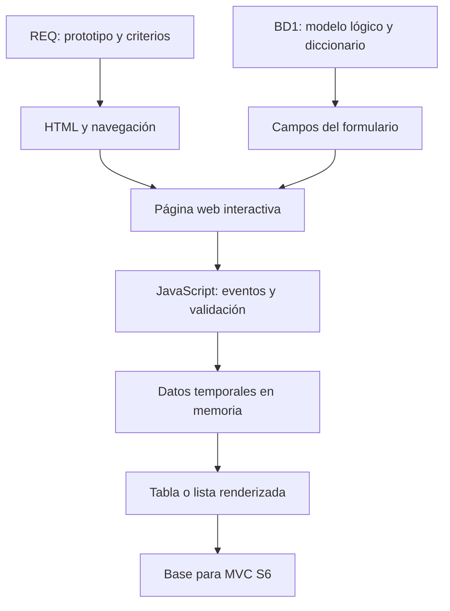

# S5 - Evaluación Unidad 1: página web interactiva

## 1. Introducción

Tiempo: 20 min.

### 1.1 Propósito

Evaluar el producto de la Unidad 1: página web interactiva con arquitectura base, plantillas, navegación, formularios, JavaScript, validaciones, mensajes y procesamiento temporal de datos, alineada a REQ y BD1.

### 1.2 Resultado de aprendizaje

El estudiante demuestra que puede construir, ejecutar, explicar y defender una página web interactiva que representa el primer incremento funcional del proyecto integrador.

### 1.3 Producto de sesión

Producto U1 integrado: página web interactiva con HTML, CSS/Bootstrap, JavaScript, formularios, validaciones y evidencias de ejecución.

### 1.4 Motivación de la sesión

La evaluación no revisa una página decorativa. Revisa si la interfaz representa el problema, usa campos coherentes con el modelo de datos y permite probar el flujo principal antes de iniciar MVC.

Preguntas para los estudiantes:

1. ¿Qué requerimiento priorizado representa tu página?
2. ¿Qué formulario implementa el prototipo de REQ?
3. ¿Qué campos vienen de BD1?
4. ¿Qué validaciones funcionan?
5. ¿Qué cambiará al pasar a MVC en S6?

### 1.5 Ubicación en el curso

- Unidad: U1 - Fundamentos del Desarrollo Web.
- Producto de unidad: página web interactiva con plantillas y formularios.
- Avance de sesión: evaluación integradora antes de iniciar MVC.

## 2. Explica

Tiempo: 15 min.

### 2.1 Conceptos clave

- Integración: HTML, CSS/Bootstrap y JavaScript funcionan en una sola experiencia.
- Evidencia individual: prueba verificable del aporte de cada estudiante.
- Diagnóstico: capacidad de ubicar fallos en HTML, CSS, JS o flujo de datos.
- Defensa técnica: explicación clara de decisiones de interfaz, validación e integración.

### 2.2 Arquitectura del producto U1



### 2.3 Criterios mínimos de revisión

- Estructura de proyecto web.
- Página inicial contextualizada.
- Bootstrap o CSS organizado.
- Navegación inicial.
- Formulario alineado al prototipo.
- Campos derivados del modelo lógico.
- Validaciones JavaScript.
- Mensajes de error y confirmación.
- Renderizado temporal de datos.
- Evidencia individual.

## 3. Aplica: evaluación práctica

Tiempo: 3h.

### 3.1 Preparar demostración

1. Abrir el proyecto web.
2. Mostrar estructura de carpetas.
3. Ejecutar la página.
4. Mostrar navegación y diseño responsive básico.
5. Demostrar formulario con datos inválidos.
6. Demostrar formulario con datos válidos.
7. Mostrar tabla o lista temporal.
8. Explicar relación con REQ y BD1.
9. Explicar qué pasará a MVC en S6.

### 3.2 Ejecutar pruebas base

El estudiante demuestra:

1. Carga correcta de HTML, CSS/Bootstrap y JS.
2. Navegación funcional.
3. Validación de campos obligatorios.
4. Validación de regla del dominio.
5. Mensaje de error.
6. Mensaje de confirmación.
7. Renderizado temporal.
8. Limpieza o actualización de formulario.

### 3.3 Demostración individual

Cada integrante debe poder responder:

- Qué parte implementó.
- Qué archivo modificó.
- Qué validación construyó.
- Qué error encontró y cómo lo corrigió.

## 4. Crea: evidencia individual

Tiempo: 4h fuera del aula.

### 4.1 Plantilla de evidencia individual

```text
S05_LP1_Equipo##_ApellidoNombre.pdf
```

#### 4.1.1 Datos del estudiante

- Nombre:
- Equipo:
- Sesión: S05 - Evaluación Unidad 1
- Rol o aporte realizado:
- Link de GitHub:

#### 4.1.2 Trabajo autónomo realizado

1. Ordenar evidencias de S1-S4.
2. Corregir observaciones finales.
3. Completar README o descripción breve.
4. Preparar defensa individual.
5. Registrar capturas de pruebas válidas e inválidas.

#### 4.1.3 Evidencia técnica

- Estructura de carpetas.
- HTML principal.
- CSS/Bootstrap aplicado.
- JavaScript de eventos.
- Validaciones.
- Mensajes.
- Tabla/lista temporal.
- Relación con REQ y BD1.
- Aporte individual.

#### 4.1.4 Error o hallazgo

Describe un problema encontrado en U1 y cómo lo diagnosticaste.

#### 4.1.5 Reflexión técnica breve

Explica cómo tu página interactiva prepara el paso hacia una aplicación MVC.

### 4.2 Criterios mínimos de aceptación

- PDF con nombre correcto.
- Evidencia del producto U1 funcionando.
- Evidencia de aporte individual.
- Pruebas válidas e inválidas.
- Relación con REQ y BD1.
- Defensa técnica preparada.

## 5. Cierre evaluativo

Tiempo: 20 min.

### 5.1 Resultados esperados

- Página web interactiva ejecutada.
- Formulario y validaciones demostradas.
- Integración REQ-BD1-LP1 explicada.
- Evidencia individual entregada.
- Base lista para iniciar MVC en S6.

### 5.2 Evidencia del producto de sesión

```text
S05_LP1_Equipo##_ApellidoNombre.pdf
```

### 5.3 Preguntas de defensa y reflexión

1. ¿Qué requerimiento representa tu página?
2. ¿Qué campos vienen de BD1?
3. ¿Qué validación implementaste?
4. ¿Dónde se procesan temporalmente los datos?
5. ¿Qué parte migrará a controlador, servicio o repositorio en MVC?

### 5.4 Rúbrica de evaluación

| Dimensión | Peso | 3 - Logro destacado | 2 - Logro | 1 - Proceso | 0 - Inicio | Puntuación obtenida |
|---|---:|---|---|---|---|---:|
| 1. Interfaz y estructura | 2 | Estructura clara, navegación y diseño coherente. | Interfaz funcional. | Interfaz incompleta. | No ejecuta interfaz. | |
| 2. Formularios y validaciones | 2 | Formulario y reglas funcionan correctamente. | Validaciones básicas funcionales. | Validación parcial. | No valida. | |
| 3. Interacción JavaScript | 2 | Procesa datos y actualiza pantalla correctamente. | Interacción funcional. | Interacción limitada. | No hay interacción. | |
| 4. Integración | 2 | Relación clara con REQ y BD1. | Relación general. | Relación débil. | No integra. | |
| 5. Evidencia individual | 1 | Evidencia clara, ordenada y verificable. | Evidencia suficiente. | Evidencia incompleta. | No entrega evidencia. | |
| 6. Defensa técnica | 1 | Responde con precisión y criterio. | Responde adecuadamente. | Responde parcialmente. | No sustenta. | |

Puntuación acumulada = suma de (`Peso` * `Puntuación obtenida`) = ____.

Nota final = (`Puntuación acumulada` / 30) * 20 = ____.