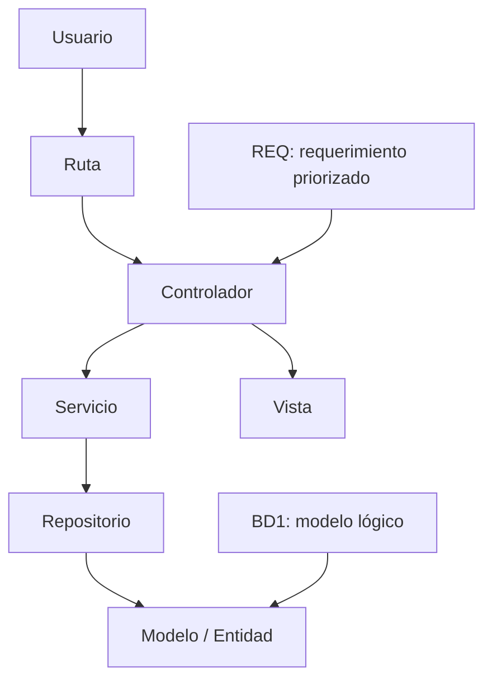

# S6 - Arquitectura MVC, rutas, controladores, servicios, ORM y repositorios

## 1. Introducción

Tiempo: 20 min.

### 1.1 Propósito

Iniciar la Unidad 2 transformando el producto web interactivo de U1 en una aplicación MVC inicial, separando rutas, controladores, servicios, repositorios y modelo para registrar y consultar una entidad o proceso simple.

### 1.2 Resultado de aprendizaje

El estudiante reconoce responsabilidades de la arquitectura MVC, crea la estructura inicial de capas y construye un primer módulo con registro y consulta básica alineado al modelo lógico de BD1 y requerimientos de REQ.

### 1.3 Producto de sesión

Módulo MVC inicial con ruta, controlador, vista, servicio, repositorio y operación simple de registro/consulta.

### 1.4 Motivación de la sesión

La página de U1 funcionaba en navegador con datos temporales. En U2 el sistema empieza a organizarse como aplicación empresarial: cada capa tiene responsabilidad y el flujo se prepara para persistencia real.

Preguntas para los estudiantes:

1. ¿Qué parte de U1 será vista?
2. ¿Qué validación pasará a servicio?
3. ¿Qué datos vienen del modelo lógico de BD1?
4. ¿Qué ruta necesita el primer módulo?
5. ¿Qué operación del primer incremento se implementará primero?

### 1.5 Ubicación en el curso

- Unidad: U2 - Desarrollo de Aplicaciones Web MVC.
- Producto de unidad: aplicación Web MVC con persistencia, relaciones, consultas y control de acceso.
- Avance de sesión: primer módulo MVC con registro y consulta simple.

## 2. Explica

Tiempo: 25 min.

### 2.1 Conceptos clave

MVC separa responsabilidades para que la aplicación no mezcle interfaz, reglas de negocio y acceso a datos en un solo archivo.

Conceptos de la sesión:

- Modelo.
- Vista.
- Controlador.
- Ruta.
- Servicio.
- Repositorio.
- ORM o acceso nativo.
- DTO o datos de formulario.
- Flujo request-response.
- Separación de responsabilidades.

### 2.2 Arquitectura de la sesión



### 2.3 Flujo de trabajo

1. Elegir módulo del primer incremento.
2. Crear estructura MVC.
3. Definir ruta inicial.
4. Crear controlador.
5. Crear vista basada en U1.
6. Crear servicio con regla simple.
7. Crear repositorio en memoria o preparación ORM.
8. Registrar datos de forma simple.
9. Consultar o listar resultados.

### 2.4 Errores frecuentes y diagnóstico

| Problema | Causa probable | Solución |
|---|---|---|
| Todo queda en el controlador | No se separó servicio | Mover reglas al servicio |
| La vista tiene lógica de negocio | Se mezcló interfaz y reglas | Dejar la vista para mostrar/capturar datos |
| Repositorio no coincide con BD1 | No se revisó modelo lógico | Usar nombres y relaciones del diccionario |
| Ruta no funciona | Configuración incorrecta | Revisar patrón de ruta y controlador |
| Se intenta hacer todo U2 en S6 | Alcance excesivo | Implementar solo registro/consulta simple |

## 3. Aplica: actividad práctica guiada

Tiempo: 2h.

### 3.1 Definir módulo inicial

| Elemento | Respuesta |
|---|---|
| Requerimiento REQ | |
| Tabla o entidad BD1 | |
| Vista de U1 reutilizada | |
| Operación inicial | Registrar / Consultar |

### 3.2 Crear estructura sugerida

```text
app/
├── controllers/
├── services/
├── repositories/
├── models/
└── views/
```

### 3.3 Definir flujo MVC

| Capa | Responsabilidad | Archivo o clase |
|---|---|---|
| Ruta | Recibe URL | |
| Controlador | Coordina solicitud | |
| Servicio | Aplica regla de negocio | |
| Repositorio | Gestiona datos | |
| Vista | Muestra formulario/lista | |

### 3.4 Implementar registro/consulta simple

**Producto del paso:** primer flujo MVC funcional.

El equipo adapta el ejemplo a su framework o tecnología definida por el docente. Lo importante es evidenciar:

- Una ruta para listar o mostrar formulario.
- Una ruta para registrar.
- Un controlador que recibe datos.
- Un servicio que valida o procesa.
- Un repositorio que guarda temporalmente o prepara persistencia.
- Una vista que muestra resultado.

### 3.5 Relacionar con BD1

| Campo de vista | Tabla.Columna BD1 | Validación |
|---|---|---|
| | | |

### 3.6 Relacionar con REQ

| Requerimiento | Ruta / Vista / Acción | Criterio de aceptación |
|---|---|---|
| | | |

### 3.7 Preparar evidencia

Checklist:

- Estructura MVC creada.
- Ruta funcional.
- Controlador funcional.
- Servicio separado.
- Repositorio separado.
- Vista conectada.
- Relación con REQ y BD1 documentada.

## 4. Crea: actividad autónoma

Tiempo: 2h fuera del aula.

### 4.1 Plantilla de evidencia individual

```text
S06_LP1_Equipo##_ApellidoNombre.pdf
```

#### 4.1.1 Datos del estudiante

- Nombre:
- Equipo:
- Sesión: S06 - Arquitectura MVC
- Rol o aporte realizado:
- Link de GitHub:

#### 4.1.2 Trabajo autónomo realizado

1. Crear o revisar estructura MVC.
2. Implementar una ruta.
3. Implementar o ajustar controlador.
4. Implementar o ajustar servicio.
5. Implementar o ajustar repositorio.
6. Conectar una vista.
7. Documentar relación con REQ y BD1.

#### 4.1.3 Evidencia técnica

- Captura de estructura.
- Código de ruta.
- Código de controlador.
- Código de servicio.
- Código de repositorio.
- Vista reutilizada o adaptada.
- Ejecución del flujo.

#### 4.1.4 Error o hallazgo

Describe un error de arquitectura o ruteo encontrado y cómo lo corregiste.

#### 4.1.5 Reflexión técnica breve

```text
¿Por qué MVC ayuda a que el sistema crezca mejor que una página con todo mezclado?
```

### 4.2 Criterios mínimos de aceptación

- PDF con nombre correcto.
- Estructura MVC evidenciada.
- Ruta y controlador funcionales.
- Servicio y repositorio separados.
- Vista conectada.
- Relación con REQ y BD1.

## 5. Cierre evaluativo

Tiempo: 20 min.

### 5.1 Resultados esperados

- Primer módulo MVC iniciado.
- Separación de responsabilidades explicada.
- Base lista para persistencia y relaciones en S7-S8.

### 5.2 Evidencia del producto de sesión

```text
S06_LP1_Equipo##_ApellidoNombre.pdf
```

### 5.3 Preguntas de defensa y reflexión

1. ¿Qué hace el controlador?
2. ¿Qué hace el servicio?
3. ¿Qué hace el repositorio?
4. ¿Qué vista viene de U1?
5. ¿Qué tabla o entidad de BD1 estás usando?
6. ¿Qué requerimiento de REQ implementa este módulo?

### 5.4 Rúbrica de evaluación

| Dimensión | Peso | 3 - Logro destacado | 2 - Logro | 1 - Proceso | 0 - Inicio | Puntuación obtenida |
|---|---:|---|---|---|---|---:|
| 1. Estructura MVC | 2 | Capas claras y coherentes. | Estructura funcional. | Estructura parcial. | No evidencia MVC. | |
| 2. Ruta y controlador | 2 | Flujo de solicitud funciona y está organizado. | Ruta/controlador funcional. | Funciona parcialmente. | No funciona. | |
| 3. Servicio y repositorio | 2 | Responsabilidades separadas correctamente. | Separación básica. | Mezcla lógica. | No separa. | |
| 4. Integración | 2 | Relación clara con REQ y BD1. | Relación general. | Relación débil. | No integra. | |
| 5. Evidencia técnica | 1 | Evidencia clara y verificable. | Evidencia suficiente. | Evidencia incompleta. | No evidencia. | |
| 6. Reflexión | 1 | Reflexión técnica precisa. | Reflexión comprensible. | Reflexión superficial. | Sin reflexión. | |

Puntuación acumulada = suma de (`Peso` * `Puntuación obtenida`) = ____.

Nota final = (`Puntuación acumulada` / 30) * 20 = ____.