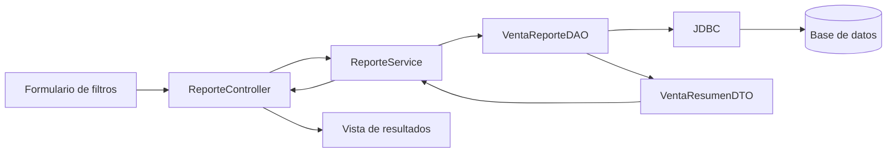

# S11 - Consultas del dominio y reportes web

## 1. Introducción

Tiempo: 20 min.

### 1.1 Propósito

Construir consultas y reportes web sobre los datos generados por el CRUD, los objetos relacionados y la operación `Venta–DetalleVenta`, usando conexión nativa, DAO y vistas MVC.

### 1.2 Resultado de aprendizaje

El estudiante implementa consultas parametrizadas, filtros combinados, ordenamiento, agregaciones y resúmenes, y presenta resultados consistentes en vistas web.

### 1.3 Producto de sesión

Módulo MVC de consultas y reportes de ventas con filtros, detalle, totales y casos sin resultados.

### 1.4 Motivación

Registrar operaciones no basta en un sistema empresarial. La información persistida debe poder localizarse, resumirse y explicarse sin alterar los datos ni duplicar reglas en los controladores.

### 1.5 Ubicación en el curso

- Unidad: U2 - Desarrollo de Aplicaciones Web MVC.
- Prerrequisito: CRUD validado, `Categoria–Producto` y `Venta–DetalleVenta` persistidos.
- Alcance: consultas y reportes funcionales; la protección por usuario o rol se incorpora en S13.

## 2. Explica

Tiempo: 40 min.

### 2.1 Conceptos clave

- Consulta parametrizada.
- Criterio de búsqueda.
- Filtros opcionales y combinados.
- Ordenamiento controlado.
- Agregación y resumen.
- Proyección o DTO de consulta.
- Reporte web.
- Caso sin resultados.
- Separación entre DAO, servicio, controlador y vista.

### 2.2 Flujo de consulta



La vista captura criterios; el controlador los recibe y delega; el servicio valida y coordina; el DAO ejecuta SQL parametrizado; el DTO transporta únicamente los datos necesarios para el reporte.

### 2.3 Consultas propuestas

1. Ventas por rango de fechas.
2. Ventas por estado.
3. Ventas que contienen un producto determinado.
4. Detalle de una venta seleccionada.
5. Total vendido por fecha, categoría o producto.
6. Productos con stock bajo.

No es obligatorio implementar todas. El equipo selecciona consultas coherentes con su dominio y demuestra al menos una consulta detallada y un resumen agregado.

### 2.4 Criterios técnicos

- Usar parámetros en las consultas; no concatenar valores provenientes del formulario.
- Mantener el SQL dentro del DAO.
- Validar fechas, estados y demás filtros en el servicio.
- Limitar el conjunto de columnas recuperadas mediante un DTO cuando corresponda.
- Controlar explícitamente el resultado vacío.
- Permitir únicamente campos de ordenamiento definidos por la aplicación.
- Registrar errores técnicos sin mostrar detalles internos al usuario.

## 3. Aplica

Tiempo: 3 h.

### 3.1 Definir criterios y DTO

Crear un objeto de criterios para no enviar numerosos parámetros sueltos:

```java
public record VentaFiltro(
        LocalDate desde,
        LocalDate hasta,
        String estado,
        Long productoId) {
}
```

Definir un DTO de salida adecuado para la vista:

```java
public record VentaResumenDTO(
        Long ventaId,
        LocalDate fecha,
        String estado,
        int cantidadItems,
        BigDecimal total) {
}
```

### 3.2 Implementar el DAO de consulta

1. Recibir filtros validados.
2. Construir únicamente las condiciones necesarias.
3. Agregar los valores a la sentencia preparada.
4. Mapear cada fila a `VentaResumenDTO`.
5. Retornar una lista vacía cuando no existan coincidencias.

El DAO puede usar SQL con `JOIN`, `GROUP BY`, funciones de agregación y ordenamiento, siempre que conserve consultas parametrizadas y responsabilidad clara.

### 3.3 Implementar servicio y controlador

El servicio:

- valida rangos y combinaciones de filtros;
- establece valores predeterminados;
- solicita los datos al DAO;
- calcula reglas que no correspondan al SQL.

El controlador:

- recibe parámetros HTTP;
- crea el criterio de búsqueda;
- invoca el servicio;
- entrega resultados y filtros activos a la vista;
- muestra mensajes comprensibles ante resultados vacíos o errores controlados.

### 3.4 Construir las vistas

La pantalla debe contener:

- formulario de filtros;
- acción para limpiar criterios;
- tabla de resultados;
- enlace al detalle de la venta;
- resumen o total agregado;
- mensaje cuando no existen coincidencias.

### 3.5 Probar el módulo

| Caso | Resultado esperado |
|---|---|
| Sin filtros | Lista general ordenada con un límite razonable |
| Rango válido | Sólo operaciones dentro del periodo |
| Rango inválido | Mensaje de validación y consulta no ejecutada |
| Estado seleccionado | Sólo operaciones del estado indicado |
| Producto seleccionado | Ventas que contienen ese producto |
| Sin coincidencias | Vista estable con mensaje informativo |
| Resumen agregado | Total coherente con las operaciones mostradas |

## 4. Crea: evidencia individual

Tiempo: 2 h fuera del aula.

Entregar:

```text
S11_LP1_Equipo##_ApellidoNombre.pdf
```

La evidencia debe incluir:

1. Consulta o reporte implementado.
2. Código del método DAO con parámetros.
3. DTO o estructura usada para los resultados.
4. Capturas con dos combinaciones de filtros.
5. Evidencia de un caso sin resultados.
6. Verificación del total o resumen agregado.
7. Explicación del aporte individual.

## 5. Cierre

Tiempo: 20 min.

### 5.1 Criterios de aceptación

- La consulta usa datos persistidos mediante JDBC y DAO.
- Los filtros se validan y no concatenan datos directamente en SQL.
- La vista conserva los criterios seleccionados.
- El reporte presenta resultados y resúmenes consistentes.
- Los casos sin resultados y los errores están controlados.
- La solución queda preparada para aplicar autorización en S13.

### 5.2 Preguntas de defensa

1. ¿Por qué la consulta se implementa después de `Venta–DetalleVenta`?
2. ¿Qué responsabilidad tiene el DAO de reporte?
3. ¿Cuándo conviene usar un DTO de consulta?
4. ¿Cómo evitas una inyección SQL?
5. ¿Cómo verificas que un total agregado sea correcto?
6. ¿Qué cambiará cuando el reporte sea protegido en U3?
