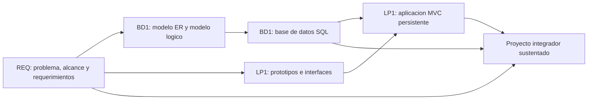

# Proyecto Integrador del Ciclo 3

## Proposito

El proyecto integrador articula los cursos de **Ingenieria de Requerimientos (REQ)**, **Administracion de Base de Datos I (BD1)** y **Lenguaje de Programacion I (LP1)** alrededor de un mismo dominio de negocio.

La secuencia curricular del proyecto es:

```text
REQ -> BD1 -> LP1
```

REQ define el problema y produce el SRS. BD1 transforma ese SRS en una base de datos relacional. LP1 implementa una aplicacion web MVC usando los requerimientos y la base de datos construida.

## Producto Integrador

**Sistema Web MVC Empresarial con SRS y Base de Datos Relacional Validada.**

El producto integrador incluye:

- Especificacion de Requerimientos de Software (SRS).
- Modelo Entidad-Relacion.
- Modelo logico relacional.
- Diccionario de datos.
- Base de datos implementada con scripts DDL y DML.
- Consultas SQL y reportes.
- Aplicacion web MVC con persistencia.
- Control de acceso, validaciones y consultas.
- Evidencias de integracion entre requerimientos, base de datos y aplicacion.

## Rol de cada curso

| Curso | Aporte al proyecto | Producto principal |
|---|---|---|
| REQ | Analiza el problema, define alcance, stakeholders, requerimientos, reglas de negocio, prototipos y trazabilidad. | SRS documentado basado en IEEE 29148. |
| BD1 | Convierte los requerimientos en modelo de datos, estructura relacional, scripts SQL, integridad y consultas. | Base de datos relacional implementada y validada. |
| LP1 | Implementa la solucion web MVC usando los requerimientos y la base de datos del proyecto. | Sistema Web MVC Empresarial. |

## Alineamiento por sesiones

| Sesiones | REQ | BD1 | LP1 | Integracion esperada |
|---|---|---|---|---|
| S1-S2 | Problema, stakeholders, contexto y alcance. | Datos, entidades y modelo ER inicial. | Arquitectura web, HTTP e interfaz base. | Todos trabajan sobre el mismo dominio y una entidad principal. |
| S3-S4 | Priorizacion y prototipo inicial. | Modelo ER avanzado y transformacion al modelo logico. | JavaScript, formularios e interaccion web. | Los prototipos de REQ orientan los formularios de LP1; BD1 modela entidades y relaciones. |
| S5-S6 | Validacion inicial y evaluacion U1. | Normalizacion, diccionario de datos y evaluacion U1. | Evaluacion U1 de la pagina web interactiva. | Primer corte integrado: requerimientos iniciales, modelo logico e interfaz web inicial. |
| S7-S8 | Historias de usuario, casos de uso y RNF. | Implementacion DDL y manipulacion DML. | Arquitectura MVC y persistencia. | LP1 inicia MVC y empieza a conectarse con la base construida en BD1. |
| S9-S10 | Reglas de negocio y prototipos funcionales. | Consultas SQL y reportes. | Relaciones, consultas, filtros y paginacion. | Las reglas de REQ se convierten en validaciones, consultas y flujos funcionales. |
| S11-S12 | Trazabilidad y evaluacion U2. | Comparacion NoSQL y evaluacion U2. | Seguridad, validaciones y optimizacion. | Segundo corte integrado: sistema MVC con persistencia, consultas, reglas y trazabilidad. |
| S13-S15 | SRS IEEE 29148, validacion y sustentacion. | Integracion, validacion y sustentacion de la base de datos. | Integracion, pruebas y sustentacion del sistema MVC. | Consolidacion final del proyecto integrador. |
| S16 | Evaluacion final. | Evaluacion final. | Evaluacion final. | Cierre academico y evaluacion individual o tecnica. |

## Hitos comunes

### Hito S6: Dominio validado

Al finalizar la sesion 6, el equipo debe contar con una primera version integrada del dominio.

| Curso | Entregable |
|---|---|
| REQ | Requerimientos iniciales, stakeholders, alcance, restricciones y prototipo inicial. |
| BD1 | Modelo ER, modelo logico, normalizacion inicial y diccionario de datos. |
| LP1 | Interfaz web inicial con formularios y validaciones basicas. |

### Hito S12: Producto funcional intermedio

Al finalizar la sesion 12, el proyecto debe mostrar funcionamiento parcial con trazabilidad.

| Curso | Entregable |
|---|---|
| REQ | Historias de usuario, casos de uso, RNF, reglas de negocio, prototipo funcional y matriz de trazabilidad. |
| BD1 | Base de datos implementada con DDL, DML, integridad referencial, consultas y reportes. |
| LP1 | Aplicacion Web MVC con persistencia, relaciones, consultas, control de acceso y validaciones. |

### Hito S15: Proyecto integrador final

Al finalizar la sesion 15, el proyecto debe estar consolidado y sustentado tecnicamente.

| Curso | Entregable |
|---|---|
| REQ | SRS final validado basado en IEEE 29148. |
| BD1 | Base de datos relacional implementada, validada y documentada. |
| LP1 | Sistema Web MVC Empresarial integrado y sustentado. |

## Criterios de integracion

Para que el proyecto se considere integrado, debe existir correspondencia entre los artefactos de los tres cursos:

- Cada modulo de LP1 debe responder a requerimientos documentados en REQ.
- Cada entidad principal de BD1 debe estar justificada por el SRS.
- Cada formulario o flujo de LP1 debe estar relacionado con historias de usuario, casos de uso o reglas de negocio.
- Cada consulta o reporte de LP1 debe tener soporte en consultas SQL o estructuras de BD1.
- La matriz de trazabilidad de REQ debe enlazar requerimientos, prototipos, entidades, tablas y funcionalidades.

## Consideraciones metodologicas

REQ no debe esperar hasta el final del semestre para entregar el SRS completo. El documento debe crecer por versiones:

- **S6:** version inicial con problema, alcance, stakeholders, requerimientos priorizados y prototipos iniciales.
- **S12:** version intermedia con historias, casos de uso, RNF, reglas de negocio, prototipo funcional y trazabilidad.
- **S15:** version final validada bajo IEEE 29148.

BD1 y LP1 consumen esas versiones durante el semestre. Por eso, LP1 puede iniciar en S6 con una entidad simple o datos provisionales, pero desde S7 debe conectarse progresivamente con la base de datos construida en BD1.

## Flujo de trabajo recomendado



## Resultado esperado

Al cierre del ciclo, el estudiante debe demostrar que puede pasar de un problema de negocio a una solucion web funcional:

```text
Problema -> Requerimientos -> Modelo de datos -> Base de datos -> Aplicacion web MVC
```

El valor del proyecto integrador no esta solo en entregar tres productos separados, sino en evidenciar que el SRS, la base de datos y la aplicacion web pertenecen al mismo sistema y evolucionaron de manera coordinada.
