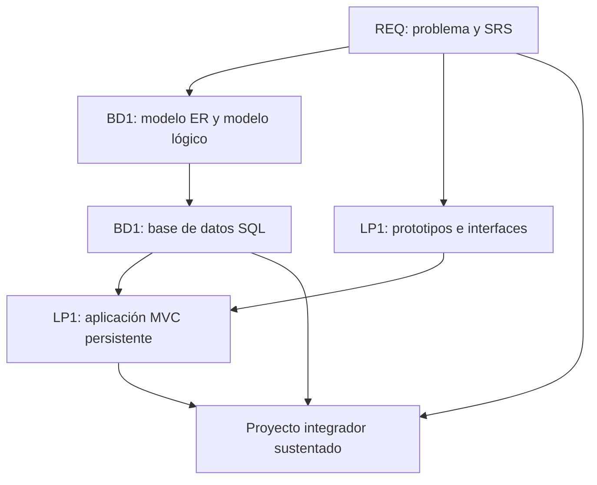

# Proyecto Integrador del Ciclo 3

## 1. Propósito

El Proyecto Integrador del Ciclo 3 articula **Ingeniería de Requerimientos (REQ)**, **Base de Datos I (BD1)** y **Lenguaje de Programación I (LP1)** alrededor de un mismo dominio de negocio.

```text
Problema -> Requerimientos -> Modelo de datos -> Base de datos -> Sistema Web MVC -> Sustentación
```

REQ define el problema y el SRS. BD1 transforma los requerimientos en una base de datos relacional. LP1 implementa una aplicación web MVC usando esos requerimientos y la base de datos construida.

### Competencia o capacidad del proyecto

Al finalizar el Proyecto Integrador, el equipo demuestra que puede transformar una necesidad de negocio en un sistema web MVC funcional, integrando requerimientos validados, modelo de datos relacional, base de datos implementada, aplicación web, trazabilidad, validación, documentación y sustentación integral del producto.

### Competencias relacionadas

| Código | Curso asociado | Competencia | Relación con el proyecto |
|---|---|---|---|
| CE021 | REQ | Ingeniería de Requerimientos | Evidencia SRS, reglas, prototipos, validación y trazabilidad. |
| CE022 | BD1 | Ingeniería de la Información | Evidencia modelo relacional, base de datos implementada, integridad, consultas y reportes. |
| CE023 | LP1 | Programación | Evidencia sistema web MVC funcional integrado con la base de datos. |
| CE024 | Transversal | Calidad de Software | Evidencia pruebas, documentación, repositorio, estándares, reproducibilidad y sustentación integral. |

## 2. El Proyecto

El producto integrador es un **Sistema Web MVC Empresarial con SRS y Base de Datos Relacional Validada**.

El proyecto debe resolver un problema de negocio realista y mantener trazabilidad entre lo que se solicita, lo que se modela, lo que se almacena y lo que se implementa.

No se considera proyecto integrador:

- Un SRS que no se usa en la base de datos ni en la aplicación.
- Una base de datos sin relación con los requerimientos.
- Una aplicación web desconectada del modelo relacional.
- Tres entregables separados sin trazabilidad común.
- Un sistema que el equipo no puede explicar de punta a punta.

## 3. Evolución del Proyecto

| Curso | Aporte principal | Producto |
|---|---|---|
| REQ | Problema, alcance, stakeholders, requerimientos, reglas, prototipos y trazabilidad. | SRS documentado basado en IEEE 29148. |
| BD1 | Modelo ER, modelo lógico, normalización, diccionario, scripts, integridad y consultas. | Base de datos relacional implementada y validada. |
| LP1 | Interfaz, formularios, MVC, persistencia, seguridad, consultas y optimización básica. | Sistema Web MVC Empresarial. |



### Alineamiento por sesiones

Este alineamiento sirve como referencia metodológica para coordinar los avances de los tres cursos sin convertir el documento principal en una lista extensa de sesiones.

| Sesiones | REQ | BD1 | LP1 | Integración esperada |
|---|---|---|---|---|
| S1-S2 | Problema, stakeholders, contexto y alcance. | Datos, entidades y modelo ER inicial. | Arquitectura web, HTTP e interfaz base. | Todos trabajan sobre el mismo dominio y una entidad principal. |
| S3-S4 | Priorización y prototipo inicial. | Modelo ER avanzado y transformación al modelo lógico. | JavaScript, formularios e interacción web. | Los prototipos de REQ orientan los formularios de LP1; BD1 modela entidades y relaciones. |
| S5-S6 | Validación inicial y evaluación U1. | Normalización, diccionario de datos y evaluación U1. | Evaluación U1 de la página web interactiva. | Primer corte integrado: requerimientos iniciales, modelo lógico e interfaz web inicial. |
| S7-S8 | Historias de usuario, casos de uso y RNF. | Implementación DDL y manipulación DML. | Arquitectura MVC y persistencia. | LP1 inicia MVC y empieza a conectarse con la base construida en BD1. |
| S9-S10 | Reglas de negocio y prototipos funcionales. | Consultas SQL y reportes. | Relaciones, consultas, filtros y paginación. | Las reglas de REQ se convierten en validaciones, consultas y flujos funcionales. |
| S11-S12 | Trazabilidad y evaluación U2. | Comparación NoSQL y evaluación U2. | Seguridad, validaciones y optimización. | Segundo corte integrado: sistema MVC con persistencia, consultas, reglas y trazabilidad. |
| S13-S15 | SRS IEEE 29148, validación y sustentación. | Integración, validación y sustentación de la base de datos. | Integración, pruebas y sustentación del sistema MVC. | Consolidación final del proyecto integrador. |
| S16 | Evaluación final. | Evaluación final. | Evaluación final. | Cierre académico y evaluación individual o técnica. |

## 4. Cronograma

| Hito | Momento | Producto esperado |
|---|---|---|
| S2 | Brief del proyecto | Problema, contexto, alcance, actores, entidad o proceso principal y criterios de éxito. |
| S6 | Dominio validado | Requerimientos iniciales, modelo lógico inicial e interfaz web base. |
| S12 | Producto intermedio | SRS trazable, base de datos implementada y aplicación MVC con persistencia, consultas y seguridad. |
| S15 | Producto final | SRS final, base de datos validada y sistema web MVC integrado y sustentado. |
| S16 | Cierre individual | Evaluación final y evidencias de dominio técnico individual. |

## 5. Producto Final

### Repositorio académico y topics

Desde la primera presentación del proyecto, el repositorio debe estar creado y configurado con los topics académicos mínimos. Esta configuración es obligatoria porque permite identificar campus, semestre, línea, tipo de proyecto, cursos participantes, sección y grupo.

El detalle oficial del estándar se encuentra en [Estándar transversal de topics para repositorios académicos](https://upeuoficial.github.io/planb/anexos/estandar-topics-repositorios/).

Ejemplo base para el Proyecto Integrador del Ciclo 3:

```text
campus-juliaca
semestre-2026-2
linea-software
tipo-pi
req
bd1
lp1
seccion-g1
grupo-<numero>-<nombre-proyecto>
```

Componentes mínimos:

- SRS con problema, alcance, stakeholders, requerimientos funcionales, no funcionales, reglas y trazabilidad.
- Prototipos o vistas que orienten la construcción del sistema.
- Modelo ER, modelo lógico relacional y diccionario de datos.
- Base de datos implementada con DDL, DML, restricciones e integridad referencial.
- Consultas SQL y reportes relevantes.
- Aplicación web MVC con persistencia.
- Formularios, validaciones, consultas, filtros y paginación.
- Control de acceso y gestión de sesiones.
- Evidencias de integración entre requerimientos, tablas, módulos y pantallas.

## 6. Evaluación por competencias

Los criterios se organizan según una matriz común de evaluación de proyectos académicos: problema, requerimientos, diseño, datos, implementación, integración y calidad, validación y sustentación. El PI se evalúa con una sola rúbrica integrada; cada dimensión indica el curso que aporta principalmente al criterio, sin separar el producto en entregas inconexas.

| Dimensión común | Criterio del PI | Curso asociado | Capacidad evaluada | Evidencias esperadas |
|---|---|---|---|---|
| 1. Problema y alcance | Problema y alcance | REQ | Analiza una necesidad organizacional y delimita una solución viable. | Contexto, problema, actores, alcance, restricciones y justificación. |
| 2. Requerimientos o funcionalidad esperada | Requerimientos | REQ | Define, valida y traza requerimientos funcionales y no funcionales. | SRS, reglas, criterios de aceptación, trazabilidad, prototipos o vistas. |
| 3. Diseño, modelo o arquitectura | Modelo de datos | BD1 | Modela información relacional coherente con los requerimientos. | Modelo ER, modelo lógico, normalización, diccionario y relación con requerimientos. |
| 4. Implementación técnica | Aplicación MVC | LP1 | Implementa una aplicación web MVC funcional alineada al modelo y requerimientos. | Rutas, controladores, servicios, vistas, formularios, seguridad y persistencia. |
| 5. Datos, persistencia o procesamiento | Base de datos | BD1 | Implementa una base relacional íntegra, consultable y útil para el sistema. | DDL, DML, restricciones, datos de prueba, consultas y reportes. |
| 6. Integración del producto y calidad técnica | Integración y calidad técnica | REQ + BD1 + LP1 | Integra requerimientos, base de datos y aplicación como un solo sistema verificable y reproducible. | Trazabilidad SRS-BD-pantallas, demo end-to-end, repositorio, estructura, documentación, estándares, scripts y forma de ejecución. |
| 7. Validación, pruebas o resultados | Validación y evidencias | REQ + BD1 + LP1 | Verifica funcionamiento, datos, reglas y resultados del sistema. | Pruebas, capturas, scripts, datos, resultados, incidencias y correcciones. |
| 8. Sustentación técnica y profesional | Sustentación integral | REQ + BD1 + LP1 | Defiende técnica y profesionalmente el PI, evidenciando autoría, integración y responsabilidad académica. | Pitch, demo, defensa técnica, aporte individual, repositorio, topics y MkDocs o equivalente. |

### Rúbrica

| Criterios | % | A (20) | B (15) | C (10) | D (5) |
|---|---:|---|---|---|---|
| 1. Problema y alcance | 10% | Problema claro, viable y bien delimitado; el alcance responde al contexto y está justificado. | Problema y alcance comprensibles, con algunos límites o justificaciones por precisar. | Problema poco delimitado o alcance parcialmente viable. | Problema confuso, sin alcance definido o sin relación clara con el producto. |
| 2. Requerimientos o funcionalidad esperada | 10% | Funcionalidades o requerimientos completos, coherentes y verificables según la necesidad planteada. | Funcionalidades principales cubiertas, con detalles menores pendientes o poco precisos. | Funcionalidades incompletas o parcialmente alineadas al problema. | Funcionalidades ausentes, inconexas o sin relación verificable con la necesidad. |
| 3. Diseño, modelo o arquitectura | 10% | Diseño, modelo o arquitectura coherente, aplicado y alineado al producto; muestra estructura y decisiones claras. | Diseño funcional con limitaciones menores o decisiones parcialmente justificadas. | Diseño poco claro, incompleto o aplicado de forma parcial. | No presenta diseño, modelo o arquitectura verificable. |
| 4. Implementación técnica | 10% | Implementación correcta, funcional y alineada a los contenidos centrales del curso. | Implementación funcional con detalles técnicos menores por corregir. | Implementación parcial, con errores o uso limitado de los contenidos del curso. | Implementación insuficiente, no funcional o no relacionada con los contenidos del curso. |
| 5. Datos, persistencia o procesamiento | 10% | Los datos se gestionan, almacenan, consultan o procesan correctamente según el tipo de proyecto. | Gestión de datos funcional con detalles menores de consistencia, estructura o procesamiento. | Gestión de datos parcial, limitada o con errores relevantes. | No hay manejo de datos verificable o este impide el funcionamiento del producto. |
| 6. Integración del producto y calidad técnica | 10% | El producto funciona como sistema integrado, ordenado, documentado y reproducible. | Integración funcional con detalles menores de organización, documentación o reproducibilidad. | Integración parcial; existen componentes aislados, desorden o evidencias incompletas. | Componentes desconectados, sin organización técnica ni evidencia reproducible. |
| 7. Validación, pruebas o resultados | 10% | Presenta pruebas, evidencias o resultados claros que comprueban el funcionamiento y el valor del producto. | Presenta evidencias suficientes, con algunos casos o resultados por completar. | Evidencias limitadas, poco claras o con validación parcial. | No presenta pruebas, evidencias ni resultados verificables. |
| 8. Sustentación técnica y profesional | 30% | Explica y defiende el producto con solvencia; demuestra aporte individual, dominio técnico, comunicación clara, repositorio, documentación y actitud profesional. | Sustentación clara y funcional, con detalles menores en defensa técnica, evidencias, comunicación o documentación. | Sustentación parcial; dominio, evidencias, comunicación o aporte individual insuficientemente demostrados. | No sustenta adecuadamente, no demuestra autoría o no presenta evidencias mínimas del producto. |

### Subaspectos de la sustentación integral

La sustentación integral debe representar como mínimo el 30% de la evaluación del proyecto. Se revisa mediante los siguientes subaspectos:

| Subaspecto | Qué observa |
|---|---|
| 1. Defensa técnica | Explicación de la trazabilidad desde el requerimiento hasta la base de datos y la funcionalidad implementada. |
| 2. Comunicación y orden | Claridad, estructura, tiempo y lenguaje técnico. |
| 3. Presentación personal y actitud | Puntualidad, vestimenta limpia y adecuada, higiene, cabello ordenado, actitud profesional, respeto, honestidad y coherencia con los valores y principios cristianos de la institución. |
| 4. Aporte individual | Cada integrante demuestra lo que hizo. |
| 5. Repositorio y estándares | Topics, organización, commits, documentación y reproducibilidad. |
| 6. MkDocs o equivalente | Documentación publicada, navegable y alineada al producto. |
| 7. Pitch/demo ejecutiva | Introducción clara del problema, solución y valor, seguida de una demo funcional. |

La sustentación profesional forma parte de la evaluación porque el producto final no solo debe funcionar; también debe ser presentado, explicado y defendido con responsabilidad académica, ética, respeto, honestidad y coherencia con los valores y principios cristianos de la institución.

## 7. Sustentación

La sustentación inicia con un video pitch breve o introducción ejecutiva de 1 a 3 minutos para presentar el problema, la solución, el valor del producto y la participación del equipo o estudiante.

| Momento | Tiempo sugerido | Propósito |
|---|---:|---|
| Exposición técnica | 10 minutos | Presentar problema, SRS, modelo de datos, arquitectura MVC, evidencias e integración. |
| Demostración en vivo | 5 minutos | Ejecutar el sistema web, mostrar persistencia, consultas, seguridad y trazabilidad. |

Cada integrante debe explicar una parte verificable del proyecto: requerimientos, base de datos, consultas, backend, vistas, seguridad, pruebas o integración. La sustentación debe mostrar cómo una necesidad se convirtió en sistema funcional.

## 8. Resultado Esperado

Al cierre del ciclo, el estudiante debe demostrar que puede pasar de un problema de negocio a una solución web funcional y trazable.

```text
Problema -> SRS -> Modelo relacional -> Base de datos -> Aplicación Web MVC -> Sustentación
```

El valor del proyecto integrador no está en entregar tres productos separados, sino en evidenciar que el SRS, la base de datos y la aplicación web evolucionaron como un mismo sistema.

## Anexo. Secuencia sugerida de presentación

La presentación puede organizarse con una secuencia breve de apoyo visual. El video pitch o introducción ejecutiva abre la sustentación y no reemplaza la demo ni la defensa técnica.

| Orden | Slide o momento | Propósito | Competencia evidenciada |
|---:|---|---|---|
| 1 | Título del proyecto y equipo | Identificar el proyecto, integrantes y dominio elegido. | CE024 |
| 2 | Video pitch o introducción ejecutiva | Presentar problema, solución, valor y participación del equipo. | CE024 |
| 3 | 1. Problema y alcance | Explicar necesidad, contexto, actores y límites del sistema. | CE021 |
| 4 | Requerimientos | Presentar SRS, reglas, criterios de aceptación y trazabilidad. | CE021 |
| 5 | Modelo de datos | Mostrar ER, modelo lógico, normalización y diccionario. | CE022 |
| 6 | Base de datos | Presentar DDL, DML, integridad, consultas y reportes. | CE022 |
| 7 | Aplicación MVC | Explicar rutas, controladores, servicios, vistas y persistencia. | CE023 |
| 8 | Integración | Evidenciar relación entre requerimientos, tablas, módulos y pantallas. | CE021 + CE022 + CE023 |
| 9 | Validación y pruebas | Mostrar scripts, capturas, datos, casos de prueba y resultados. | CE024 |
| 10 | Demo en vivo | Ejecutar el flujo principal del sistema web. | CE023 + CE024 |
| 11 | 4. Aporte individual | Indicar qué hizo cada integrante por curso o componente. | CE024 |
| 12 | Repositorio, estándares y mejoras | Mostrar topics, documentación publicada en MkDocs o equivalente, reproducibilidad, límites y mejora. | CE024 |

## Anexo. Plantilla mínima de documentación MkDocs o equivalente

La documentación publicada no reemplaza al informe. Su función es permitir que otra persona comprenda, ejecute, revise y verifique el producto desde el repositorio.

| Página o sección | Contenido mínimo | Evidencia esperada |
|---|---|---|
| Inicio | Nombre del proyecto, problema, solución, curso o cursos, integrantes y enlace al repositorio. | Presentación clara del producto. |
| Instalación o ejecución | Requisitos, dependencias, configuración y comandos para ejecutar el proyecto. | Instrucciones reproducibles. |
| Uso del sistema | Flujo principal, pantallas, comandos, endpoints, notebooks o casos de uso según corresponda. | Guía breve para probar el producto. |
| Arquitectura o estructura | Diagrama, componentes, carpetas principales y decisiones técnicas. | Vista técnica comprensible. |
| Módulos o funcionalidades | Descripción de las funciones principales del producto. | Relación entre funcionalidades y problema. |
| Datos | Modelo, archivos, base de datos, datasets, fuentes o estructura de almacenamiento según el curso. | Evidencia de gestión de datos. |
| Pruebas y evidencias | Casos de prueba, capturas, resultados, métricas, validaciones o salidas generadas. | Verificación del funcionamiento. |
| Equipo y aporte individual | Integrantes, responsabilidades, aportes y evidencias de participación. | Autoría verificable. |
| 5. Repositorio y estándares | Topics académicos, estructura, commits, ramas si aplica y criterios de reproducibilidad. | Cumplimiento de estándares técnicos. |
| Limitaciones y mejoras | Restricciones del producto y mejoras futuras priorizadas. | Cierre reflexivo y realista. |

La documentación debe estar disponible desde las primeras presentaciones y crecer con el proyecto. Para FP puede ser una documentación sencilla; para proyectos integradores y cursos avanzados debe ser más completa y técnica.
## Anexo. Plantilla sugerida de informe del proyecto

El informe debe documentar el producto integrador como un solo sistema, no como tres entregables separados. Debe evidenciar la trazabilidad entre REQ, BD1 y LP1.

| Sección | Contenido mínimo | Evidencia esperada |
|---|---|---|
| Portada | Nombre del proyecto, cursos, sección, integrantes, docentes y semestre. | Datos completos del equipo. |
| Resumen ejecutivo | Problema, solución web MVC y valor para el negocio. | Síntesis de 10 a 15 líneas. |
| Competencia y trazabilidad | Competencia/capacidad del PI y competencias relacionadas. | CE021, CE022, CE023 y CE024 vinculadas al producto. |
| Requerimientos | RF, RNF, reglas, criterios de aceptación y trazabilidad. | SRS, prototipos o vistas. |
| Modelo de datos | Modelo ER, modelo lógico, normalización y diccionario. | Diagramas, diccionario y relación con requerimientos. |
| Base de datos | DDL, DML, restricciones, datos, consultas y reportes. | Scripts, capturas y resultados. |
| Aplicación MVC | Rutas, controladores, servicios, vistas, seguridad y persistencia. | Código, capturas y demo funcional. |
| Integración y validación | Relación SRS-BD-aplicación y pruebas end-to-end. | Matriz de trazabilidad, pruebas y evidencias. |
| Repositorio y documentación | Repositorio, topics, estructura, instrucciones y documentación publicada. | URL del repositorio y MkDocs o equivalente. |
| 4. Aporte individual | Responsabilidad de cada integrante por curso o componente. | Tabla de tareas, commits o evidencias por integrante. |
| Limitaciones y mejoras | Límites del sistema y mejoras posibles. | Lista priorizada y realista. |


