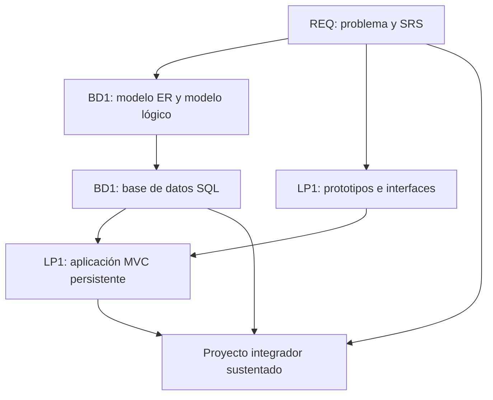

# Proyecto Integrador del Ciclo 3

## 1. Propósito

El Proyecto Integrador del Ciclo 3 articula **Ingeniería de Requerimientos (REQ)**, **Base de Datos I (BD1)** y **Lenguaje de Programación I (LP1)** alrededor de un mismo dominio de negocio.

```text
Problema -> Requerimientos -> Modelo de datos -> Base de datos -> Sistema Web MVC -> Sustentación
```

REQ define el problema y el SRS. BD1 transforma los requerimientos en una base de datos relacional. LP1 implementa una aplicación web MVC usando esos requerimientos y la base de datos construida.

## 2. El Proyecto

El producto integrador es un **Sistema Web MVC Empresarial con SRS y Base de Datos Relacional Validada**.

El proyecto debe resolver un problema de negocio realista y mantener trazabilidad entre lo que se solicita, lo que se modela, lo que se almacena y lo que se implementa.

No se considera proyecto integrador:

- Un SRS que no se usa en la base de datos ni en la aplicación.
- Una base de datos sin relación con los requerimientos.
- Una aplicación web desconectada del modelo relacional.
- Tres entregables separados sin trazabilidad común.
- Un sistema que el equipo no puede explicar de punta a punta.

## 3. Evolución del Proyecto

| Curso | Aporte principal | Producto |
|---|---|---|
| REQ | Problema, alcance, stakeholders, requerimientos, reglas, prototipos y trazabilidad. | SRS documentado basado en IEEE 29148. |
| BD1 | Modelo ER, modelo lógico, normalización, diccionario, scripts, integridad y consultas. | Base de datos relacional implementada y validada. |
| LP1 | Interfaz, formularios, MVC, persistencia, seguridad, consultas y optimización básica. | Sistema Web MVC Empresarial. |



### Alineamiento por sesiones

Este alineamiento sirve como referencia metodológica para coordinar los avances de los tres cursos sin convertir el documento principal en una lista extensa de sesiones.

| Sesiones | REQ | BD1 | LP1 | Integración esperada |
|---|---|---|---|---|
| S1-S2 | Problema, stakeholders, contexto y alcance. | Datos, entidades y modelo ER inicial. | Arquitectura web, HTTP e interfaz base. | Todos trabajan sobre el mismo dominio y una entidad principal. |
| S3-S4 | Priorización y prototipo inicial. | Modelo ER avanzado y transformación al modelo lógico. | JavaScript, formularios e interacción web. | Los prototipos de REQ orientan los formularios de LP1; BD1 modela entidades y relaciones. |
| S5-S6 | Validación inicial y evaluación U1. | Normalización, diccionario de datos y evaluación U1. | Evaluación U1 de la página web interactiva. | Primer corte integrado: requerimientos iniciales, modelo lógico e interfaz web inicial. |
| S7-S8 | Historias de usuario, casos de uso y RNF. | Implementación DDL y manipulación DML. | Arquitectura MVC y persistencia. | LP1 inicia MVC y empieza a conectarse con la base construida en BD1. |
| S9-S10 | Reglas de negocio y prototipos funcionales. | Consultas SQL y reportes. | Relaciones, consultas, filtros y paginación. | Las reglas de REQ se convierten en validaciones, consultas y flujos funcionales. |
| S11-S12 | Trazabilidad y evaluación U2. | Comparación NoSQL y evaluación U2. | Seguridad, validaciones y optimización. | Segundo corte integrado: sistema MVC con persistencia, consultas, reglas y trazabilidad. |
| S13-S15 | SRS IEEE 29148, validación y sustentación. | Integración, validación y sustentación de la base de datos. | Integración, pruebas y sustentación del sistema MVC. | Consolidación final del proyecto integrador. |
| S16 | Evaluación final. | Evaluación final. | Evaluación final. | Cierre académico y evaluación individual o técnica. |

## 4. Cronograma

| Hito | Momento | Producto esperado |
|---|---|---|
| S2 | Brief del proyecto | Problema, contexto, alcance, actores, entidad o proceso principal y criterios de éxito. |
| S6 | Dominio validado | Requerimientos iniciales, modelo lógico inicial e interfaz web base. |
| S12 | Producto intermedio | SRS trazable, base de datos implementada y aplicación MVC con persistencia, consultas y seguridad. |
| S15 | Producto final | SRS final, base de datos validada y sistema web MVC integrado y sustentado. |
| S16 | Cierre individual | Evaluación final y evidencias de dominio técnico individual. |

## 5. Producto Final

Componentes mínimos:

- SRS con problema, alcance, stakeholders, requerimientos funcionales, no funcionales, reglas y trazabilidad.
- Prototipos o vistas que orienten la construcción del sistema.
- Modelo ER, modelo lógico relacional y diccionario de datos.
- Base de datos implementada con DDL, DML, restricciones e integridad referencial.
- Consultas SQL y reportes relevantes.
- Aplicación web MVC con persistencia.
- Formularios, validaciones, consultas, filtros y paginación.
- Control de acceso y gestión de sesiones.
- Evidencias de integración entre requerimientos, tablas, módulos y pantallas.

## 6. Evaluación

| Criterio | Qué se observa |
|---|---|
| Problema y alcance | El proyecto responde a una necesidad clara y viable para el ciclo. |
| Requerimientos | El SRS define requerimientos, reglas, actores, restricciones y trazabilidad útil. |
| Modelo de datos | El modelo ER/lógico representa correctamente el dominio y se normaliza de manera adecuada. |
| Base de datos | La base implementa estructura, integridad, datos de prueba, consultas y reportes. |
| Aplicación MVC | El sistema implementa formularios, persistencia, seguridad, consultas y flujos principales. |
| Integración | REQ, BD1 y LP1 pertenecen al mismo sistema y se justifican entre sí. |
| Evidencias | Se presentan documentos, scripts, capturas, pruebas, repositorio y ejecución. |
| Calidad técnica | El código, la base y la documentación son ordenados, verificables y mantenibles. |
| Sustentación técnica | El equipo explica la trazabilidad desde el requerimiento hasta la funcionalidad. |
| Sustentación profesional | Cada integrante defiende su aporte, demuestra evidencia y mantiene presentación adecuada. |

## 7. Sustentación

| Momento | Tiempo sugerido | Propósito |
|---|---:|---|
| Exposición técnica | 10 minutos | Presentar problema, SRS, modelo de datos, arquitectura MVC, evidencias e integración. |
| Demostración en vivo | 5 minutos | Ejecutar el sistema web, mostrar persistencia, consultas, seguridad y trazabilidad. |

Cada integrante debe explicar una parte verificable del proyecto: requerimientos, base de datos, consultas, backend, vistas, seguridad, pruebas o integración. La sustentación debe mostrar cómo una necesidad se convirtió en sistema funcional.

Se espera comunicación clara, puntualidad, vestimenta limpia y adecuada, apariencia ordenada y actitud profesional.

## 8. Resultado Esperado

Al cierre del ciclo, el estudiante debe demostrar que puede pasar de un problema de negocio a una solución web funcional y trazable.

```text
Problema -> SRS -> Modelo relacional -> Base de datos -> Aplicación Web MVC -> Sustentación
```

El valor del proyecto integrador no está en entregar tres productos separados, sino en evidenciar que el SRS, la base de datos y la aplicación web evolucionaron como un mismo sistema.

