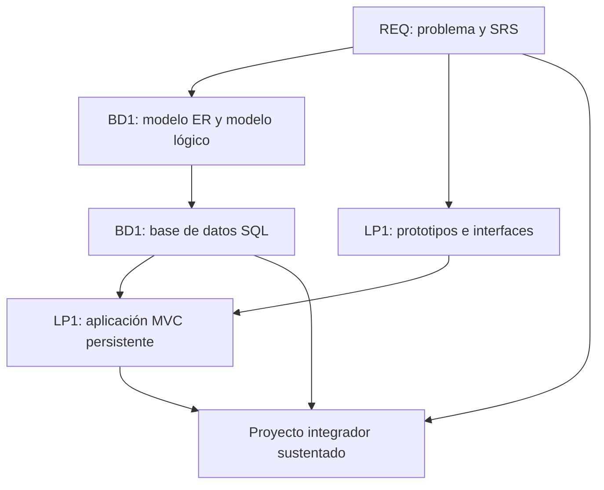

# Proyecto Integrador del Ciclo 3

## 1. Propósito

El Proyecto Integrador del Ciclo 3 articula **Ingeniería de Requerimientos (REQ)**, **Base de Datos I (BD1)** y **Lenguaje de Programación I (LP1)** alrededor de un mismo dominio de negocio.

```text
Problema -> Requerimientos -> Modelo de datos -> Base de datos -> Sistema Web MVC -> Sustentación
```

REQ define el problema y el SRS. BD1 transforma los requerimientos en una base de datos relacional. LP1 implementa una aplicación web MVC usando esos requerimientos y la base de datos construida.

## 2. El Proyecto

El producto integrador es un **Sistema Web MVC Empresarial con SRS y Base de Datos Relacional Validada**.

El proyecto debe resolver un problema de negocio realista y mantener trazabilidad entre lo que se solicita, lo que se modela, lo que se almacena y lo que se implementa.

No se considera proyecto integrador:

- Un SRS que no se usa en la base de datos ni en la aplicación.
- Una base de datos sin relación con los requerimientos.
- Una aplicación web desconectada del modelo relacional.
- Tres entregables separados sin trazabilidad común.
- Un sistema que el equipo no puede explicar de punta a punta.

## 3. Evolución del Proyecto

| Curso | Aporte principal | Producto |
|---|---|---|
| REQ | Problema, alcance, stakeholders, requerimientos, reglas, prototipos y trazabilidad. | SRS documentado basado en IEEE 29148. |
| BD1 | Modelo ER, modelo lógico, normalización, diccionario, scripts, integridad y consultas. | Base de datos relacional implementada y validada. |
| LP1 | Interfaz, formularios, MVC, persistencia, seguridad, consultas y optimización básica. | Sistema Web MVC Empresarial. |



### Alineamiento por sesiones

Este alineamiento sirve como referencia metodológica para coordinar los avances de los tres cursos sin convertir el documento principal en una lista extensa de sesiones.

| Sesiones | REQ | BD1 | LP1 | Integración esperada |
|---|---|---|---|---|
| S1-S2 | Problema, stakeholders, contexto y alcance. | Datos, entidades y modelo ER inicial. | Arquitectura web, HTTP e interfaz base. | Todos trabajan sobre el mismo dominio y una entidad principal. |
| S3-S4 | Priorización y prototipo inicial. | Modelo ER avanzado y transformación al modelo lógico. | JavaScript, formularios e interacción web. | Los prototipos de REQ orientan los formularios de LP1; BD1 modela entidades y relaciones. |
| S5-S6 | Validación inicial y evaluación U1. | Normalización, diccionario de datos y evaluación U1. | Evaluación U1 de la página web interactiva. | Primer corte integrado: requerimientos iniciales, modelo lógico e interfaz web inicial. |
| S7-S8 | Historias de usuario, casos de uso y RNF. | Implementación DDL y manipulación DML. | Arquitectura MVC y persistencia. | LP1 inicia MVC y empieza a conectarse con la base construida en BD1. |
| S9-S10 | Reglas de negocio y prototipos funcionales. | Consultas SQL y reportes. | Relaciones, consultas, filtros y paginación. | Las reglas de REQ se convierten en validaciones, consultas y flujos funcionales. |
| S11-S12 | Trazabilidad y evaluación U2. | Comparación NoSQL y evaluación U2. | Seguridad, validaciones y optimización. | Segundo corte integrado: sistema MVC con persistencia, consultas, reglas y trazabilidad. |
| S13-S15 | SRS IEEE 29148, validación y sustentación. | Integración, validación y sustentación de la base de datos. | Integración, pruebas y sustentación del sistema MVC. | Consolidación final del proyecto integrador. |
| S16 | Evaluación final. | Evaluación final. | Evaluación final. | Cierre académico y evaluación individual o técnica. |

## 4. Cronograma

| Hito | Momento | Producto esperado |
|---|---|---|
| S2 | Brief del proyecto | Problema, contexto, alcance, actores, entidad o proceso principal y criterios de éxito. |
| S6 | Dominio validado | Requerimientos iniciales, modelo lógico inicial e interfaz web base. |
| S12 | Producto intermedio | SRS trazable, base de datos implementada y aplicación MVC con persistencia, consultas y seguridad. |
| S15 | Producto final | SRS final, base de datos validada y sistema web MVC integrado y sustentado. |
| S16 | Cierre individual | Evaluación final y evidencias de dominio técnico individual. |

## 5. Producto Final

### Repositorio académico y topics

Desde la primera presentación del proyecto, el repositorio debe estar creado y configurado con los topics académicos mínimos. Esta configuración es obligatoria porque permite identificar campus, semestre, línea, tipo de proyecto, cursos participantes, sección y grupo.

El detalle oficial del estándar se encuentra en [Estándar transversal de topics para repositorios académicos](https://upeuoficial.github.io/planb/anexos/estandar-topics-repositorios/).

Ejemplo base para el Proyecto Integrador del Ciclo 3:

```text
campus-juliaca
semestre-2026-2
linea-software
tipo-pi
req
bd1
lp1
seccion-g1
grupo-<numero>-<nombre-proyecto>
```

Componentes mínimos:

- SRS con problema, alcance, stakeholders, requerimientos funcionales, no funcionales, reglas y trazabilidad.
- Prototipos o vistas que orienten la construcción del sistema.
- Modelo ER, modelo lógico relacional y diccionario de datos.
- Base de datos implementada con DDL, DML, restricciones e integridad referencial.
- Consultas SQL y reportes relevantes.
- Aplicación web MVC con persistencia.
- Formularios, validaciones, consultas, filtros y paginación.
- Control de acceso y gestión de sesiones.
- Evidencias de integración entre requerimientos, tablas, módulos y pantallas.

## 6. Evaluación

Los criterios se organizan según una matriz común de evaluación de proyectos académicos: problema, requerimientos, diseño, datos, implementación, integración, calidad, validación y sustentación. El PI se evalúa con una sola rúbrica integrada; cada dimensión indica el curso que aporta principalmente al criterio, sin separar el producto en entregas inconexas.

| Dimensión común | Criterio del PI | Curso asociado | Qué se observa |
|---|---|---|---|
| Problema y alcance | Problema y alcance | REQ | El proyecto responde a una necesidad clara, viable y bien delimitada para el ciclo. |
| Requerimientos o funcionalidad esperada | Requerimientos | REQ | El SRS define requerimientos, reglas, actores, restricciones, criterios de aceptación y trazabilidad útil. |
| Diseño, modelo o arquitectura | Modelo de datos | BD1 | El modelo ER/lógico representa correctamente el dominio, se normaliza de manera adecuada y se relaciona con los requerimientos. |
| Implementación técnica | Aplicación MVC | LP1 | El sistema implementa formularios, rutas, controladores, servicios, persistencia y flujos principales. |
| Datos, persistencia o procesamiento | Base de datos | BD1 | La base implementa estructura, integridad, datos de prueba, consultas y reportes alineados al sistema. |
| Integración del producto | Integración | REQ + BD1 + LP1 | Requerimientos, base de datos y aplicación pertenecen al mismo sistema y se justifican entre sí. |
| Calidad técnica | Calidad técnica | REQ + BD1 + LP1 | El código, la base, la documentación y el repositorio son ordenados, verificables, mantenibles y reproducibles. |
| Validación, pruebas o resultados | Validación y evidencias | REQ + BD1 + LP1 | Se presentan documentos, scripts, capturas, pruebas, datos, ejecución y resultados verificables del sistema. |
| Sustentación técnica y profesional | Sustentación integral | REQ + BD1 + LP1 | Se evalúa mediante subaspectos de defensa técnica, comunicación, presentación personal, aporte individual, repositorio, documentación publicada y pitch/demo ejecutiva. |

### Subaspectos de la sustentación integral

La sustentación integral debe representar como mínimo el 30% de la evaluación del proyecto. Se revisa mediante los siguientes subaspectos:

| Subaspecto | Qué observa |
|---|---|
| Defensa técnica | Explicación de la trazabilidad desde el requerimiento hasta la base de datos y la funcionalidad implementada. |
| Comunicación y orden | Claridad, estructura, tiempo y lenguaje técnico. |
| Presentación personal y actitud | Puntualidad, vestimenta limpia y adecuada, higiene, cabello ordenado y actitud profesional. |
| Aporte individual | Cada integrante demuestra lo que hizo. |
| Repositorio y estándares | Topics, organización, commits, documentación y reproducibilidad. |
| MkDocs o equivalente | Documentación publicada, navegable y alineada al producto. |
| Pitch/demo ejecutiva | Introducción clara del problema, solución y valor, seguida de una demo funcional. |

## 7. Sustentación

La sustentación inicia con un video pitch breve o introducción ejecutiva de 1 a 3 minutos para presentar el problema, la solución, el valor del producto y la participación del equipo o estudiante.

| Momento | Tiempo sugerido | Propósito |
|---|---:|---|
| Exposición técnica | 10 minutos | Presentar problema, SRS, modelo de datos, arquitectura MVC, evidencias e integración. |
| Demostración en vivo | 5 minutos | Ejecutar el sistema web, mostrar persistencia, consultas, seguridad y trazabilidad. |

Cada integrante debe explicar una parte verificable del proyecto: requerimientos, base de datos, consultas, backend, vistas, seguridad, pruebas o integración. La sustentación debe mostrar cómo una necesidad se convirtió en sistema funcional.

## 8. Resultado Esperado

Al cierre del ciclo, el estudiante debe demostrar que puede pasar de un problema de negocio a una solución web funcional y trazable.

```text
Problema -> SRS -> Modelo relacional -> Base de datos -> Aplicación Web MVC -> Sustentación
```

El valor del proyecto integrador no está en entregar tres productos separados, sino en evidenciar que el SRS, la base de datos y la aplicación web evolucionaron como un mismo sistema.

## Anexo. Secuencia sugerida de presentación

La presentación puede organizarse con una secuencia breve de apoyo visual. El video pitch o introducción ejecutiva abre la sustentación y no reemplaza la demo ni la defensa técnica.

| Orden | Slide o momento | Propósito |
|---:|---|---|
| 1 | Título del proyecto y equipo | Identificar el proyecto, integrantes y dominio elegido. |
| 2 | Video pitch o introducción ejecutiva | Presentar problema, solución, valor y participación del equipo. |
| 3 | Problema y alcance | Explicar necesidad, contexto, actores y límites del sistema. |
| 4 | Requerimientos | Presentar SRS, reglas, criterios de aceptación y trazabilidad. |
| 5 | Modelo de datos | Mostrar ER, modelo lógico, normalización y diccionario. |
| 6 | Base de datos | Presentar DDL, DML, integridad, consultas y reportes. |
| 7 | Aplicación MVC | Explicar rutas, controladores, servicios, vistas y persistencia. |
| 8 | Integración | Evidenciar relación entre requerimientos, tablas, módulos y pantallas. |
| 9 | Validación y pruebas | Mostrar scripts, capturas, datos, casos de prueba y resultados. |
| 10 | Demo en vivo | Ejecutar el flujo principal del sistema web. |
| 11 | Aporte individual | Indicar qué hizo cada integrante por curso o componente. |
| 12 | Repositorio, estándares y mejoras | Mostrar topics, documentación publicada en MkDocs o equivalente, reproducibilidad, límites y mejora. |
