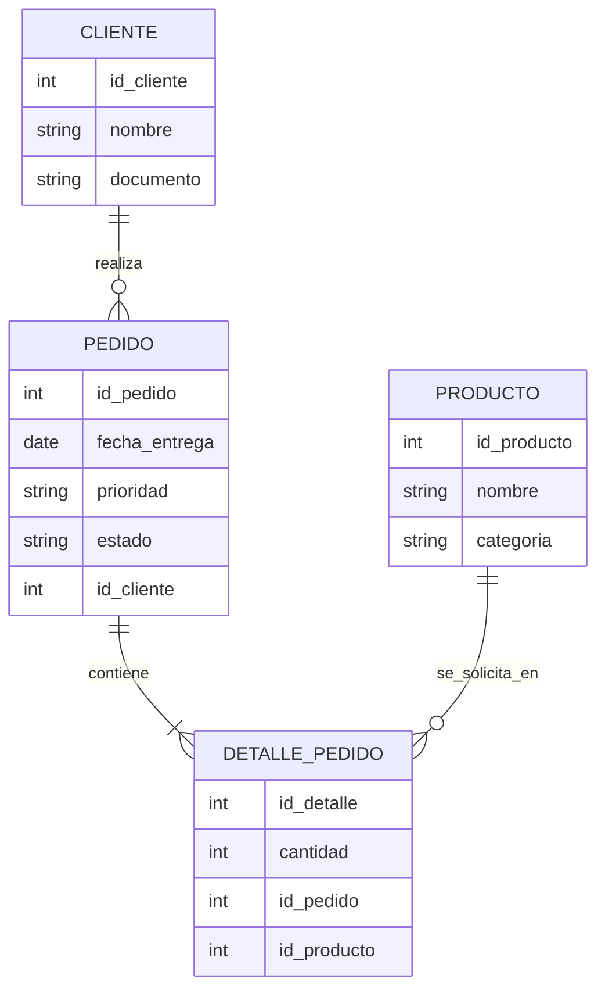

# BD1 - Producto de Unidad 1

## Producto

**Modelo de datos conceptual y logico documentado.**

Este producto transforma los requerimientos iniciales de REQ en una estructura de datos coherente para que LP1 pueda construir formularios, validaciones y, posteriormente, persistencia MVC.

## 1. Inventario de datos

| Dato | Descripcion | Origen |
|---|---|---|
| nombre_cliente | Nombre de la persona que realiza el pedido. | RF-01 |
| documento_cliente | Documento de identificacion del cliente. | RF-01 |
| nombre_producto | Producto solicitado. | RF-01 |
| cantidad | Numero de unidades solicitadas. | RF-01, RF-03 |
| fecha_entrega | Fecha tentativa de atencion o entrega. | RF-01 |
| prioridad | Nivel de prioridad del pedido. | RN-03 |
| estado | Situacion del pedido. | RF-04 |

## 2. Entidades identificadas

| Tipo | Entidad | Justificacion |
|---|---|---|
| Maestra | Cliente | Permite identificar quien solicita el pedido. |
| Maestra | Producto | Permite reconocer que se esta solicitando. |
| Transaccional | Pedido | Representa la operacion principal del sistema. |
| Detalle | DetallePedido | Permite que un pedido pueda crecer a varios productos en unidades posteriores. |

## 3. Modelo conceptual ER

## 4. Modelo logico inicial

| Tabla | Campo | Tipo sugerido | Clave | Nulo | Regla |
|---|---|---|---|---|---|
| cliente | id_cliente | INT | PK | No | Identificador autogenerado. |
| cliente | nombre | VARCHAR(100) |  | No | Debe contener texto. |
| cliente | documento | VARCHAR(20) |  | Si | Opcional en U1. |
| producto | id_producto | INT | PK | No | Identificador autogenerado. |
| producto | nombre | VARCHAR(100) |  | No | Debe contener texto. |
| producto | categoria | VARCHAR(50) |  | Si | Clasificacion opcional. |
| pedido | id_pedido | INT | PK | No | Identificador autogenerado. |
| pedido | id_cliente | INT | FK | No | Referencia a cliente. |
| pedido | fecha_entrega | DATE |  | No | Fecha de atencion o entrega. |
| pedido | prioridad | VARCHAR(20) |  | No | Normal, alta o urgente. |
| pedido | estado | VARCHAR(20) |  | No | Pendiente por defecto. |
| detalle_pedido | id_detalle | INT | PK | No | Identificador autogenerado. |
| detalle_pedido | id_pedido | INT | FK | No | Referencia a pedido. |
| detalle_pedido | id_producto | INT | FK | No | Referencia a producto. |
| detalle_pedido | cantidad | INT |  | No | Debe ser mayor que cero. |

## 5. Normalizacion inicial

| Revision | Resultado |
|---|---|
| Primera forma normal | Los campos contienen valores atomicos. No se guardan varios productos en una sola columna. |
| Segunda forma normal | Los datos de cliente y producto se separan del pedido para evitar repeticion. |
| Tercera forma normal | La prioridad y el estado pertenecen al pedido; los datos del producto no dependen del cliente. |

## 6. Relacion con LP1

| Campo del formulario LP1 | Tabla/campo BD1 | Regla de validacion |
|---|---|---|
| Cliente | cliente.nombre | Obligatorio. |
| Producto | producto.nombre | Obligatorio. |
| Cantidad | detalle_pedido.cantidad | Entero mayor que cero. |
| Fecha de entrega | pedido.fecha_entrega | Obligatoria. |
| Prioridad | pedido.prioridad | Valor permitido: normal, alta, urgente. |

## 7. Preparacion para Unidad 2

En Unidad 2, este modelo debe convertirse en scripts SQL:

- `CREATE TABLE cliente`.
- `CREATE TABLE producto`.
- `CREATE TABLE pedido`.
- `CREATE TABLE detalle_pedido`.
- Claves primarias y foraneas.
- Restricciones para cantidad positiva, estado y prioridad.
- Datos de prueba coherentes con los casos de uso de REQ.
