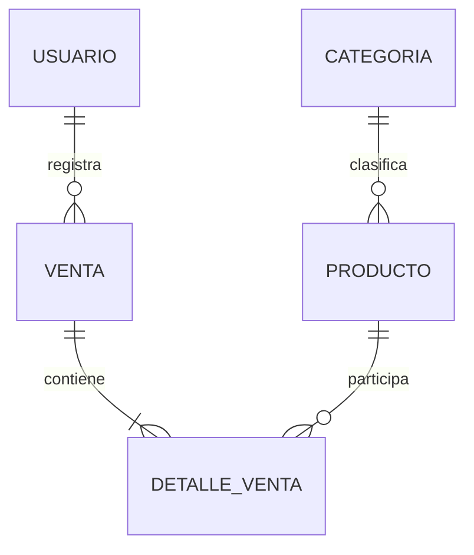

# BD1 - Producto de Unidad 1

## Producto

**Modelo conceptual y lógico inicial de CoMarket.**

El modelo conserva `Producto`, `Venta`, `DetalleVenta` y `Usuario` de POO e incorpora `Categoria` como incremento coordinado con LP1.

## 1. Entidades

| Tipo | Entidad | Responsabilidad |
|---|---|---|
| Maestra | Categoria | Clasifica productos. |
| Maestra | Producto | Conserva nombre, precio y stock. |
| Seguridad | Usuario | Identifica quién registra operaciones en U3. |
| Transaccional | Venta | Conserva cliente, fecha, estado y total. |
| Detalle | DetalleVenta | Relaciona una venta con sus productos, cantidades y subtotales. |

## 2. Modelo conceptual

La relación `Usuario–Venta` se modela desde BD1, pero el login y la asignación automática del usuario se implementan en LP1 U3.

## 3. Modelo lógico inicial

| Tabla | Campos principales |
|---|---|
| categoria | id_categoria, nombre, descripcion |
| producto | id_producto, nombre, precio, stock, id_categoria |
| usuario | id_usuario, username, password_hash, rol, activo |
| venta | id_venta, cliente, fecha, estado, total, id_usuario |
| detalle_venta | id_detalle, id_venta, id_producto, cantidad, precio_unitario, subtotal |

## 4. Reglas de integridad

- `producto.id_categoria` referencia una categoría existente.
- Precio y stock no son negativos.
- Una venta activa debe contener al menos un detalle.
- Cantidad y precio unitario producen el subtotal del detalle.
- El total de venta coincide con la suma de subtotales.
- El estado de venta sólo puede ser `ACTIVA` o `ANULADA`.
- `venta.id_usuario` puede quedar pendiente durante U2 y se vuelve obligatorio al integrar seguridad en U3.

## 5. Diccionario mínimo

| Campo | Tipo lógico | Nulo | Regla |
|---|---|---|---|
| producto.nombre | VARCHAR(100) | No | Texto no vacío |
| producto.precio | DECIMAL(10,2) | No | Mayor o igual a cero |
| producto.stock | INTEGER | No | Mayor o igual a cero |
| venta.cliente | VARCHAR(120) | No | Texto no vacío |
| venta.fecha | TIMESTAMP | No | Fecha de registro |
| venta.estado | VARCHAR(20) | No | ACTIVA o ANULADA |
| detalle_venta.cantidad | INTEGER | No | Mayor que cero |
| detalle_venta.precio_unitario | DECIMAL(10,2) | No | Mayor o igual a cero |
| detalle_venta.subtotal | DECIMAL(12,2) | No | cantidad × precio_unitario |

## 6. Relación con LP1

| BD1 | LP1 U1 | LP1 U2/U3 |
|---|---|---|
| producto y categoria | Formulario y listado temporal | CRUD persistente mediante JDBC y DAO |
| venta y detalle_venta | Prototipo | Operación transaccional cabecera–detalle |
| usuario | Fuera de alcance | Autenticación y sesión en U3 |
