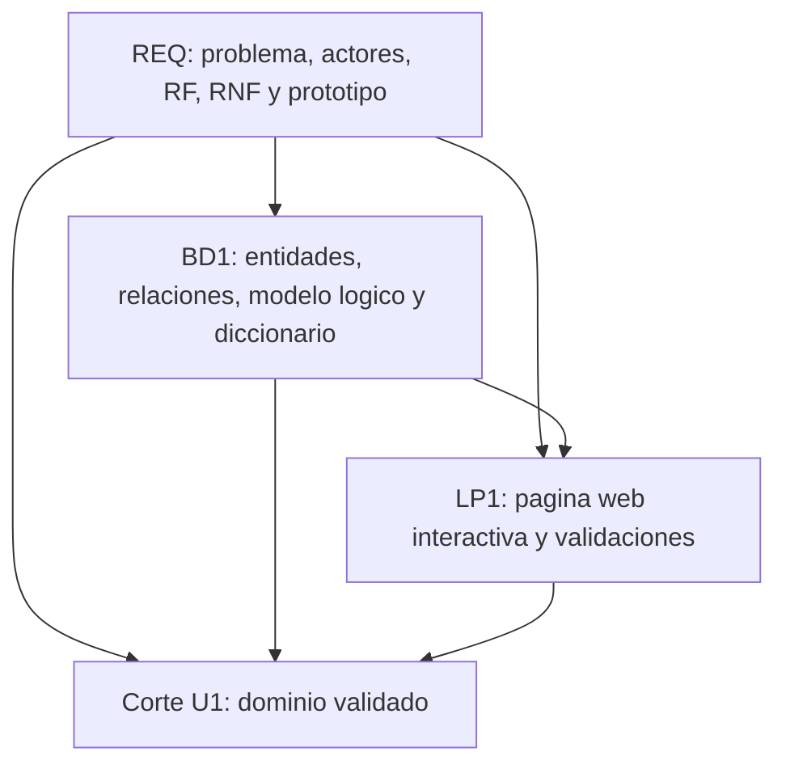

# Unidad 1 - Producto integrado

## Corte U1

El corte de Unidad 1 demuestra que el equipo ya tiene un dominio validado para iniciar la construccion MVC. No es todavia el sistema final; es el primer producto integrado donde REQ, BD1 y LP1 trabajan sobre el mismo problema.

## Dominio de ejemplo

**Gestion inicial de pedidos para una tienda local.**

Una tienda registra pedidos de clientes de forma manual. Esto genera errores en cantidades, datos incompletos y poca visibilidad del estado de atencion. El equipo propone una aplicacion web empresarial que permita registrar, consultar y dar seguimiento inicial a pedidos.

## Productos por curso

| Curso | Producto U1 | Archivo |
|---|---|---|
| REQ | Requerimientos iniciales priorizados y prototipos validados. | [Producto REQ U1](req-producto.md) |
| REQ + LP1 | Esbozo funcional y prototipo de pantalla. | [Prototipos U1](prototipos-u1.md) |
| BD1 | Modelo de datos conceptual y logico documentado. | [Producto BD1 U1](bd1-producto.md) |
| LP1 | Pagina web interactiva con plantillas, formulario y validaciones. | [Producto LP1 U1](lp1-demo.md) |

## Integracion esperada

## Como usar estos artefactos

Estos archivos sirven como referencia minima para que cada grupo construya su propio producto. El grupo no debe copiar el dominio si su proyecto es distinto; debe reproducir la misma logica de integracion:

- REQ define el problema, actores, alcance y requerimientos.
- BD1 convierte esos requerimientos en entidades, relaciones y diccionario.
- LP1 implementa una primera interfaz interactiva usando los campos y reglas definidos.

## Evidencia minima para presentar

- Repositorio creado con topics academicos.
- Brief del proyecto.
- Backlog inicial priorizado.
- Prototipo o esbozo funcional validado.
- Modelo ER y modelo logico inicial.
- Diccionario de datos.
- Pagina web interactiva ejecutable.
- Validaciones del lado cliente.
- Evidencia de trazabilidad entre requerimiento, dato y pantalla.
