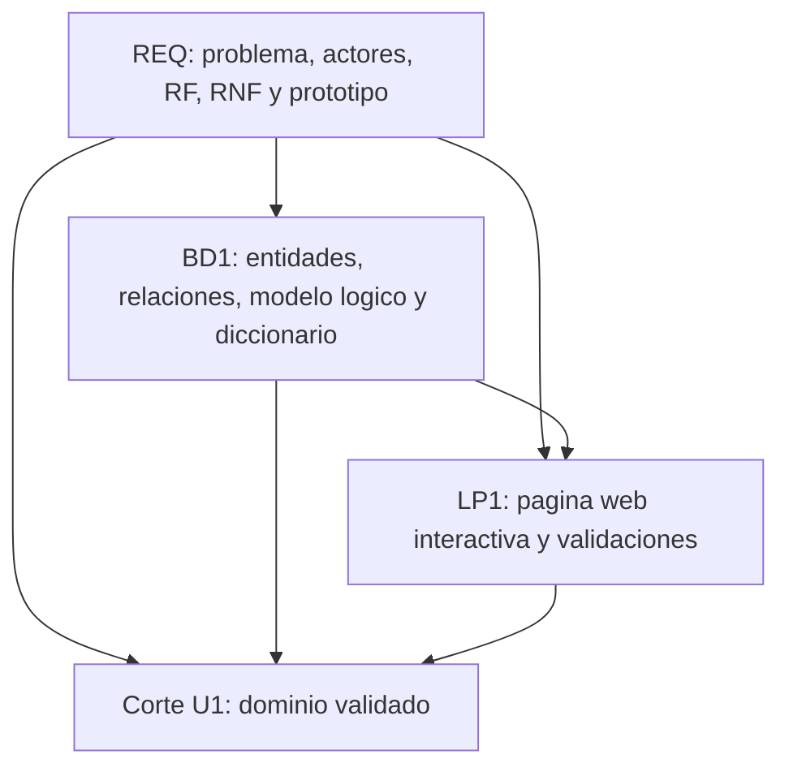
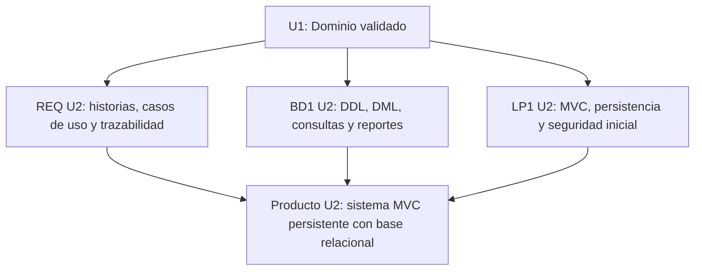

# Unidad 1 - Producto integrado

## Corte U1

El corte de Unidad 1 demuestra que el equipo ya tiene un dominio validado para iniciar la construccion MVC. No es todavia el sistema final; es el primer producto integrado donde REQ, BD1 y LP1 trabajan sobre el mismo problema.

## Dominio de ejemplo

**Gestion inicial de pedidos para una tienda local.**

Una tienda registra pedidos de clientes de forma manual. Esto genera errores en cantidades, datos incompletos y poca visibilidad del estado de atencion. El equipo propone una aplicacion web empresarial que permita registrar, consultar y dar seguimiento inicial a pedidos.

## Productos por curso

| Curso | Producto U1 | Archivo |
|---|---|---|
| REQ | Requerimientos iniciales priorizados y prototipos validados. | [Producto REQ U1](req-producto.md) |
| REQ + LP1 | Esbozo funcional y prototipo de pantalla. | [Prototipos U1](prototipos-u1.md) |
| BD1 | Modelo de datos conceptual y logico documentado. | [Producto BD1 U1](bd1-producto.md) |
| LP1 | Pagina web interactiva con plantillas, formulario y validaciones. | [Producto LP1 U1](lp1-demo.md) |

## Integracion esperada

## Como usar estos artefactos

Estos archivos sirven como referencia minima para que cada grupo construya su propio producto. El grupo no debe copiar el dominio si su proyecto es distinto; debe reproducir la misma logica de integracion:

- REQ define el problema, actores, alcance y requerimientos.
- BD1 convierte esos requerimientos en entidades, relaciones y diccionario.
- LP1 implementa una primera interfaz interactiva usando los campos y reglas definidos.

## Evidencia minima para presentar

- Repositorio creado con topics academicos.
- Brief del proyecto.
- Backlog inicial priorizado.
- Prototipo o esbozo funcional validado.
- Modelo ER y modelo logico inicial.
- Diccionario de datos.
- Pagina web interactiva ejecutable.
- Validaciones del lado cliente.
- Evidencia de trazabilidad entre requerimiento, dato y pantalla.

## Pruebas minimas del corte U1

| Caso | Datos de entrada | Resultado esperado | Evidencia |
|---|---|---|---|
| Pedido valido | Cliente, producto, cantidad mayor que cero, fecha y prioridad. | El pedido se registra, aparece en la tabla y actualiza el resumen. | Captura o ejecucion en vivo. |
| Cliente vacio | Producto, cantidad, fecha y prioridad sin cliente. | El sistema muestra mensaje de validacion y no registra el pedido. | Captura del mensaje. |
| Cantidad cero o negativa | Cliente, producto, cantidad invalida, fecha y prioridad. | El sistema indica que la cantidad debe ser mayor que cero. | Captura del mensaje. |
| Fecha vacia | Cliente, producto, cantidad y prioridad sin fecha. | El sistema solicita completar la fecha de entrega. | Captura del mensaje. |
| Pedido urgente | Pedido valido con prioridad urgente. | El pedido aparece diferenciado visualmente en el listado. | Captura de la fila registrada. |

## Estado de aprobacion del corte U1

| Estado | Significado | Decision metodologica |
|---|---|---|
| Aprobado para continuar a U2 | El dominio, requerimientos, modelo de datos, prototipo y demo son coherentes. | El equipo puede iniciar DDL/DML, MVC y persistencia. |
| Aprobado con observaciones | El producto funciona, pero requiere ajustes puntuales de alcance, modelo, prototipo o validaciones. | El equipo continua a U2 corrigiendo las observaciones en la primera semana. |
| No aprobado | Los productos de REQ, BD1 y LP1 no corresponden al mismo dominio o no existe evidencia ejecutable. | El equipo debe rehacer el corte U1 antes de avanzar. |

## Transicion hacia Unidad 2

La Unidad 2 inicia solo cuando el corte U1 tiene un dominio suficientemente claro. La transicion esperada es:

| Curso | En U1 queda | En U2 se convierte en |
|---|---|---|
| REQ | Brief, RF/RNF, reglas, prototipo y validacion inicial. | Historias de usuario, casos de uso, reglas detalladas, trazabilidad y requerimientos no funcionales verificables. |
| BD1 | Modelo ER, modelo logico y diccionario de datos. | Scripts DDL, datos de prueba DML, restricciones, consultas SQL y reportes. |
| LP1 | Pagina HTML/CSS/JS interactiva con datos temporales. | Aplicacion MVC con rutas, controladores, servicios, persistencia, relaciones, consultas y seguridad inicial. |

