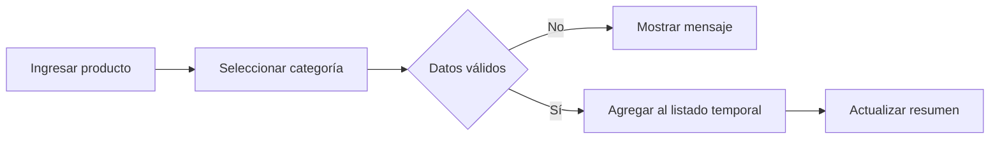
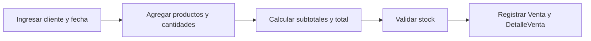

# Prototipos U1 - CoMarket

## Propósito

Validar el catálogo de `Producto–Categoria` que LP1 implementa en U1 y anticipar, sin persistencia, el flujo `Venta–DetalleVenta` que se construirá en U2.

## 1. Flujo implementable en U1



## 2. Esbozo del catálogo

```text
CoMarket - Productos

Nombre:    [________________]
Precio:    [________]
Stock:     [________]
Categoría: [Seleccione      v]

[Registrar producto] [Limpiar]

| Producto | Precio | Stock | Categoría |
```

## 3. Flujo preparado para U2



Este segundo flujo sólo se valida como prototipo en U1. Su persistencia atómica corresponde a LP1 S10.

## 4. Trazabilidad

| Elemento | REQ | BD1 | LP1 U1 |
|---|---|---|---|
| Nombre, precio y stock | RF-01, RF-03 | producto | Formulario y validación |
| Categoría | RF-04 | categoria, producto.id_categoria | Selector y tabla |
| Cliente y fecha | RF-05 | venta | Prototipo U2 |
| Producto y cantidad | RN-04 | detalle_venta | Prototipo U2 |
| Subtotal y total | RN-05 | detalle_venta.subtotal, venta.total | Prototipo U2 |

## 5. Criterios de aceptación

- El catálogo puede implementarse sin base de datos en LP1 U1.
- `Categoria` amplía `Producto` sin romper la continuidad con POO.
- El prototipo de venta usa las entidades que BD1 formalizará.
- No se exige login ni persistencia real en este corte.
