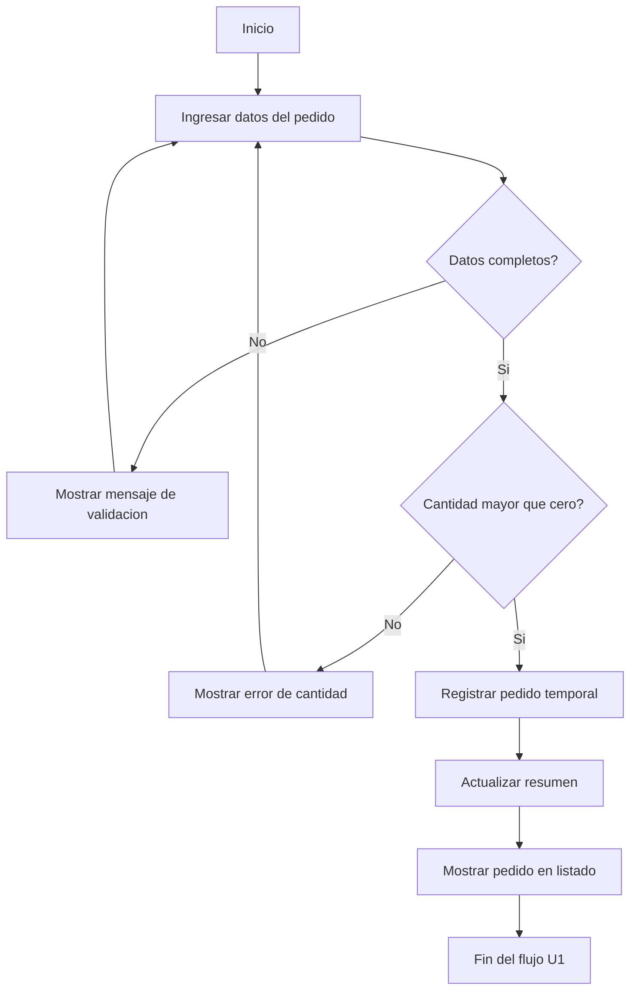
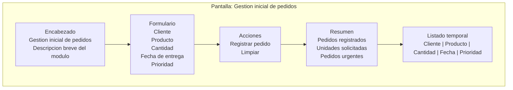
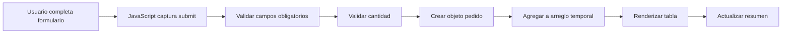

# Prototipos U1

## Proposito

Los prototipos de Unidad 1 permiten validar el flujo principal antes de implementar. No son disenos finales de interfaz; son esbozos funcionales para que REQ, BD1 y LP1 trabajen sobre la misma solucion.

## Flujo funcional inicial



## Esbozo de pantalla principal



## Esbozo de comportamiento



## Prototipo textual

```text
---------------------------------------------------------
Gestion inicial de pedidos
---------------------------------------------------------
Cliente:        [________________________]
Producto:       [________________________]
Cantidad:       [____]
Fecha entrega:  [____/____/____]
Prioridad:      [Normal v]

[Registrar pedido] [Limpiar]

Resumen:
+----------------------+----------------------+----------------+
| Pedidos registrados  | Unidades solicitadas | Urgentes       |
| 0                    | 0                    | 0              |
+----------------------+----------------------+----------------+

Listado temporal:
+----+----------+----------+----------+------------+----------+
| #  | Cliente  | Producto | Cantidad | Fecha      | Prioridad |
+----+----------+----------+----------+------------+----------+
|    |          |          |          |            |          |
+----+----------+----------+----------+------------+----------+
```

## Relacion con REQ, BD1 y LP1

| Elemento del prototipo | REQ | BD1 | LP1 |
|---|---|---|---|
| Cliente | RF-01, RN-01 | cliente.nombre | Campo de texto obligatorio |
| Producto | RF-01, RN-02 | producto.nombre | Campo de texto obligatorio |
| Cantidad | RF-01, RF-03 | detalle_pedido.cantidad | Campo numerico validado |
| Fecha de entrega | RF-01 | pedido.fecha_entrega | Campo tipo fecha |
| Prioridad | RN-03, RN-04 | pedido.prioridad | Selector y distintivo visual |
| Listado temporal | RF-04 | pedido, detalle_pedido | Tabla renderizada con DOM |
| Resumen | RF-05 | pedido.cantidad | Tarjetas calculadas con JavaScript |

## Criterios de validacion del prototipo

- El flujo permite registrar el proceso principal definido en el brief.
- Los campos del prototipo existen en el modelo de datos inicial.
- Las validaciones del prototipo responden a reglas o requerimientos.
- La pantalla puede implementarse en LP1 sin inventar campos fuera de REQ y BD1.
- El prototipo permite explicar que falta para Unidad 2: persistencia, MVC, seguridad y consultas.
