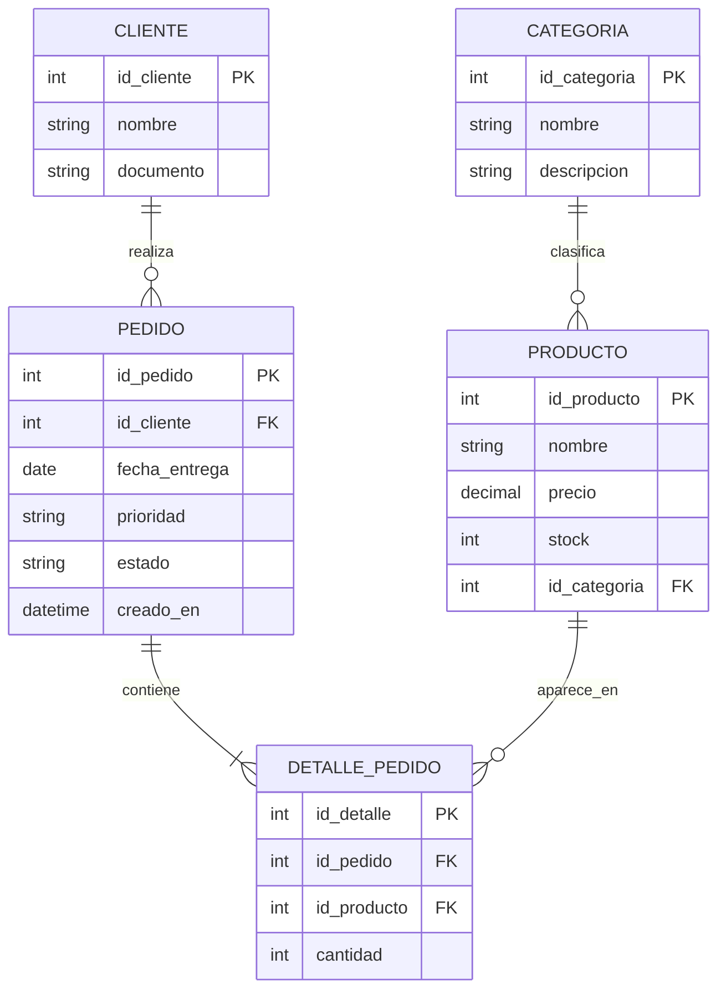

# BD1 - Producto de Unidad 2

## Producto

**Base de datos relacional implementada con consultas funcionales.**

Este producto convierte el modelo logico de U1 en scripts SQL ejecutables, datos de prueba, restricciones y consultas que soportan el flujo principal de LP1.

## 1. Scripts del producto

| Script | Uso |
|---|---|
| [schema.sql](sql/schema.sql) | Crea tablas, claves primarias, claves foraneas y restricciones. |
| [seed.sql](sql/seed.sql) | Inserta datos iniciales para pruebas. |
| [queries.sql](sql/queries.sql) | Contiene consultas y reportes basicos del corte U2. |

## 2. Modelo fisico inicial

## 3. Restricciones implementadas

| Regla | Evidencia en SQL |
|---|---|
| Cliente obligatorio para pedido. | `pedido.id_cliente NOT NULL` y clave foranea. |
| Cantidad mayor que cero. | `CHECK (cantidad > 0)`. |
| Prioridad controlada. | `CHECK (prioridad IN ('normal','alta','urgente'))`. |
| Estado controlado. | `CHECK (estado IN ('pendiente','atendido','anulado'))`. |
| Integridad detalle-pedido-producto. | Claves foraneas en `detalle_pedido`. |
| Cada producto pertenece a una categoría válida. | `producto.id_categoria NOT NULL` y clave foránea. |

## 4. Consultas funcionales

| Consulta | Proposito | Requerimiento |
|---|---|---|
| Listado general de pedidos. | Mostrar pedidos con cliente, producto, cantidad, prioridad y estado. | RF-04 |
| Pedidos por estado. | Filtrar pendientes, atendidos o anulados. | HU-02 |
| Pedidos urgentes. | Priorizar atencion. | RN-04 |
| Resumen por estado. | Reporte de carga operativa. | HU-04 |
| Total de unidades por producto. | Identificar productos mas solicitados. | HU-04 |

## 5. Datos de prueba minimos

| Tabla | Datos requeridos |
|---|---|
| cliente | Tres clientes de prueba. |
| producto | Tres productos de prueba. |
| categoria | Dos categorías de prueba. |
| pedido | Pedidos con estados pendiente, atendido y anulado. |
| detalle_pedido | Cantidades validas asociadas a productos. |

## 6. Evidencia de integracion

| BD1 | REQ | LP1 |
|---|---|---|
| `pedido.estado` | HU-03, RF-06 | Accion atender/anular. |
| `pedido.prioridad` | RN-03, RN-04 | Filtro y distintivo visual. |
| `detalle_pedido.cantidad` | RF-03 | Validacion de cantidad. |
| `producto.id_categoria` | Continuidad POO–LP1 S02 | Selector y vista de categoría por producto. |
| Consulta de listado | RF-04 | Vista de pedidos. |
| Consulta de resumen | HU-04 | Dashboard del modulo. |
