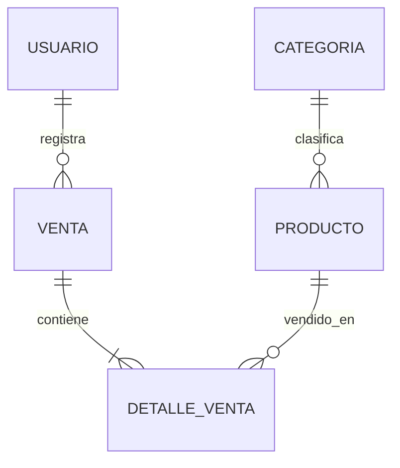

# BD1 - Producto de Unidad 2

## Producto

**Base de datos relacional implementada para Producto–Categoria y Venta–DetalleVenta.**

## 1. Scripts

| Archivo | Contenido |
|---|---|
| [schema.sql](sql/schema.sql) | Tablas, claves, restricciones y relaciones. |
| [seed.sql](sql/seed.sql) | Categorías, productos, usuarios de referencia, ventas y detalles. |
| [queries.sql](sql/queries.sql) | Consultas de ventas, detalles, estados, categorías y productos vendidos. |

## 2. Modelo implementado

## 3. Integridad requerida

| Regla | Implementación |
|---|---|
| Producto con categoría existente | FK producto–categoria |
| Precio y stock no negativos | Restricciones `CHECK` |
| Estado de venta controlado | `ACTIVA` o `ANULADA` |
| Detalle con cantidad positiva | Restricción y validación de servicio |
| Detalle unido a venta y producto | Claves foráneas |
| Venta consistente | Transacción para cabecera, detalles y stock |

## 4. Consultas mínimas

- Ventas por fecha o estado.
- Detalles de una venta.
- Ventas registradas por usuario cuando U3 asigne la sesión activa.
- Unidades e importe vendidos por producto o categoría.
- Comprobación del total de cabecera contra sus detalles.

## 5. Integración con LP1

| BD1 | LP1 |
|---|---|
| schema.sql | Entidades y DAO JDBC |
| restricciones | Validaciones de servicio y mensajes web |
| transacción venta | Servicio de `Venta–DetalleVenta` con commit/rollback |
| queries.sql | Consultas y reportes MVC de S11 |
| usuario | Autenticación y sesión de S13 |
