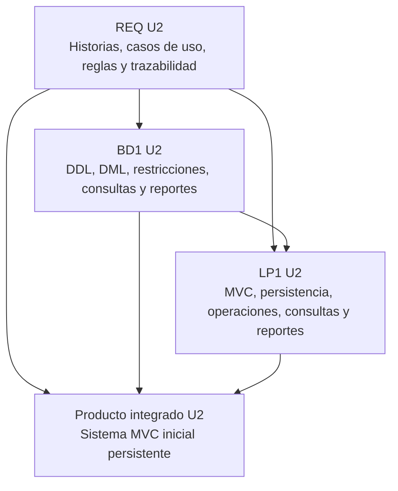
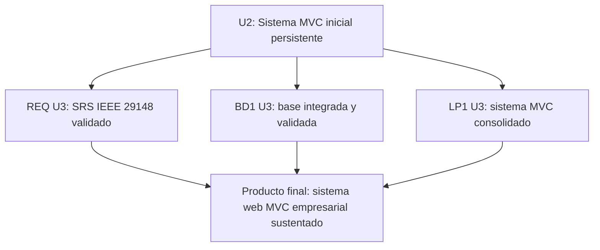

# Unidad 2 - Producto integrado

## Corte U2

El corte de Unidad 2 demuestra que el dominio validado en U1 ya se transforma en un producto funcional intermedio. En este punto, REQ formaliza historias, casos de uso, reglas y trazabilidad; BD1 implementa la base de datos con SQL; LP1 construye una aplicacion MVC inicial con persistencia, consultas y validaciones.

## Producto integrado U2

**Sistema MVC inicial con base relacional y requerimientos trazables.**

El producto no tiene que estar completo como entrega final, pero debe permitir ejecutar el flujo principal del negocio con datos persistidos, consultas basicas y evidencia de trazabilidad entre requerimiento, tabla y modulo.

## Productos por curso

| Curso | Producto U2 | Archivo |
|---|---|---|
| REQ | Modelo funcional y requerimientos documentados con trazabilidad. | [Producto REQ U2](req-producto.md) |
| BD1 | Base de datos relacional implementada con consultas funcionales. | [Producto BD1 U2](bd1-producto.md) |
| LP1 | Aplicacion MVC con persistencia, CRUD validado, objetos relacionados, operacion cabecera-detalle, consultas y reportes. | [Producto LP1 U2](lp1-demo.md) |

## Integracion esperada

## Evidencia minima para presentar

- Historias de usuario priorizadas.
- Casos de uso del flujo principal.
- Requerimientos no funcionales verificables.
- Reglas de negocio detalladas.
- Matriz de trazabilidad REQ-BD-LP1.
- Scripts DDL y DML ejecutables.
- Consultas SQL y reportes basicos.
- Aplicacion MVC inicial o demo estructurada con persistencia.
- Validaciones, filtros, busqueda y mensajes de error.
- Evidencia de ejecucion end-to-end.

## Pruebas minimas del corte U2

| Caso | Entrada o accion | Resultado esperado | Curso que aporta evidencia |
|---|---|---|---|
| Registrar pedido persistente | Cliente, producto, cantidad, fecha y prioridad validos. | El pedido se guarda y permanece despues de recargar la aplicacion. | LP1 + BD1 |
| Rechazar cantidad invalida | Cantidad cero o negativa. | La aplicacion bloquea el registro y muestra mensaje. | REQ + LP1 |
| Consultar pedidos por estado | Filtrar por pendiente, atendido o anulado. | La lista muestra solo pedidos del estado seleccionado. | BD1 + LP1 |
| Atender pedido | Cambiar estado de pendiente a atendido. | El estado se actualiza y el resumen cambia. | LP1 |
| Reporte basico | Ejecutar consulta de pedidos por prioridad o estado. | Se obtiene una salida verificable. | BD1 |
| Trazabilidad | Seleccionar un RF y mostrar tabla, modulo y prueba asociada. | El equipo explica de donde sale y donde se implementa. | REQ + BD1 + LP1 |

## Estado de aprobacion del corte U2

| Estado | Significado | Decision metodologica |
|---|---|---|
| Aprobado para continuar a U3 | El sistema MVC inicial, la base de datos y la trazabilidad son coherentes y ejecutables. | El equipo puede iniciar integracion final, pruebas y sustentacion. |
| Aprobado con observaciones | El flujo principal funciona, pero existen ajustes en SQL, validaciones, trazabilidad o estructura MVC. | El equipo continua a U3 corrigiendo observaciones antes de S13-S14. |
| No aprobado | No existe integracion verificable entre REQ, BD1 y LP1, o el producto no ejecuta el flujo principal. | El equipo debe corregir U2 antes de avanzar al cierre final. |

## Transicion hacia Unidad 3

| Curso | En U2 queda | En U3 se convierte en |
|---|---|---|
| REQ | Historias, casos de uso, reglas, RNF y trazabilidad. | SRS formal basado en IEEE 29148, validado y aceptado. |
| BD1 | Base implementada con DDL/DML, consultas y reportes. | Base de datos integrada, validada y sustentada como soporte del sistema. |
| LP1 | Aplicacion MVC con persistencia, operaciones, consultas y reportes. | Sistema MVC empresarial protegido, consolidado, probado y sustentado. |

