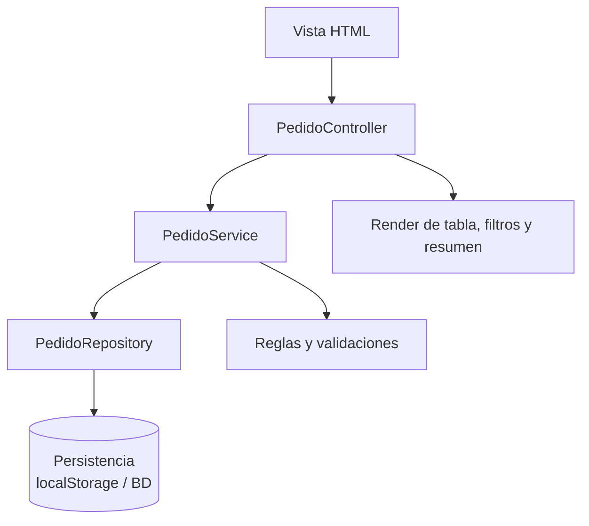

# LP1 - Producto de Unidad 2

## Producto

**Aplicacion MVC con persistencia, CRUD validado, objetos relacionados, operacion cabecera-detalle, consultas y reportes.**

La demo representa el salto desde la pagina interactiva de U1 hacia una aplicacion organizada por responsabilidades. Para que pueda publicarse en MkDocs sin servidor, usa `localStorage` como persistencia academica. En la implementacion real de LP1, esta capa se reemplaza por DAO, conexion nativa mediante JDBC y base de datos; el ORM es opcional y complementario.

## Demo ejecutable

[Abrir demo LP1 U2](demo-lp1-mvc/index.html)

## Arquitectura de referencia

## Que demuestra

- Separacion conceptual entre vista, controlador, servicio y repositorio.
- Persistencia de pedidos despues de recargar la pagina.
- Registro de pedidos con validaciones.
- Listado con filtros por estado y prioridad.
- Cambio de estado de pedido.
- Resumen de pedidos, unidades y urgentes.

## Trazabilidad con REQ y BD1

| Elemento LP1 | Origen REQ | Origen BD1 |
|---|---|---|
| Registro de pedido | HU-01 | pedido, cliente, producto, detalle_pedido |
| Validacion de campos | RF-02, RN-01 | `NOT NULL` |
| Validacion de cantidad | RF-03, RN-02 | `CHECK (cantidad > 0)` |
| Filtro por estado | HU-02 | `pedido.estado` |
| Cambio de estado | HU-03 | `pedido.estado` |
| Resumen | HU-04 | consultas agregadas |

## Casos de prueba de la demo

| Caso | Accion | Resultado esperado |
|---|---|---|
| Registrar pedido | Completar datos validos y guardar. | El pedido queda en estado pendiente y aparece en la tabla. |
| Persistencia | Recargar la pagina despues de registrar. | Los pedidos registrados siguen visibles. |
| Filtrar | Seleccionar estado o prioridad. | La tabla muestra solo coincidencias. |
| Atender pedido | Presionar atender en un pedido pendiente. | El estado cambia a atendido y se actualiza el resumen. |
| Datos invalidos | Guardar con cantidad cero o campos vacios. | El sistema muestra mensaje de validacion. |

## Como debe adaptarlo cada grupo

Cada grupo debe mantener la estructura metodologica aunque cambie el dominio:

- Un modulo MVC inicial asociado al proceso principal.
- Persistencia real o simulada de manera justificable para el corte.
- Filtros o consultas alineadas a requerimientos.
- Reglas de negocio implementadas en servicios o capa equivalente.
- Evidencia de trazabilidad con REQ y BD1.
