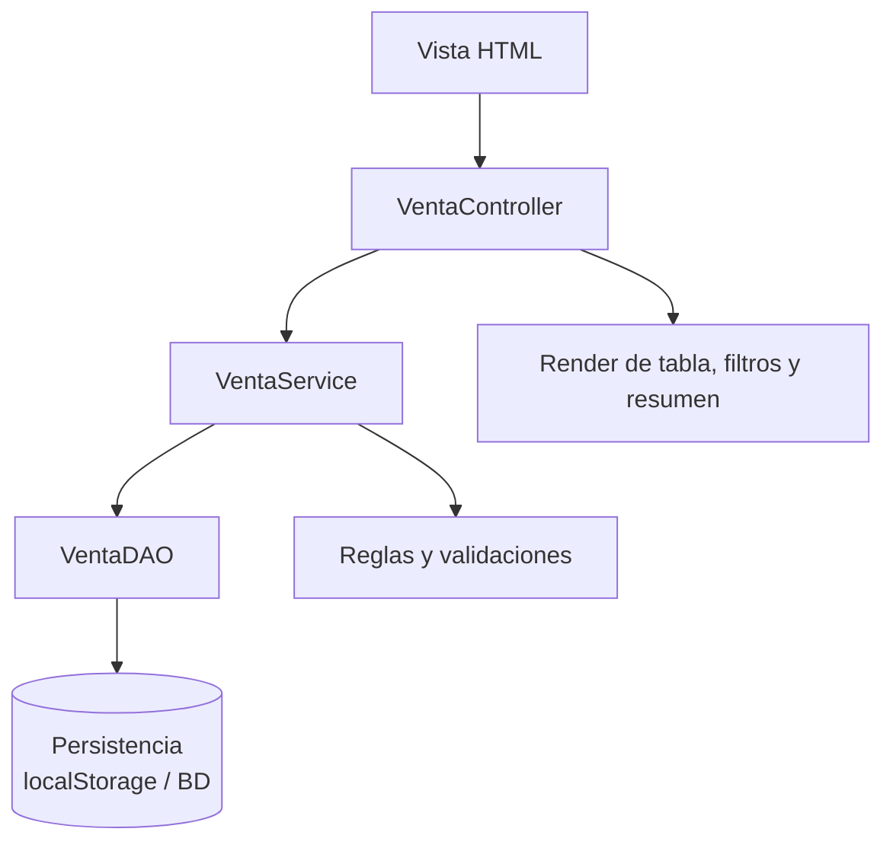

# LP1 - Producto de Unidad 2

## Producto

**Aplicacion MVC con persistencia, CRUD validado, objetos relacionados, operacion cabecera-detalle, consultas y reportes.**

La demo representa el salto desde la pagina interactiva de U1 hacia una aplicacion organizada por responsabilidades. Para que pueda publicarse en MkDocs sin servidor, usa `localStorage` como persistencia academica. En la implementacion real de LP1, esta capa se reemplaza por DAO, conexion nativa mediante JDBC y base de datos; el ORM es opcional y complementario.

## Demo ejecutable

[Abrir demo LP1 U2](demo-lp1-mvc/index.html)

## Arquitectura de referencia

## Que demuestra

- Separación conceptual entre vista, controlador, servicio y DAO.
- Persistencia de ventas con cabecera y colección de detalles.
- Validación de cliente, productos, cantidades, stock y total.
- Listado y filtro por estado.
- Anulación de una venta.
- Resumen de ventas, unidades e importe.

## Trazabilidad con REQ y BD1

| Elemento LP1 | Origen REQ | Origen BD1 |
|---|---|---|
| CRUD Producto | HU-01 | producto, categoria |
| Registro de venta | HU-02 | venta, detalle_venta, producto |
| Validación de cantidad y stock | RN-03 | `CHECK`, stock y servicio |
| Filtro por estado | HU-03 | venta.estado |
| Anulación | HU-04 | venta.estado y producto.stock |
| Resumen | HU-05 | consultas agregadas |

## Casos de prueba de la demo

| Caso | Accion | Resultado esperado |
|---|---|---|
| Registrar venta | Ingresar cliente y dos detalles válidos. | La venta ACTIVA aparece con total consistente. |
| Persistencia | Recargar la página después de registrar. | Las ventas siguen visibles. |
| Filtrar | Seleccionar ACTIVA o ANULADA. | La tabla muestra sólo coincidencias. |
| Anular venta | Presionar anular en una venta activa. | El estado cambia y el resumen excluye la venta anulada. |
| Datos inválidos | Confirmar sin cliente, sin detalles o con cantidad inválida. | El sistema muestra validación y no registra. |

## Como debe adaptarlo cada grupo

Cada grupo debe mantener la estructura metodologica aunque cambie el dominio:

- Un modulo MVC inicial asociado al proceso principal.
- Persistencia real o simulada de manera justificable para el corte.
- Filtros o consultas alineadas a requerimientos.
- Reglas de negocio implementadas en servicios o capa equivalente.
- Evidencia de trazabilidad con REQ y BD1.
