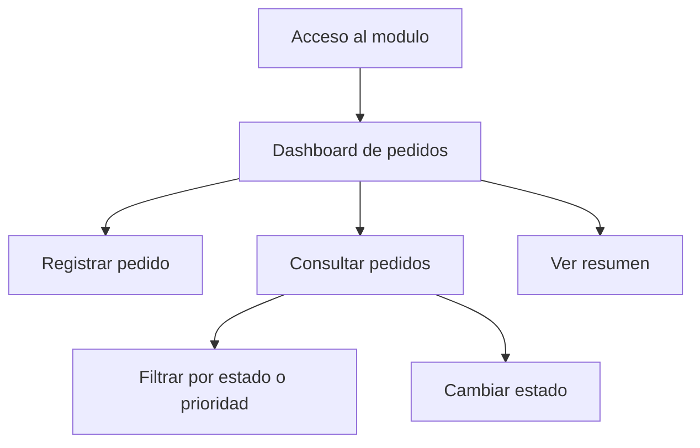

# REQ - Producto de Unidad 2

## Producto

**Modelo funcional y requerimientos documentados con trazabilidad.**

Este producto toma el brief, prototipo y requerimientos iniciales de U1 y los convierte en historias de usuario, casos de uso, reglas de negocio, requerimientos no funcionales verificables y matriz de trazabilidad.

## 1. Historias de usuario priorizadas

| Codigo | Historia de usuario | Prioridad | Criterios de aceptacion |
|---|---|---|---|
| HU-01 | Como vendedor, quiero registrar pedidos de clientes para iniciar su atencion. | Alta | El pedido se registra con cliente, producto, cantidad, fecha, prioridad y estado pendiente. |
| HU-02 | Como vendedor, quiero consultar pedidos registrados para verificar la informacion ingresada. | Alta | La aplicacion lista pedidos y permite filtrar por estado o prioridad. |
| HU-03 | Como encargado de atencion, quiero cambiar el estado de un pedido para controlar su avance. | Alta | Un pedido pendiente puede pasar a atendido o anulado. |
| HU-04 | Como administrador, quiero ver un resumen de pedidos para conocer la carga de atencion. | Media | El sistema muestra totales por estado, prioridad y unidades solicitadas. |
| HU-05 | Como administrador, quiero que solo usuarios autorizados gestionen pedidos. | Media | Requerimiento documentado en U2 y planificado para su implementación en LP1 U3. |

## 2. Caso de uso principal

| Elemento | Descripcion |
|---|---|
| Caso de uso | Registrar pedido |
| Actor principal | Vendedor |
| Proposito | Registrar un pedido valido para iniciar su seguimiento. |
| Precondicion | El vendedor accede al modulo de pedidos. |
| Postcondicion | El pedido queda registrado con estado pendiente. |

### Flujo principal

1. El vendedor ingresa al modulo de pedidos.
2. El sistema muestra el formulario de registro.
3. El vendedor completa cliente, producto, cantidad, fecha y prioridad.
4. El sistema valida campos obligatorios y cantidad.
5. El sistema registra el pedido.
6. El sistema muestra el pedido en la lista y actualiza el resumen.

### Flujos alternos

| Codigo | Situacion | Respuesta del sistema |
|---|---|---|
| FA-01 | Faltan campos obligatorios. | Muestra mensaje de validacion y no registra. |
| FA-02 | La cantidad es cero o negativa. | Muestra mensaje de cantidad invalida y no registra. |
| FA-03 | El usuario filtra por estado. | Muestra solo pedidos que coinciden con el estado seleccionado. |
| FA-04 | El usuario atiende un pedido. | Cambia el estado del pedido y actualiza resumen. |

## 3. Reglas de negocio detalladas

| Codigo | Regla | Implementacion esperada |
|---|---|---|
| RN-01 | Todo pedido debe estar asociado a un cliente. | Validacion de formulario y campo obligatorio en BD. |
| RN-02 | Todo pedido debe tener al menos un producto y cantidad mayor que cero. | Validacion de LP1 y restriccion `CHECK` en BD. |
| RN-03 | El estado inicial de un pedido es pendiente. | Valor por defecto en BD o servicio. |
| RN-04 | Un pedido atendido no debe volver a pendiente sin justificacion. | Regla de servicio documentada. |
| RN-05 | La prioridad solo puede ser normal, alta o urgente. | Selector en LP1 y restriccion en BD. |

## 4. Requerimientos no funcionales verificables

| Codigo | Requerimiento | Evidencia |
|---|---|---|
| RNF-01 | La aplicacion debe mantener los datos registrados al recargar durante la demo. | Persistencia en base de datos o almacenamiento local para demo academica. |
| RNF-02 | La interfaz debe permitir ubicar pedidos por estado o prioridad. | Filtros visibles y funcionales. |
| RNF-03 | El codigo debe separarse por responsabilidades. | Rutas/controladores/servicios/repositorios o estructura equivalente. |
| RNF-04 | El sistema debe mostrar errores comprensibles. | Mensajes ante datos invalidos o acciones no permitidas. |
| RNF-05 | La demo debe ser reproducible. | Instrucciones de ejecucion y datos de prueba. |

## 5. Prototipo funcional U2

## 6. Matriz de trazabilidad U2

| Requerimiento | Historia | Tabla BD1 | Modulo LP1 | Prueba |
|---|---|---|---|---|
| RF-01 Registrar pedido | HU-01 | pedido, detalle_pedido | PedidoController.registrar | Pedido valido |
| RF-02 Validar campos | HU-01 | restricciones de campos | PedidoService.validar | Campos vacios |
| RF-03 Validar cantidad | HU-01 | detalle_pedido.cantidad | PedidoService.validar | Cantidad cero |
| RF-04 Listar pedidos | HU-02 | pedido, cliente, producto | PedidoController.listar | Consulta general |
| RF-05 Resumen | HU-04 | pedido, detalle_pedido | DashboardView.renderResumen | Totales por estado |
| RF-06 Cambiar estado | HU-03 | pedido.estado | PedidoController.cambiarEstado | Atender pedido |

## 7. Validacion del corte U2

| Evidencia | Criterio |
|---|---|
| Historias y casos de uso revisados. | Los actores y flujos corresponden al dominio. |
| Reglas conectadas con BD y LP1. | Cada regla tiene forma de implementarse o validarse. |
| Trazabilidad completa. | Cada RF principal llega a tabla, modulo y prueba. |
| Demo ejecutable. | El equipo puede mostrar el flujo end-to-end. |
