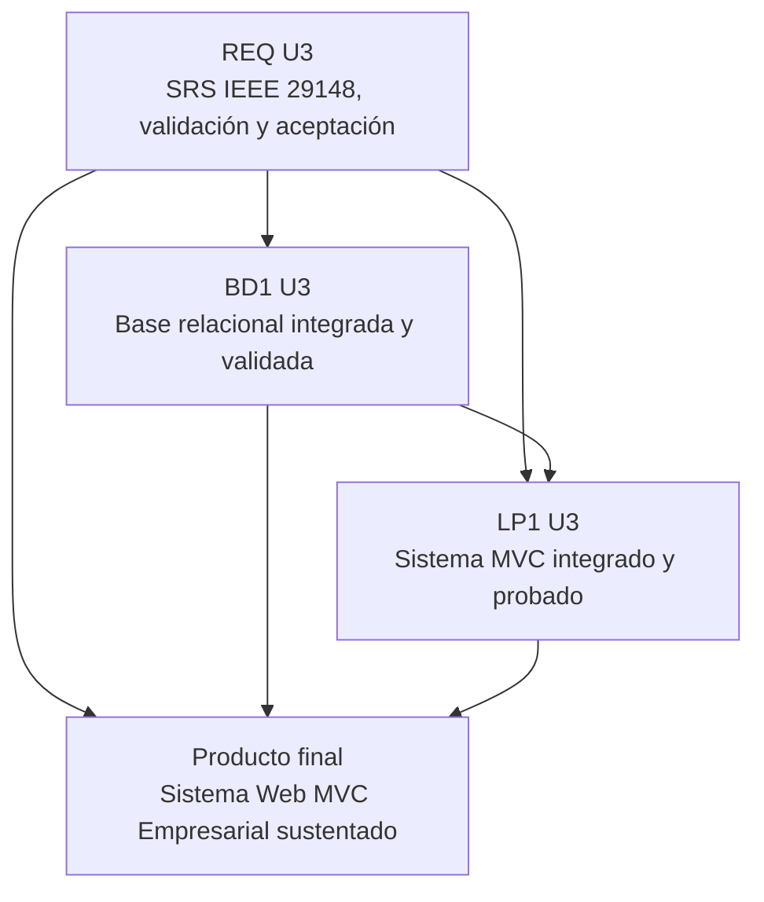

# Unidad 3 - Producto integrado

## Corte U3

La Unidad 3 consolida el producto final del Proyecto Integrador del Ciclo 3. No repite el producto intermedio de U2: cierra el SRS, valida la base de datos, integra el sistema MVC y prepara la sustentación técnica del equipo.

## Producto integrado U3

**Sistema Web MVC Empresarial con SRS final y Base de Datos Relacional Validada.**

Este producto evidencia que el equipo puede transformar una necesidad de negocio en un sistema web funcional, trazable y sustentable, integrando requerimientos, datos, aplicación, pruebas y documentación.

## Productos por curso

| Curso | Producto U3 | Archivo |
|---|---|---|
| REQ | SRS documentado basado en IEEE 29148, validado y aceptado. | [Producto REQ U3](req-producto.md) |
| BD1 | Base de datos relacional implementada, integrada y validada. | [Producto BD1 U3](bd1-producto.md) |
| LP1 | Sistema Web MVC Empresarial integrado, probado y sustentado. | [Producto LP1 U3](lp1-producto.md) |
| Integrado | Checklist final, trazabilidad, pruebas y sustentación. | [Checklist final](checklist-final.md) |

## Integración esperada

## Evidencia mínima para presentar

- SRS final con problema, alcance, stakeholders, RF, RNF, reglas, casos de uso, prototipos y trazabilidad.
- Modelo ER, modelo lógico, diccionario, scripts SQL y datos de prueba.
- Base de datos implementada con integridad referencial, restricciones, consultas y reportes.
- Sistema MVC con persistencia, relaciones, consultas, seguridad básica, validaciones y manejo de errores.
- Matriz final de trazabilidad REQ-BD1-LP1.
- Plan de pruebas, resultados y correcciones.
- Manual breve de instalación/ejecución.
- Documentación MkDocs o equivalente.
- Sustentación con demo y aporte individual.

## Diferencia entre U2 y U3

| Aspecto | Unidad 2 | Unidad 3 |
|---|---|---|
| Enfoque | Producto intermedio funcional. | Producto final validado y sustentado. |
| REQ | Historias, casos, reglas y trazabilidad parcial. | SRS formal completo y aceptado. |
| BD1 | Base implementada con consultas funcionales. | Base integrada, validada y documentada. |
| LP1 | Aplicación MVC inicial con persistencia y seguridad básica. | Sistema MVC consolidado, probado y refinado. |
| Evidencia | Funciona el flujo principal. | El producto está completo, probado, documentado y defendible. |

## Criterios de aprobación U3

| Criterio | Evidencia |
|---|---|
| Coherencia del producto | SRS, base y aplicación trabajan el mismo dominio. |
| Trazabilidad final | Requerimiento, tabla, módulo, pantalla y prueba relacionados. |
| Integridad de datos | Restricciones, claves, datos de prueba y consultas verificables. |
| Funcionamiento MVC | Flujo principal ejecutable con persistencia real o demostrable. |
| Validación | Casos de prueba, errores corregidos y evidencias. |
| Sustentación | Demo en vivo y defensa individual. |
