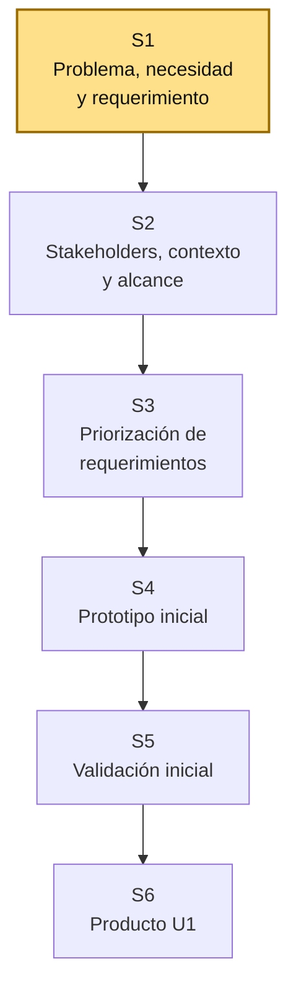
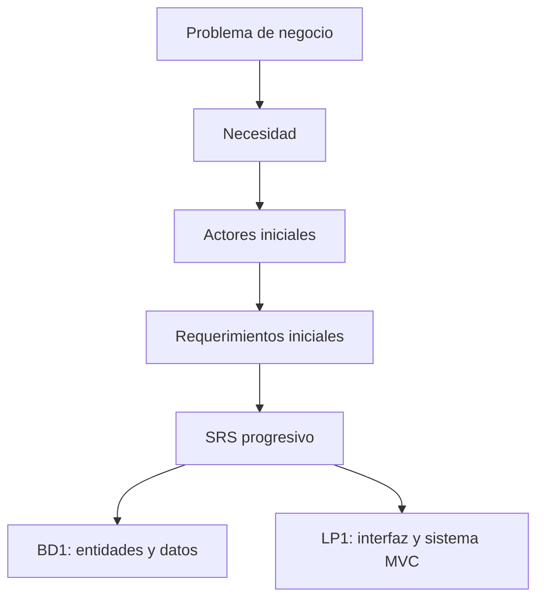

# S1 - Fundamentos de Ingeniería de Requerimientos

## 1. Introducción

Tiempo: 20 min.

### 1.1 Propósito

Comprender el rol de la Ingeniería de Requerimientos en el proyecto integrador, diferenciar problema, necesidad, requerimiento y solución, e iniciar la definición del dominio que será usado también por BD1 y LP1.

### 1.2 Resultado de aprendizaje

El estudiante identifica una necesidad de negocio, reconoce actores iniciales, diferencia requerimientos funcionales y no funcionales, y explica por qué el SRS es la fuente de verdad para el desarrollo del sistema web MVC.

### 1.3 Producto de sesión

Mapa inicial del problema, actores involucrados, necesidad principal y primera idea de sistema propuesto.

### 1.4 Motivación de la sesión

#### 1.4.1 Caso: problema de negocio inicial

Una organización necesita mejorar un proceso: ventas, reservas, inventario, atención de clientes, biblioteca, matrículas, citas, pedidos u otro dominio definido por el equipo.

Antes de diseñar pantallas, crear tablas o programar módulos, se debe entender qué problema existe, quién lo vive, qué información se maneja y qué resultado espera el usuario.

Preguntas para los estudiantes:

1. ¿Qué problema concreto existe en el dominio elegido?
2. ¿Quiénes son los usuarios, responsables o interesados?
3. ¿Qué datos aparecen de forma natural en el proceso?
4. ¿Qué espera lograr la organización con el sistema?
5. ¿Qué sería peligroso asumir sin validar?

### 1.5 Ubicación en el curso

- Unidad: U1 - Descubrimiento, Elicitación y Análisis del Problema.
- Producto de unidad: requerimientos iniciales priorizados y prototipos validados.
- Producto del curso: Especificación de Requerimientos de Software (SRS) documentada.
- Avance del producto en esta sesión: problema inicial, actores, necesidad y primera frontera del sistema.

Roadmap del producto de la unidad:



## 2. Explica

Tiempo: 25 min.

### 2.1 Conceptos clave

La Ingeniería de Requerimientos permite comprender qué necesita el usuario antes de construir una solución. Un requerimiento no es una ocurrencia técnica: debe responder a una necesidad, estar ubicado en un contexto y poder verificarse.

Conceptos de la sesión:

- Problema de negocio.
- Necesidad del usuario o de la organización.
- Solución propuesta.
- Requerimiento funcional.
- Requerimiento no funcional.
- Actor o stakeholder.
- Alcance inicial.
- Supuesto, restricción y riesgo.
- SRS como documento base del proyecto integrador.

Alcance metodológico de S1:

```text
En S1 no se redacta todavía el SRS completo.
Se identifica el problema, los actores iniciales, la necesidad y
las primeras ideas de requerimientos.

La priorización, prototipado, trazabilidad y validación formal
se desarrollan en las siguientes sesiones.
```

### 2.2 Arquitectura de la sesión



Lectura del diagrama:

- REQ define el problema y los requerimientos.
- BD1 toma datos y entidades desde los requerimientos.
- LP1 toma flujos, formularios y reglas desde los requerimientos.
- El proyecto integrador no debe tener tres productos desconectados.

### 2.3 Flujo de trabajo

1. Seleccionar un dominio de negocio viable.
2. Describir el problema en lenguaje simple.
3. Identificar actores iniciales.
4. Diferenciar problema, necesidad y solución.
5. Registrar datos visibles del proceso.
6. Proponer requerimientos funcionales iniciales.
7. Proponer requerimientos no funcionales iniciales.
8. Registrar supuestos y dudas por validar.
9. Preparar evidencia para la siguiente sesión.

### 2.4 Errores frecuentes y diagnóstico

| Problema | Causa probable | Solución |
|---|---|---|
| El proyecto empieza por pantallas | Se saltó el análisis del problema | Redactar primero necesidad, actores y alcance inicial |
| El requerimiento parece una tecnología | Se confunde solución con necesidad | Escribir qué necesita el usuario antes de decir cómo se implementa |
| El problema es demasiado amplio | No se delimitó el proceso principal | Elegir una entidad o proceso central para iniciar |
| No aparecen datos claros | El dominio no fue observado | Identificar documentos, registros, entradas y salidas |
| Todos los actores son "administrador" | No se analizó el proceso real | Diferenciar usuario, responsable, cliente, operador u otros |
| Los requerimientos son ambiguos | Falta criterio verificable | Redactar acciones observables y resultados esperados |

## 3. Aplica: actividad práctica guiada

Tiempo: 2h.

### 3.1 Elegir el dominio del proyecto

**Producto del paso:** dominio y proceso principal seleccionados.

| Elemento | Respuesta |
|---|---|
| Dominio elegido | |
| Organización o contexto | |
| Proceso principal | |
| Usuario principal | |
| Resultado esperado | |

### 3.2 Redactar el problema

**Producto del paso:** problema inicial redactado.

Usar esta plantilla:

```text
En [contexto u organización], actualmente [situación problemática],
lo que genera [consecuencia]. Se necesita [necesidad principal]
para lograr [resultado esperado].
```

### 3.3 Identificar actores iniciales

**Producto del paso:** lista de actores o stakeholders.

| Actor | Interés o necesidad | Relación con el sistema |
|---|---|---|
| Usuario principal | | |
| Responsable del proceso | | |
| Cliente o beneficiario | | |
| Administrador o supervisor | | |

### 3.4 Diferenciar necesidad, solución y requerimiento

**Producto del paso:** primeras ideas de requerimientos.

| Necesidad | Solución posible | Requerimiento funcional inicial |
|---|---|---|
| | | |
| | | |
| | | |

### 3.5 Identificar datos visibles del proceso

**Producto del paso:** datos candidatos para BD1.

| Dato | Descripción | Posible entidad |
|---|---|---|
| Nombre del producto | Identifica el producto vendido | Producto |
| Stock | Cantidad disponible | Producto |
| Fecha de venta | Momento de la operación | Venta |

### 3.6 Redactar requerimientos iniciales

**Producto del paso:** lista inicial de RF y RNF.

Requerimientos funcionales:

1. El sistema debe ...
2. El sistema debe ...
3. El sistema debe ...

Requerimientos no funcionales:

1. El sistema debe permitir una navegación clara para el usuario.
2. El sistema debe proteger el acceso a funciones administrativas cuando corresponda.
3. El sistema debe conservar una estructura comprensible para mantenimiento.

### 3.7 Registrar supuestos y dudas

**Producto del paso:** lista de temas por validar.

| Supuesto o duda | Por qué importa | Cómo se validará |
|---|---|---|
| | | |
| | | |

## 4. Crea: actividad autónoma

Tiempo: 2h fuera del aula.

Cada estudiante consolida el análisis inicial del problema y prepara una evidencia individual.

### 4.1 Plantilla de evidencia individual

Entrega un PDF con el siguiente nombre:

```text
S01_REQ_Equipo##_ApellidoNombre.pdf
```

#### 4.1.1 Datos del estudiante

- Nombre:
- Equipo:
- Sesión: S01 - Fundamentos de Ingeniería de Requerimientos
- Rol o aporte realizado:
- Link de GitHub:

#### 4.1.2 Trabajo autónomo realizado

Completa y evidencia estas tareas:

1. Redactar el problema inicial del proyecto.
2. Identificar al menos tres actores o stakeholders.
3. Diferenciar necesidad, solución y requerimiento.
4. Proponer al menos tres requerimientos funcionales iniciales.
5. Proponer al menos dos requerimientos no funcionales iniciales.
6. Identificar datos visibles que luego puedan usar BD1 y LP1.
7. Registrar al menos dos supuestos o dudas por validar.

#### 4.1.3 Evidencia técnica

Incluye:

- Tabla de dominio y proceso principal.
- Redacción del problema.
- Matriz de actores.
- Tabla necesidad-solución-requerimiento.
- Lista de datos candidatos.
- Supuestos o dudas por validar.

#### 4.1.4 Error o hallazgo

Describe al menos un error o hallazgo: qué estaba confuso, cómo lo detectaste, qué ajuste hiciste y qué aprendiste sobre requerimientos.

#### 4.1.5 Reflexión técnica breve

Responde en 5 a 8 líneas:

```text
¿Por qué no conviene iniciar un sistema escribiendo código sin entender primero el problema?
```

### 4.2 Criterios mínimos de aceptación

La evidencia individual se considera completa si:

- El archivo respeta el nombre solicitado.
- El problema está redactado con contexto, dificultad y consecuencia.
- Identifica actores iniciales.
- Diferencia necesidad, solución y requerimiento.
- Incluye RF y RNF iniciales.
- Incluye datos candidatos para BD1.
- Incluye supuestos o dudas por validar.
- Cada evidencia tiene una descripción breve.

## 5. Cierre evaluativo

Tiempo: 20 min.

### 5.1 Resultados esperados

Al finalizar la sesión, el estudiante debe demostrar que:

- Reconoce la diferencia entre problema, necesidad, solución y requerimiento.
- Identifica actores iniciales del dominio.
- Redacta requerimientos funcionales iniciales.
- Propone requerimientos no funcionales básicos.
- Reconoce datos candidatos para el modelo de BD1.
- Explica cómo REQ orienta el sistema MVC de LP1.

### 5.2 Evidencia del producto de sesión

Cada estudiante entrega un PDF individual siguiendo la plantilla de la sección 4.1.

Nombre del archivo:

```text
S01_REQ_Equipo##_ApellidoNombre.pdf
```

### 5.3 Preguntas de defensa y reflexión

1. ¿Cuál es la diferencia entre problema y requerimiento?
2. ¿Qué actor es más importante en tu dominio y por qué?
3. ¿Qué necesidad concreta intenta resolver el sistema?
4. ¿Qué dato identificado podría convertirse en entidad para BD1?
5. ¿Qué formulario o pantalla inicial podría construir LP1?
6. ¿Qué supuesto todavía debe validarse?

### 5.4 Rúbrica de evaluación

| Dimensión | Peso | 3 - Logro destacado | 2 - Logro | 1 - Proceso | 0 - Inicio | Puntuación obtenida |
|---|---:|---|---|---|---|---:|
| 1. Problema y necesidad | 2 | Redacta un problema claro, contextualizado y justificable. | Redacta un problema comprensible. | Presenta un problema parcial o ambiguo. | No define problema verificable. | |
| 2. Actores y contexto | 2 | Identifica actores relevantes y explica su relación con el sistema. | Identifica actores principales. | Lista actores sin relación clara. | No identifica actores. | |
| 3. Requerimientos iniciales | 2 | Diferencia necesidad, solución, RF y RNF con precisión. | Propone RF y RNF básicos. | Mezcla solución con requerimiento. | No presenta requerimientos. | |
| 4. Datos e integración | 2 | Relaciona datos candidatos con BD1 y pantallas iniciales de LP1. | Identifica datos útiles para el proyecto. | Identifica datos incompletos o poco claros. | No reconoce datos del proceso. | |
| 5. Supuestos o hallazgos | 1 | Analiza dudas, riesgos o supuestos y propone validación. | Presenta supuestos por validar. | Menciona dudas sin análisis. | No presenta supuestos. | |
| 6. Orden y reflexión | 1 | Evidencia ordenada, legible y reflexión técnica clara. | Evidencia suficiente y reflexión comprensible. | Evidencia incompleta o reflexión superficial. | Evidencia desordenada o sin reflexión. | |

Puntuación acumulada = suma de (`Peso` * `Puntuación obtenida`) = ____.

Nota final = (`Puntuación acumulada` / 30) * 20 = ____.