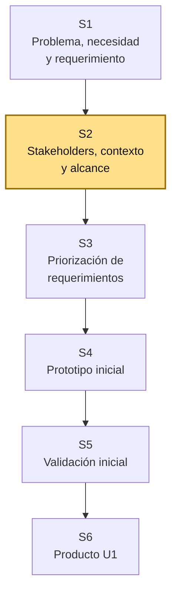
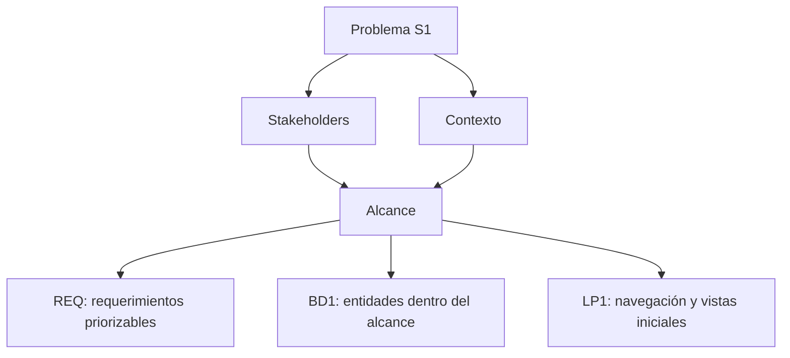

# S2 - Stakeholders, contexto y alcance

## 1. Introducción

Tiempo: 20 min.

### 1.1 Propósito

Identificar stakeholders, comprender el contexto del problema y delimitar el alcance inicial del proyecto integrador para evitar que BD1 modele datos innecesarios y que LP1 construya pantallas fuera del objetivo.

### 1.2 Resultado de aprendizaje

El estudiante identifica actores relevantes, describe el contexto operativo, define límites del sistema y redacta un alcance preliminar verificable para orientar requerimientos, modelo de datos e interfaz web.

### 1.3 Producto de sesión

Matriz de stakeholders, contexto del sistema, alcance preliminar, límites, supuestos y restricciones.

### 1.4 Motivación de la sesión

#### 1.4.1 Caso: el sistema no puede resolverlo todo

Después de elegir un problema en S1, el equipo suele querer construir muchas funciones. Eso puede volver inviable el proyecto. En S2 se decide qué entra y qué queda fuera.

Preguntas para los estudiantes:

1. ¿Quién usará realmente el sistema?
2. ¿Quién decide si el sistema sirve o no?
3. ¿Qué proceso exacto será atendido?
4. ¿Qué funciones quedan fuera por ahora?
5. ¿Qué límites debe respetar BD1 y LP1?

### 1.5 Ubicación en el curso

- Unidad: U1 - Descubrimiento, Elicitación y Análisis del Problema.
- Producto de unidad: requerimientos iniciales priorizados y prototipos validados.
- Producto del curso: Especificación de Requerimientos de Software (SRS) documentada.
- Avance del producto en esta sesión: stakeholders, contexto y alcance inicial del sistema.

Roadmap del producto de la unidad:



## 2. Explica

Tiempo: 25 min.

### 2.1 Conceptos clave

Un stakeholder es una persona, grupo o área que afecta o es afectada por el sistema. El alcance define qué parte del problema será atendida por el proyecto y qué parte queda fuera.

Conceptos de la sesión:

- Stakeholder primario y secundario.
- Usuario final.
- Responsable del proceso.
- Contexto organizacional.
- Alcance del sistema.
- Límite del sistema.
- Restricción.
- Supuesto.
- Riesgo de alcance.
- Criterio de éxito inicial.

Alcance metodológico de S2:

```text
En S2 no se redactan todavía todos los requerimientos detallados.
Se define quién participa, dónde ocurre el problema, qué entra al
sistema y qué queda fuera.

La priorización de requerimientos se trabaja en S3 y el prototipo
inicial se trabaja en S4.
```

### 2.2 Arquitectura de la sesión



Lectura del diagrama:

- Los stakeholders ayudan a validar necesidades y reglas.
- El contexto evita soluciones genéricas.
- El alcance funciona como contrato metodológico para REQ, BD1 y LP1.

### 2.3 Flujo de trabajo

1. Recuperar el problema redactado en S1.
2. Identificar stakeholders primarios y secundarios.
3. Describir el contexto operativo del proceso.
4. Definir qué entra al sistema.
5. Definir qué queda fuera del sistema.
6. Registrar restricciones y supuestos.
7. Definir criterios de éxito iniciales.
8. Traducir el alcance en insumos para BD1 y LP1.
9. Preparar evidencia para la revisión del equipo.

### 2.4 Errores frecuentes y diagnóstico

| Problema | Causa probable | Solución |
|---|---|---|
| El alcance es demasiado grande | Se intenta resolver todo el negocio | Elegir un proceso principal y dejar mejoras para versiones futuras |
| Todos los stakeholders son iguales | No se diferenció rol ni poder de decisión | Clasificar usuario, responsable, beneficiario y supervisor |
| Se incluyen funciones sin usuario claro | Falta vínculo con stakeholder | Preguntar quién necesita esa función y para qué |
| BD1 propone entidades fuera del alcance | No se compartió el límite del sistema | Revisar si la entidad aparece en el proceso seleccionado |
| LP1 diseña pantallas extra | No se definió navegación mínima | Relacionar cada vista con un actor y una operación del alcance |
| Los supuestos no se registran | Se toman decisiones sin evidencia | Documentar lo que falta validar en S3-S5 |

## 3. Aplica: actividad práctica guiada

Tiempo: 2h.

### 3.1 Recuperar el problema de S1

**Producto del paso:** problema base para delimitar.

| Elemento | Respuesta |
|---|---|
| Dominio | |
| Problema principal | |
| Necesidad principal | |
| Resultado esperado | |

### 3.2 Identificar stakeholders

**Producto del paso:** matriz de stakeholders.

| Stakeholder | Tipo | Necesidad o interés | Decisión o información que aporta |
|---|---|---|---|
| Usuario principal | Primario | | |
| Responsable del proceso | Primario | | |
| Cliente o beneficiario | Secundario | | |
| Supervisor o administrador | Secundario | | |

### 3.3 Describir el contexto operativo

**Producto del paso:** contexto del proceso.

| Aspecto | Descripción |
|---|---|
| Lugar o área donde ocurre | |
| Cómo se realiza actualmente | |
| Documentos o registros usados | |
| Problemas frecuentes | |
| Restricciones conocidas | |

### 3.4 Definir alcance preliminar

**Producto del paso:** alcance inicial del sistema.

Redactar:

```text
El sistema permitirá [operaciones principales] para [stakeholder principal],
considerando [datos o entidades principales], con el objetivo de [resultado esperado].
```

Luego completar:

| Dentro del alcance | Fuera del alcance por ahora |
|---|---|
| | |
| | |

### 3.5 Definir criterios de éxito

**Producto del paso:** criterios iniciales verificables.

| Criterio de éxito | Cómo se verificará |
|---|---|
| El usuario puede registrar o ejecutar el proceso principal | Demo del formulario o flujo |
| El usuario puede consultar información básica | Lista, búsqueda o reporte simple |
| Los datos principales están estructurados | Modelo ER inicial de BD1 |

### 3.6 Derivar insumos para BD1 y LP1

**Producto del paso:** contrato de integración S02.

| Decisión de alcance | Impacto en BD1 | Impacto en LP1 |
|---|---|---|
| Entidades del proceso principal | Se modelan como entidades candidatas, incluyendo entidades transaccionales si corresponde | Se muestran en vistas, tablas o formularios iniciales |
| Operación principal | Requiere atributos y relación | Requiere opción de navegación |
| Actor principal | Puede originar una entidad o rol | Define vista, menú o flujo |

### 3.7 Preparar acuerdos del equipo

**Producto del paso:** acuerdos para continuar.

Checklist:

- Stakeholders identificados.
- Contexto descrito.
- Alcance redactado.
- Fuera de alcance registrado.
- Criterios de éxito definidos.
- Insumos para BD1 y LP1 acordados.

## 4. Crea: actividad autónoma

Tiempo: 2h fuera del aula.

Cada estudiante completa la evidencia individual de stakeholders, contexto y alcance.

### 4.1 Plantilla de evidencia individual

Entrega un PDF con el siguiente nombre:

```text
S02_REQ_Equipo##_ApellidoNombre.pdf
```

#### 4.1.1 Datos del estudiante

- Nombre:
- Equipo:
- Sesión: S02 - Stakeholders, contexto y alcance
- Rol o aporte realizado:
- Link de GitHub:

#### 4.1.2 Trabajo autónomo realizado

Completa y evidencia estas tareas:

1. Actualizar el problema de S1 si fue necesario.
2. Identificar al menos cuatro stakeholders.
3. Describir el contexto operativo.
4. Redactar el alcance preliminar.
5. Registrar qué queda fuera del alcance.
6. Definir al menos tres criterios de éxito.
7. Explicar cómo el alcance orienta BD1 y LP1.

#### 4.1.3 Evidencia técnica

Incluye:

- Matriz de stakeholders.
- Tabla de contexto operativo.
- Alcance preliminar redactado.
- Tabla dentro/fuera del alcance.
- Criterios de éxito.
- Tabla de impacto en BD1 y LP1.

#### 4.1.4 Error o hallazgo

Describe un ajuste realizado al alcance: qué estaba sobredimensionado, qué se quitó o qué se aclaró.

#### 4.1.5 Reflexión técnica breve

Responde en 5 a 8 líneas:

```text
¿Por qué un alcance mal definido afecta al modelo de datos y a la aplicación web?
```

### 4.2 Criterios mínimos de aceptación

La evidencia individual se considera completa si:

- El archivo respeta el nombre solicitado.
- Incluye matriz de stakeholders.
- Describe contexto operativo.
- Define alcance y fuera de alcance.
- Presenta criterios de éxito.
- Explica impacto en BD1 y LP1.
- Incluye hallazgo o ajuste.
- Cada evidencia tiene una descripción breve.

## 5. Cierre evaluativo

Tiempo: 20 min.

### 5.1 Resultados esperados

Al finalizar la sesión, el estudiante debe demostrar que:

- Identifica stakeholders relevantes.
- Describe el contexto del sistema.
- Redacta un alcance viable.
- Diferencia dentro y fuera del alcance.
- Define criterios iniciales de éxito.
- Explica cómo el alcance limita datos y pantallas.

### 5.2 Evidencia del producto de sesión

Cada estudiante entrega un PDF individual siguiendo la plantilla de la sección 4.1.

Nombre del archivo:

```text
S02_REQ_Equipo##_ApellidoNombre.pdf
```

### 5.3 Preguntas de defensa y reflexión

1. ¿Quién es el stakeholder principal y por qué?
2. ¿Qué parte del negocio queda dentro del alcance?
3. ¿Qué se decidió dejar fuera y por qué?
4. ¿Qué entidades del proceso principal debería modelar BD1?
5. ¿Qué vista o menú inicial debería construir LP1?
6. ¿Qué supuesto debe validarse antes de S3?

### 5.4 Rúbrica de evaluación

| Dimensión | Peso | 3 - Logro destacado | 2 - Logro | 1 - Proceso | 0 - Inicio | Puntuación obtenida |
|---|---:|---|---|---|---|---:|
| 1. Stakeholders | 2 | Identifica actores relevantes y explica su aporte al sistema. | Identifica actores principales. | Lista actores incompletos o poco diferenciados. | No identifica stakeholders. | |
| 2. Contexto | 2 | Describe contexto operativo con registros, problemas y restricciones. | Describe contexto básico. | Contexto parcial o genérico. | No describe contexto. | |
| 3. Alcance | 2 | Define alcance viable, claro y verificable. | Define alcance comprensible. | Alcance amplio o ambiguo. | No define alcance. | |
| 4. Integración | 2 | Relaciona alcance con entidades de BD1 y vistas de LP1. | Explica relación general con otros cursos. | Relación parcial o débil. | No evidencia integración. | |
| 5. Hallazgo o ajuste | 1 | Analiza un ajuste de alcance y justifica la decisión. | Presenta un ajuste básico. | Menciona ajuste sin explicación. | No presenta hallazgo. | |
| 6. Orden y reflexión | 1 | Evidencia ordenada, legible y reflexión técnica clara. | Evidencia suficiente y reflexión comprensible. | Evidencia incompleta o reflexión superficial. | Evidencia desordenada o sin reflexión. | |

Puntuación acumulada = suma de (`Peso` * `Puntuación obtenida`) = ____.

Nota final = (`Puntuación acumulada` / 30) * 20 = ____.
