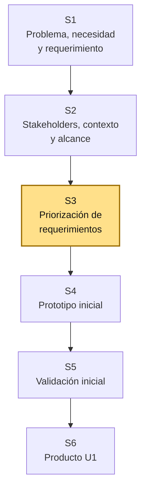
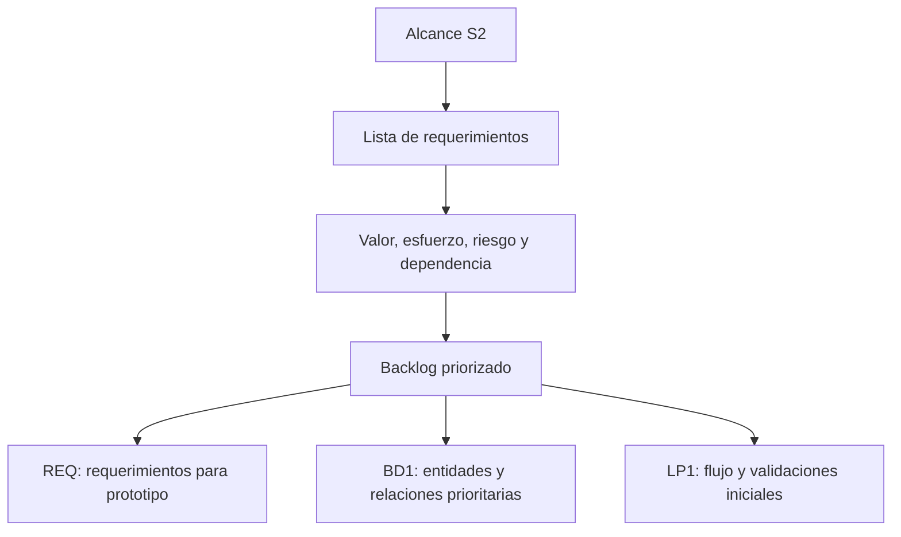

# S3 - Priorización de requerimientos

## 1. Introducción

Tiempo: 20 min.

### 1.1 Propósito

Priorizar los requerimientos del proyecto integrador para definir qué funcionalidades se desarrollarán primero, qué datos debe fortalecer BD1 y qué flujos debe empezar a prototipar LP1.

### 1.2 Resultado de aprendizaje

El estudiante clasifica requerimientos según valor, urgencia, riesgo y dependencia, aplica una técnica de priorización y justifica el primer incremento funcional del sistema.

### 1.3 Producto de sesión

Backlog inicial de requerimientos priorizados con criterios de aceptación y dependencias básicas.

### 1.4 Motivación de la sesión

#### 1.4.1 Caso: no todo puede construirse al mismo tiempo

En S2 ya existe un alcance inicial. Pero dentro de ese alcance no todo tiene la misma importancia. Algunas funciones son indispensables para que el proceso exista; otras son mejoras o reportes que pueden esperar.

Preguntas para los estudiantes:

1. ¿Qué funcionalidad permite que el proceso principal ocurra?
2. ¿Qué requerimiento depende de otro?
3. ¿Qué necesita primero BD1 para modelar correctamente?
4. ¿Qué flujo debe poder mostrar LP1 en su prototipo?
5. ¿Qué puede quedar para una versión posterior?

### 1.5 Ubicación en el curso

- Unidad: U1 - Descubrimiento, Elicitación y Análisis del Problema.
- Producto de unidad: requerimientos iniciales priorizados y prototipos validados.
- Producto del curso: Especificación de Requerimientos de Software (SRS) documentada.
- Avance del producto en esta sesión: backlog priorizado para orientar modelo de datos y prototipo inicial.

Roadmap del producto de la unidad:



## 2. Explica

Tiempo: 25 min.

### 2.1 Conceptos clave

Priorizar no significa elegir lo que más gusta. Significa decidir qué aporta más valor al usuario y qué debe existir primero para que el sistema funcione.

Conceptos de la sesión:

- Backlog inicial.
- Requerimiento funcional.
- Requerimiento no funcional.
- Valor para el usuario.
- Urgencia.
- Riesgo.
- Dependencia.
- Criterio de aceptación.
- MoSCoW: Must, Should, Could, Won't.
- Matriz valor/esfuerzo.
- Incremento funcional.

Alcance metodológico de S3:

```text
En S3 se priorizan requerimientos y se define el primer incremento.
No se cierra todavía el SRS completo ni se validan formalmente todos
los requerimientos.

El prototipo inicial se trabaja en S4 y la validación inicial en S5.
```

### 2.2 Arquitectura de la sesión



Lectura del diagrama:

- REQ decide el orden de construcción.
- BD1 refina primero las entidades y relaciones necesarias para ese orden.
- LP1 agrega interacción en las vistas que pertenecen al primer incremento.

### 2.3 Flujo de trabajo

1. Recuperar alcance y stakeholders de S2.
2. Listar requerimientos funcionales iniciales.
3. Agregar requerimientos no funcionales básicos.
4. Identificar dependencias entre requerimientos.
5. Valorar cada requerimiento según valor y esfuerzo.
6. Clasificar con MoSCoW.
7. Definir criterios de aceptación iniciales.
8. Seleccionar el primer incremento funcional.
9. Comunicar impacto a BD1 y LP1.

### 2.4 Errores frecuentes y diagnóstico

| Problema | Causa probable | Solución |
|---|---|---|
| Todo aparece como Must | No se distinguió valor ni dependencia | Usar MoSCoW con límite realista de tiempo |
| Se prioriza por gusto del equipo | No se consideró al stakeholder | Volver a necesidad, actor y criterio de éxito |
| Un requerimiento depende de otro no priorizado | No se revisaron dependencias | Ordenar requisitos por secuencia lógica |
| BD1 modela relaciones que no se usarán pronto | No se comunicó el primer incremento | Marcar entidades y transacciones prioritarias |
| LP1 valida campos sin requerimiento | Se diseñó desde la pantalla | Relacionar cada validación con un criterio de aceptación |
| Los criterios de aceptación son vagos | Falta verificación observable | Redactar condición, acción y resultado esperado |

## 3. Aplica: actividad práctica guiada

Tiempo: 2h.

### 3.1 Listar requerimientos iniciales

**Producto del paso:** lista base de requerimientos.

| Código | Requerimiento | Tipo | Stakeholder asociado |
|---|---|---|---|
| RF-01 | | Funcional | |
| RF-02 | | Funcional | |
| RNF-01 | | No funcional | |

### 3.2 Analizar valor, esfuerzo y riesgo

**Producto del paso:** matriz de decisión.

| Código | Valor para el usuario | Esfuerzo estimado | Riesgo | Dependencias |
|---|---|---|---|---|
| RF-01 | Alto/Medio/Bajo | Alto/Medio/Bajo | Alto/Medio/Bajo | |
| RF-02 | Alto/Medio/Bajo | Alto/Medio/Bajo | Alto/Medio/Bajo | |

### 3.3 Aplicar MoSCoW

**Producto del paso:** requerimientos clasificados.

| Código | Requerimiento | Prioridad MoSCoW | Justificación |
|---|---|---|---|
| RF-01 | | Must | |
| RF-02 | | Should | |
| RF-03 | | Could | |

### 3.4 Definir criterios de aceptación

**Producto del paso:** criterios verificables.

| Código | Criterio de aceptación |
|---|---|
| RF-01 | Dado [contexto], cuando [acción], entonces [resultado esperado]. |
| RF-02 | |

Ejemplo:

```text
Dado que el usuario está en la vista de pedidos,
cuando registra un pedido con cliente y productos válidos,
entonces el sistema muestra el pedido registrado en la lista inicial.
```

### 3.5 Definir primer incremento funcional

**Producto del paso:** alcance operativo para S4-S6.

| Incremento | Requerimientos incluidos | Evidencia esperada |
|---|---|---|
| Incremento 1 | RF-01, RF-02, RNF-01 | Prototipo inicial, modelo de datos ajustado y vista interactiva |

### 3.6 Derivar impacto en BD1 y LP1

**Producto del paso:** guía de integración para la semana.

| Requerimiento priorizado | Impacto en BD1 | Impacto en LP1 |
|---|---|---|
| RF-01 | Entidades, atributos o relación necesaria | Vista, formulario o validación inicial |
| RF-02 | | |

### 3.7 Preparar backlog revisable

**Producto del paso:** backlog listo para S4.

Checklist:

- Requerimientos codificados.
- Prioridad asignada.
- Dependencias visibles.
- Criterios de aceptación redactados.
- Primer incremento definido.
- Impacto en BD1 y LP1 documentado.

## 4. Crea: actividad autónoma

Tiempo: 2h fuera del aula.

Cada estudiante consolida la priorización del proyecto y prepara evidencia individual.

### 4.1 Plantilla de evidencia individual

Entrega un PDF con el siguiente nombre:

```text
S03_REQ_Equipo##_ApellidoNombre.pdf
```

#### 4.1.1 Datos del estudiante

- Nombre:
- Equipo:
- Sesión: S03 - Priorización de requerimientos
- Rol o aporte realizado:
- Link de GitHub:

#### 4.1.2 Trabajo autónomo realizado

Completa y evidencia estas tareas:

1. Listar requerimientos funcionales y no funcionales iniciales.
2. Analizar valor, esfuerzo, riesgo y dependencia.
3. Clasificar requerimientos con MoSCoW.
4. Redactar criterios de aceptación para los Must.
5. Definir el primer incremento funcional.
6. Explicar impacto en BD1 y LP1.
7. Registrar una decisión discutida por el equipo.

#### 4.1.3 Evidencia técnica

Incluye:

- Backlog inicial.
- Matriz valor/esfuerzo/riesgo.
- Tabla MoSCoW.
- Criterios de aceptación.
- Primer incremento funcional.
- Tabla de impacto en BD1 y LP1.

#### 4.1.4 Error o hallazgo

Describe un requerimiento que fue cambiado de prioridad y explica por qué.

#### 4.1.5 Reflexión técnica breve

Responde en 5 a 8 líneas:

```text
¿Por qué priorizar requerimientos mejora el trabajo de BD1 y LP1?
```

### 4.2 Criterios mínimos de aceptación

La evidencia individual se considera completa si:

- El archivo respeta el nombre solicitado.
- Incluye backlog inicial codificado.
- Aplica una técnica de priorización.
- Justifica prioridades.
- Incluye criterios de aceptación.
- Define primer incremento funcional.
- Explica impacto en BD1 y LP1.
- Cada evidencia tiene una descripción breve.

## 5. Cierre evaluativo

Tiempo: 20 min.

### 5.1 Resultados esperados

Al finalizar la sesión, el estudiante debe demostrar que:

- Prioriza requerimientos según valor, esfuerzo, riesgo y dependencia.
- Usa MoSCoW o matriz equivalente.
- Define criterios de aceptación observables.
- Selecciona un primer incremento viable.
- Explica cómo esa prioridad guía el modelo de datos y la interfaz.

### 5.2 Evidencia del producto de sesión

Cada estudiante entrega un PDF individual siguiendo la plantilla de la sección 4.1.

Nombre del archivo:

```text
S03_REQ_Equipo##_ApellidoNombre.pdf
```

### 5.3 Preguntas de defensa y reflexión

1. ¿Qué requerimiento es Must y por qué?
2. ¿Qué requerimiento depende de otro?
3. ¿Qué criterio de aceptación demuestra que un requerimiento se cumple?
4. ¿Qué entidad o relación debe ajustar BD1 por esta prioridad?
5. ¿Qué vista o validación debe trabajar LP1 primero?
6. ¿Qué requerimiento quedó para después y por qué?

### 5.4 Rúbrica de evaluación

| Dimensión | Peso | 3 - Logro destacado | 2 - Logro | 1 - Proceso | 0 - Inicio | Puntuación obtenida |
|---|---:|---|---|---|---|---:|
| 1. Backlog | 2 | Requerimientos claros, codificados y vinculados a stakeholders. | Backlog comprensible. | Backlog incompleto o ambiguo. | No presenta backlog. | |
| 2. Priorización | 2 | Aplica técnica y justifica con valor, esfuerzo, riesgo y dependencia. | Prioriza con justificación básica. | Prioridad poco sustentada. | No prioriza. | |
| 3. Criterios de aceptación | 2 | Criterios verificables, observables y alineados al requerimiento. | Criterios comprensibles. | Criterios vagos o incompletos. | No presenta criterios. | |
| 4. Integración | 2 | Explica impacto claro en BD1 y LP1 para el primer incremento. | Relaciona prioridades con otros cursos. | Relación parcial o genérica. | No evidencia integración. | |
| 5. Hallazgo o decisión | 1 | Analiza cambio de prioridad y justifica la decisión. | Presenta una decisión básica. | Menciona decisión sin análisis. | No presenta hallazgo. | |
| 6. Orden y reflexión | 1 | Evidencia ordenada, legible y reflexión técnica clara. | Evidencia suficiente y reflexión comprensible. | Evidencia incompleta o reflexión superficial. | Evidencia desordenada o sin reflexión. | |

Puntuación acumulada = suma de (`Peso` * `Puntuación obtenida`) = ____.

Nota final = (`Puntuación acumulada` / 30) * 20 = ____.