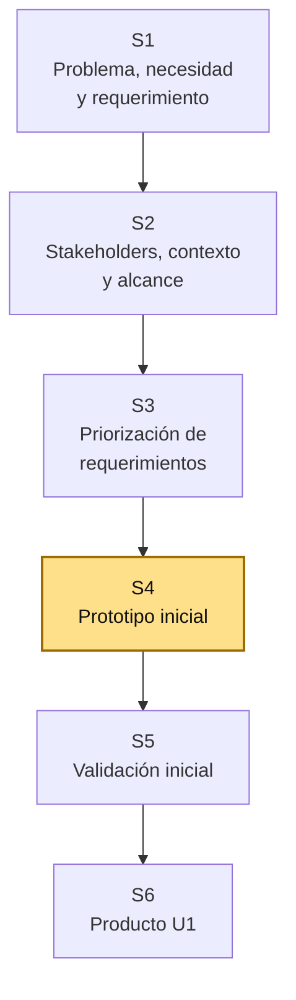
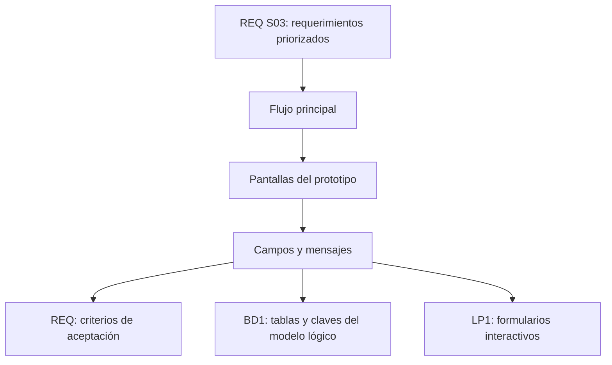
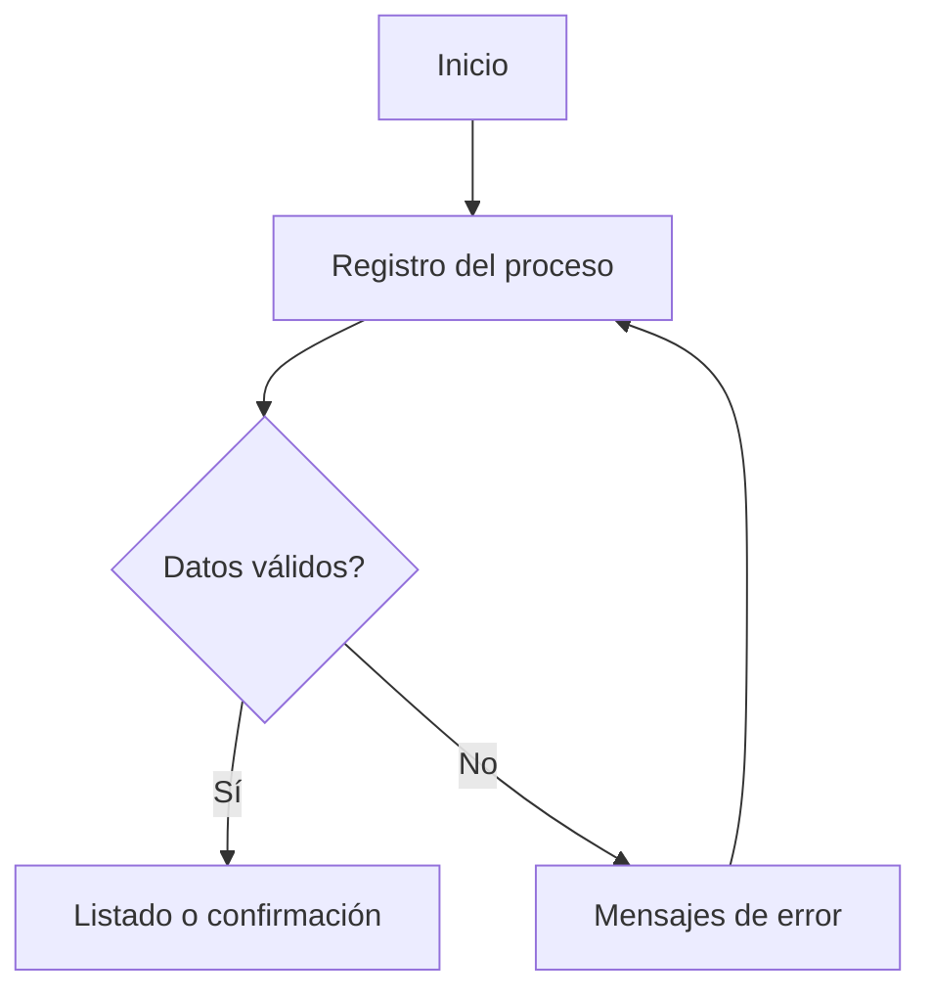

# S4 - Prototipado inicial

## 1. Introducción

Tiempo: 20 min.

### 1.1 Propósito

Construir un prototipo inicial del primer incremento funcional priorizado en S3, representando pantallas, navegación y flujo de interacción para validar tempranamente la solución con usuarios y orientar el trabajo de BD1 y LP1.

### 1.2 Resultado de aprendizaje

El estudiante diseña prototipos de baja o media fidelidad, relaciona cada pantalla con requerimientos priorizados y explica cómo el flujo propuesto será implementado progresivamente en la aplicación web.

### 1.3 Producto de sesión

Prototipo inicial de pantallas o flujo de interacción, vinculado a requerimientos priorizados, entidades del proceso principal y criterios de aceptación.

### 1.4 Motivación de la sesión

#### 1.4.1 Caso: ver antes de construir

Un requerimiento escrito puede parecer claro, pero al convertirlo en pantalla aparecen dudas: campos que faltan, pasos innecesarios, botones confusos, mensajes ausentes o datos que no estaban modelados.

Preguntas para los estudiantes:

1. ¿Qué flujo del primer incremento debe poder realizar el usuario?
2. ¿Qué pantallas necesita ese flujo?
3. ¿Qué datos aparecen en cada pantalla?
4. ¿Qué entidades y relaciones de BD1 se confirman o se cuestionan?
5. ¿Qué partes podrá implementar LP1 en la página interactiva de U1?

### 1.5 Ubicación en el curso

- Unidad: U1 - Descubrimiento, Elicitación y Análisis del Problema.
- Producto de unidad: requerimientos iniciales priorizados y prototipos validados.
- Producto del curso: Especificación de Requerimientos de Software (SRS) documentada.
- Avance del producto en esta sesión: prototipo inicial del primer incremento funcional.

Roadmap del producto de la unidad:



## 2. Explica

Tiempo: 25 min.

### 2.1 Conceptos clave

Un prototipo permite discutir la solución antes de construirla por completo. No reemplaza el requerimiento; lo vuelve visible para detectar errores de comprensión.

Conceptos de la sesión:

- Prototipo de baja fidelidad.
- Prototipo de media fidelidad.
- Flujo de usuario.
- Pantalla o vista.
- Navegación.
- Wireframe.
- Campo de entrada.
- Mensaje de error o confirmación.
- Criterio de aceptación visualizable.
- Trazabilidad requerimiento-pantalla.

Alcance metodológico de S4:

```text
En S4 se prototipa el primer incremento funcional.
No se busca diseño visual final ni implementación completa.

La validación inicial del prototipo se trabaja en S5.
La implementación web interactiva se consolida en LP1 S4.
```

### 2.2 Arquitectura de la sesión



Lectura del diagrama:

- El prototipo nace del primer incremento priorizado.
- Cada pantalla debe responder a un requerimiento.
- Cada campo debe tener sentido para BD1 y LP1.

### 2.3 Flujo de trabajo

1. Revisar requerimientos Must de S3.
2. Elegir el flujo principal del primer incremento.
3. Definir pantallas o vistas necesarias.
4. Identificar campos, acciones y mensajes.
5. Relacionar pantallas con entidades y atributos de BD1.
6. Dibujar wireframes o prototipo de baja/media fidelidad.
7. Crear mapa de navegación.
8. Elaborar matriz requerimiento-pantalla.
9. Preparar preguntas para validación en S5.

### 2.4 Errores frecuentes y diagnóstico

| Problema | Causa probable | Solución |
|---|---|---|
| El prototipo no corresponde al requerimiento Must | Se diseñó por intuición | Volver al backlog priorizado de S3 |
| Hay campos sin relación con datos | No se revisó BD1 | Relacionar cada campo con entidad o atributo |
| Se diseña una pantalla demasiado completa | Se quiere cerrar todo el sistema | Prototipar solo el primer incremento |
| No hay mensajes de error | Se piensa solo en flujo feliz | Incluir entradas inválidas y confirmaciones |
| LP1 no puede implementarlo en U1 | Prototipo demasiado complejo | Separar lo visual de lo que se implementará primero |
| No se documenta navegación | Pantallas aisladas | Dibujar flujo entre pantallas |

## 3. Aplica: actividad práctica guiada

Tiempo: 2h.

### 3.1 Seleccionar el flujo del primer incremento

**Producto del paso:** flujo principal seleccionado.

| Elemento | Respuesta |
|---|---|
| Requerimiento Must | |
| Actor principal | |
| Objetivo del flujo | |
| Entidades involucradas | |

### 3.2 Definir pantallas necesarias

**Producto del paso:** lista de pantallas o vistas.

| Pantalla | Propósito | Requerimiento asociado |
|---|---|---|
| Inicio o dashboard | Orientar al usuario | |
| Registro de transacción | Capturar datos del proceso | |
| Consulta o listado | Ver resultado del registro | |

### 3.3 Identificar campos y acciones

**Producto del paso:** campos vinculados a datos.

| Pantalla | Campo o acción | Entidad/atributo BD1 | Validación inicial |
|---|---|---|---|
| Registro | Cliente | Cliente.idCliente o nombre | Obligatorio |
| Registro | Cantidad | Detalle.cantidad | Mayor que cero |
| Registro | Guardar | Transacción | Debe existir al menos un detalle |

### 3.4 Dibujar prototipo inicial

**Producto del paso:** wireframe o prototipo de baja/media fidelidad.

Puede usarse papel, draw.io, Figma, Excalidraw, PowerPoint, Canva o una maqueta HTML simple.

Checklist del prototipo:

- Título de la pantalla.
- Menú o navegación mínima.
- Campos principales.
- Botones de acción.
- Mensajes de error o confirmación.
- Lista o tabla de resultado.

### 3.5 Construir mapa de navegación

**Producto del paso:** flujo de pantallas.



### 3.6 Elaborar trazabilidad requerimiento-pantalla

**Producto del paso:** matriz de trazabilidad inicial.

| Requerimiento | Pantalla | Campo o acción | Criterio de aceptación |
|---|---|---|---|
| RF-01 | Registro | Guardar | El registro aparece en el listado |
| RF-02 | Consulta | Buscar/Listar | El usuario visualiza resultados |

### 3.7 Preparar validación de S5

**Producto del paso:** guía de revisión.

| Pregunta de validación | A quién se consultará | Evidencia esperada |
|---|---|---|
| ¿El flujo representa el proceso real? | Usuario o equipo | Observación registrada |
| ¿Falta algún campo importante? | BD1/usuario | Ajuste al modelo o prototipo |
| ¿La pantalla es comprensible? | Usuario | Comentario o aprobación |

## 4. Crea: actividad autónoma

Tiempo: 2h fuera del aula.

Cada estudiante consolida el prototipo inicial del proyecto y prepara evidencia individual.

### 4.1 Plantilla de evidencia individual

Entrega un PDF con el siguiente nombre:

```text
S04_REQ_Equipo##_ApellidoNombre.pdf
```

#### 4.1.1 Datos del estudiante

- Nombre:
- Equipo:
- Sesión: S04 - Prototipado inicial
- Rol o aporte realizado:
- Link de GitHub:

#### 4.1.2 Trabajo autónomo realizado

Completa y evidencia estas tareas:

1. Seleccionar el flujo principal del primer incremento.
2. Definir pantallas necesarias.
3. Identificar campos, acciones y mensajes.
4. Dibujar el prototipo inicial.
5. Relacionar campos con entidades o atributos de BD1.
6. Crear mapa de navegación.
7. Elaborar matriz requerimiento-pantalla.
8. Preparar preguntas para validación en S5.

#### 4.1.3 Evidencia técnica

Incluye:

- Flujo principal seleccionado.
- Capturas o imágenes del prototipo.
- Tabla de campos y acciones.
- Mapa de navegación.
- Matriz requerimiento-pantalla.
- Preguntas de validación.

#### 4.1.4 Error o hallazgo

Describe una decisión cambiada por el prototipo: pantalla eliminada, campo agregado, flujo simplificado o requisito aclarado.

#### 4.1.5 Reflexión técnica breve

Responde en 5 a 8 líneas:

```text
¿Por qué un prototipo ayuda a detectar errores antes de programar o crear tablas definitivas?
```

### 4.2 Criterios mínimos de aceptación

La evidencia individual se considera completa si:

- El archivo respeta el nombre solicitado.
- El prototipo corresponde al primer incremento funcional.
- Cada pantalla tiene propósito.
- Los campos se relacionan con datos de BD1.
- Incluye mapa de navegación.
- Incluye trazabilidad requerimiento-pantalla.
- Incluye preguntas para validar en S5.
- Cada evidencia tiene una descripción breve.

## 5. Cierre evaluativo

Tiempo: 20 min.

### 5.1 Resultados esperados

Al finalizar la sesión, el estudiante debe demostrar que:

- Diseña prototipos iniciales alineados a requerimientos priorizados.
- Define pantallas, campos, acciones y mensajes.
- Relaciona prototipo con datos del modelo lógico.
- Propone un flujo navegable.
- Prepara validación temprana del prototipo.

### 5.2 Evidencia del producto de sesión

Cada estudiante entrega un PDF individual siguiendo la plantilla de la sección 4.1.

Nombre del archivo:

```text
S04_REQ_Equipo##_ApellidoNombre.pdf
```

### 5.3 Preguntas de defensa y reflexión

1. ¿Qué requerimiento priorizado representa tu prototipo?
2. ¿Qué pantalla inicia el flujo y por qué?
3. ¿Qué campos provienen del modelo de BD1?
4. ¿Qué mensaje de error o confirmación incluiste?
5. ¿Qué implementará LP1 primero de este prototipo?
6. ¿Qué pregunta llevarás a validación en S5?

### 5.4 Rúbrica de evaluación

| Dimensión | Peso | 3 - Logro destacado | 2 - Logro | 1 - Proceso | 0 - Inicio | Puntuación obtenida |
|---|---:|---|---|---|---|---:|
| 1. Alineación con requerimientos | 2 | Prototipo responde claramente al primer incremento priorizado. | Prototipo relacionado con requerimientos. | Relación parcial o débil. | No se relaciona con requerimientos. | |
| 2. Flujo y navegación | 2 | Pantallas y navegación claras, completas y coherentes. | Flujo comprensible. | Flujo incompleto o confuso. | No presenta flujo. | |
| 3. Campos y datos | 2 | Campos vinculados a entidades, atributos y validaciones de BD1. | Campos principales relacionados. | Campos incompletos o poco justificados. | No vincula campos con datos. | |
| 4. Trazabilidad | 2 | Matriz requerimiento-pantalla-criterio clara y verificable. | Presenta trazabilidad básica. | Trazabilidad incompleta. | No presenta trazabilidad. | |
| 5. Preparación de validación | 1 | Preguntas y criterios de validación bien orientados. | Incluye preguntas básicas. | Preguntas poco útiles. | No prepara validación. | |
| 6. Orden y reflexión | 1 | Evidencia ordenada, legible y reflexión técnica clara. | Evidencia suficiente y reflexión comprensible. | Evidencia incompleta o reflexión superficial. | Evidencia desordenada o sin reflexión. | |

Puntuación acumulada = suma de (`Peso` * `Puntuación obtenida`) = ____.

Nota final = (`Puntuación acumulada` / 30) * 20 = ____.