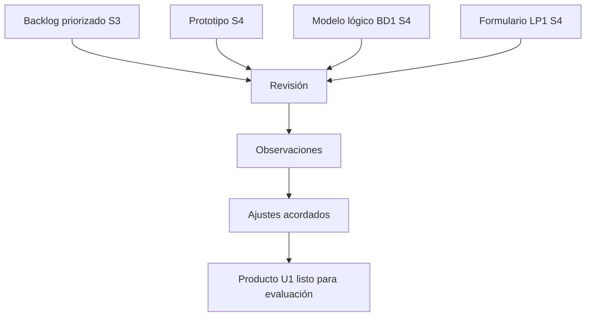

# S5 - Validación inicial de requerimientos

## 1. Introducción

Tiempo: 20 min.

### 1.1 Propósito

Validar los requerimientos, prototipos y criterios de aceptación del primer incremento funcional para detectar ambigüedades, omisiones, conflictos y ajustes necesarios antes de la evaluación de Unidad 1.

### 1.2 Resultado de aprendizaje

El estudiante aplica revisión y validación inicial de requerimientos, registra observaciones, levanta acuerdos y actualiza el backlog y prototipo para que BD1 y LP1 trabajen sobre un primer corte estable.

### 1.3 Producto de sesión

Requerimientos iniciales validados con observaciones, acuerdos, ajustes al prototipo y matriz de cambios.

### 1.4 Motivación de la sesión

Antes de evaluar U1, el equipo debe comprobar si lo definido realmente se entiende y si puede convertirse en modelo de datos e interfaz. Validar temprano evita que BD1 normalice datos equivocados o que LP1 construya formularios que no responden al proceso real.

Preguntas para los estudiantes:

1. ¿El usuario entiende el flujo del prototipo?
2. ¿Los requerimientos Must son claros y verificables?
3. ¿Los campos del prototipo coinciden con el modelo lógico?
4. ¿Qué observación obliga a cambiar requerimiento, dato o pantalla?
5. ¿Qué queda listo para sustentar en S6?

### 1.5 Ubicación en el curso

- Unidad: U1 - Descubrimiento, Elicitación y Análisis del Problema.
- Producto de unidad: requerimientos iniciales priorizados y prototipos validados.
- Avance de sesión: validación previa a evaluación U1.

## 2. Explica

Tiempo: 25 min.

### 2.1 Conceptos clave

Validar requerimientos significa confirmar si son correctos para el usuario y útiles para construir el sistema. No basta que estén escritos; deben ser claros, consistentes, completos para el incremento y verificables.

Conceptos de la sesión:

- Validación de requerimientos.
- Ambigüedad.
- Completitud.
- Consistencia.
- Verificabilidad.
- Criterio de aceptación.
- Observación.
- Acuerdo.
- Control de cambios.
- Evidencia de validación.

### 2.2 Arquitectura de la sesión



### 2.3 Flujo de trabajo

1. Revisar problema, alcance y stakeholders.
2. Revisar requerimientos Must y criterios de aceptación.
3. Revisar prototipo y navegación.
4. Comparar campos con modelo lógico de BD1.
5. Comparar flujo con formulario interactivo de LP1.
6. Registrar observaciones.
7. Clasificar observaciones: requerimiento, dato, pantalla o validación.
8. Levantar acuerdos.
9. Preparar evidencias para S6.

### 2.4 Errores frecuentes y diagnóstico

| Problema | Causa probable | Solución |
|---|---|---|
| Se valida solo entre integrantes | Falta mirada de usuario o contexto | Usar entrevista breve, revisión guiada o checklist externo |
| Observaciones sin responsable | No hay control de cambios | Registrar acuerdo, responsable y estado |
| Se cambia el prototipo sin actualizar requerimientos | Falta trazabilidad | Ajustar requerimiento, criterio y pantalla juntos |
| BD1 y LP1 usan nombres distintos | No se integraron artefactos | Homologar entidad, tabla, campo y etiqueta visual |
| Los criterios siguen vagos | No se prueban con casos | Redactar condición, acción y resultado esperado |

## 3. Aplica: actividad práctica guiada

Tiempo: 2h.

### 3.1 Preparar material de validación

**Producto del paso:** paquete de revisión U1.

| Artefacto | Estado | Observación |
|---|---|---|
| Problema y alcance | Listo / Por ajustar | |
| Backlog priorizado | Listo / Por ajustar | |
| Criterios de aceptación | Listo / Por ajustar | |
| Prototipo inicial | Listo / Por ajustar | |
| Relación con BD1 y LP1 | Listo / Por ajustar | |

### 3.2 Aplicar checklist de validación

**Producto del paso:** revisión guiada.

| Pregunta | Sí/No | Evidencia u observación |
|---|---|---|
| ¿El requerimiento responde al problema? | | |
| ¿El actor está identificado? | | |
| ¿El criterio de aceptación es verificable? | | |
| ¿La pantalla representa el flujo? | | |
| ¿Los campos existen en el modelo lógico? | | |
| ¿LP1 puede implementar el flujo inicial? | | |

### 3.3 Registrar observaciones y acuerdos

**Producto del paso:** matriz de cambios.

| Observación | Tipo | Acuerdo | Responsable | Estado |
|---|---|---|---|---|
| | Requerimiento / Dato / Pantalla / Validación | | | Pendiente / Cerrado |

### 3.4 Actualizar artefactos mínimos

**Producto del paso:** versión corregida para evaluación.

Actualizar:

- Backlog priorizado.
- Criterios de aceptación.
- Prototipo inicial.
- Trazabilidad requerimiento-pantalla-dato.
- Evidencias de validación.

### 3.5 Preparar defensa U1

**Producto del paso:** guion breve para S6.

| Bloque | Qué se mostrará | Evidencia |
|---|---|---|
| Problema y alcance | Necesidad y límites | Brief S2 |
| Priorización | Must/Should/Could | Backlog S3 |
| Prototipo | Flujo principal | Wireframes S4 |
| Validación | Observaciones y acuerdos | Matriz S5 |

## 4. Crea: actividad autónoma

Tiempo: 2h fuera del aula.

### 4.1 Plantilla de evidencia individual

Entrega un PDF con el siguiente nombre:

```text
S05_REQ_Equipo##_ApellidoNombre.pdf
```

#### 4.1.1 Datos del estudiante

- Nombre:
- Equipo:
- Sesión: S05 - Validación inicial de requerimientos
- Rol o aporte realizado:
- Link de GitHub:

#### 4.1.2 Trabajo autónomo realizado

1. Revisar y corregir al menos un requerimiento.
2. Revisar un criterio de aceptación.
3. Comparar un campo del prototipo con BD1.
4. Comparar una interacción con LP1.
5. Registrar una observación y su acuerdo.
6. Preparar evidencia para evaluación S6.

#### 4.1.3 Evidencia técnica

- Checklist de validación.
- Matriz de observaciones.
- Requerimiento o criterio ajustado.
- Prototipo o pantalla ajustada.
- Evidencia de relación con BD1 y LP1.

#### 4.1.4 Error o hallazgo

Describe un hallazgo detectado durante la validación y cómo se corrigió.

#### 4.1.5 Reflexión técnica breve

```text
¿Por qué validar requerimientos antes de evaluar U1 reduce errores en la base de datos y la interfaz?
```

### 4.2 Criterios mínimos de aceptación

- PDF con nombre correcto.
- Checklist completado.
- Observaciones registradas.
- Al menos un ajuste evidenciado.
- Relación REQ-BD1-LP1 demostrada.
- Preparación para evaluación S6.

## 5. Cierre evaluativo

Tiempo: 20 min.

### 5.1 Resultados esperados

- Requerimientos iniciales revisados.
- Prototipo ajustado.
- Observaciones y acuerdos registrados.
- Evidencias preparadas para evaluación U1.

### 5.2 Evidencia del producto de sesión

```text
S05_REQ_Equipo##_ApellidoNombre.pdf
```

### 5.3 Preguntas de defensa y reflexión

1. ¿Qué requerimiento cambió luego de validar?
2. ¿Qué observación afectó a BD1?
3. ¿Qué observación afectó a LP1?
4. ¿Qué criterio de aceptación quedó más verificable?
5. ¿Qué evidencia llevarás a S6?

### 5.4 Rúbrica de evaluación

| Dimensión | Peso | 3 - Logro destacado | 2 - Logro | 1 - Proceso | 0 - Inicio | Puntuación obtenida |
|---|---:|---|---|---|---|---:|
| 1. Validación | 2 | Aplica revisión completa y detecta ajustes relevantes. | Valida artefactos principales. | Validación parcial. | No valida. | |
| 2. Observaciones y acuerdos | 2 | Registra observaciones claras, responsables y estados. | Registra observaciones básicas. | Observaciones incompletas. | No registra observaciones. | |
| 3. Ajustes | 2 | Corrige requerimientos, criterios o prototipo con trazabilidad. | Realiza ajustes comprensibles. | Ajustes superficiales. | No ajusta. | |
| 4. Integración | 2 | Evidencia impacto claro en BD1 y LP1. | Relaciona con otros cursos. | Relación débil. | No integra. | |
| 5. Evidencia | 1 | Evidencia ordenada y verificable. | Evidencia suficiente. | Evidencia incompleta. | No evidencia. | |
| 6. Reflexión | 1 | Reflexión técnica clara y crítica. | Reflexión comprensible. | Reflexión superficial. | Sin reflexión. | |

Puntuación acumulada = suma de (`Peso` * `Puntuación obtenida`) = ____.

Nota final = (`Puntuación acumulada` / 30) * 20 = ____.