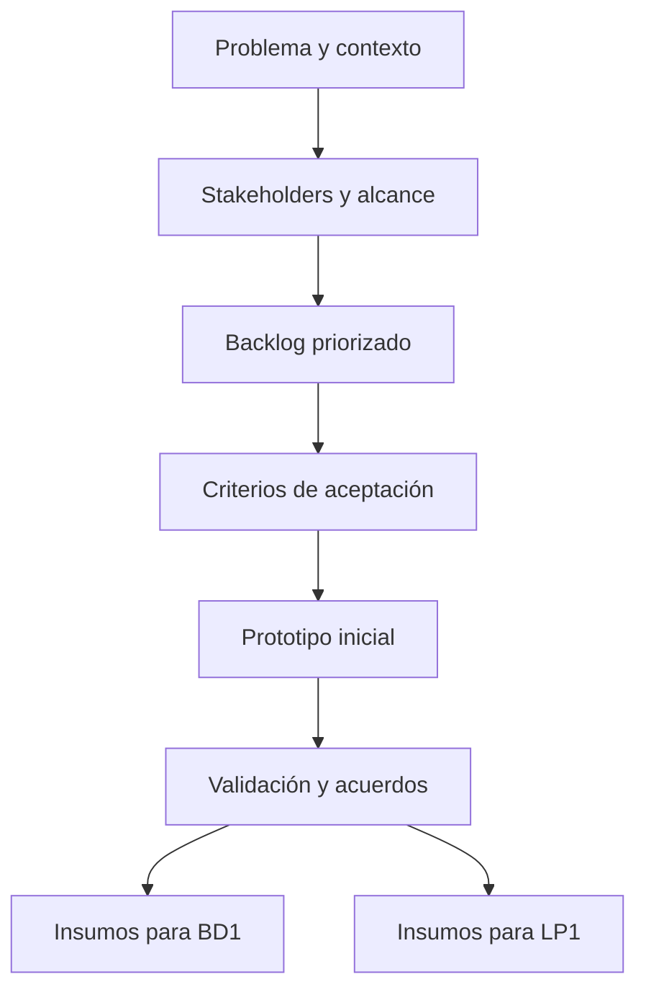

# S6 - Evaluación Unidad 1: requerimientos iniciales y prototipo validado

## 1. Introducción

Tiempo: 20 min.

### 1.1 Propósito

Evaluar el producto de la Unidad 1: problema, stakeholders, contexto, alcance, requerimientos priorizados, prototipo inicial, criterios de aceptación y evidencias de validación, articulados con BD1 y LP1.

### 1.2 Resultado de aprendizaje

El estudiante demuestra que puede analizar una necesidad de negocio, delimitar una solución viable, priorizar requerimientos y defender un prototipo inicial validado para orientar el modelo de datos y la interfaz web.

### 1.3 Producto de sesión

Producto U1 integrado: requerimientos iniciales priorizados y prototipos validados, con evidencias de trazabilidad hacia BD1 y LP1.

### 1.4 Motivación de la sesión

La evaluación no revisa documentos sueltos. Revisa si el equipo puede explicar cómo una necesidad se convirtió en alcance, requerimientos priorizados, prototipo y acuerdos de validación.

Preguntas para los estudiantes:

1. ¿Qué problema se resolverá y para quién?
2. ¿Qué requerimientos se implementarán primero?
3. ¿Qué prototipo evidencia el flujo principal?
4. ¿Qué cambió luego de validar?
5. ¿Cómo se conecta esto con BD1 y LP1?

### 1.5 Ubicación en el curso

- Unidad: U1 - Descubrimiento, Elicitación y Análisis del Problema.
- Producto de unidad: requerimientos iniciales priorizados y prototipos validados.
- Avance de sesión: evaluación integradora antes de análisis funcional U2.

## 2. Explica

Tiempo: 15 min.

### 2.1 Conceptos clave

- Integración: problema, alcance, requerimientos, prototipo y validación funcionan como un solo avance.
- Evidencia individual: cada integrante demuestra aporte verificable.
- Trazabilidad inicial: requerimiento, pantalla, dato y validación se relacionan.
- Defensa técnica: explicación clara de decisiones y cambios.

### 2.2 Arquitectura del producto U1



### 2.3 Criterios mínimos de revisión

- Problema y alcance claros.
- Stakeholders identificados.
- Requerimientos codificados y priorizados.
- Criterios de aceptación verificables.
- Prototipo inicial navegable o comprensible.
- Validación inicial con observaciones y acuerdos.
- Relación con entidades/modelo de BD1.
- Relación con formularios/interfaz de LP1.
- Evidencia individual.

## 3. Aplica: evaluación práctica

Tiempo: 3h.

### 3.1 Preparar demostración

Orden recomendado:

1. Presentar problema, contexto y alcance.
2. Presentar stakeholders.
3. Mostrar backlog priorizado.
4. Mostrar criterios de aceptación.
5. Mostrar prototipo inicial.
6. Mostrar observaciones de validación.
7. Explicar impacto en BD1 y LP1.
8. Defender aporte individual.

### 3.2 Ejecutar revisión base

El estudiante demuestra:

1. Un requerimiento Must y su justificación.
2. Un criterio de aceptación verificable.
3. Una pantalla del prototipo asociada al requerimiento.
4. Un dato o entidad que BD1 debe modelar.
5. Un formulario o interacción que LP1 debe implementar.
6. Una observación levantada en validación.

### 3.3 Demostración individual

Cada integrante debe poder responder:

- Qué artefacto elaboró o corrigió.
- Qué decisión defendió.
- Qué observación registró.
- Cómo su aporte ayuda al proyecto integrador.

## 4. Crea: evidencia individual

Tiempo: 4h fuera del aula.

### 4.1 Plantilla de evidencia individual

Entrega un PDF con el siguiente nombre:

```text
S06_REQ_Equipo##_ApellidoNombre.pdf
```

#### 4.1.1 Datos del estudiante

- Nombre:
- Equipo:
- Sesión: S06 - Evaluación Unidad 1
- Rol o aporte realizado:
- Link de GitHub:

#### 4.1.2 Trabajo autónomo realizado

1. Ordenar evidencias de S1-S5.
2. Corregir observaciones finales.
3. Preparar defensa individual.
4. Documentar aporte personal.
5. Registrar capturas, tablas o enlaces usados en la sustentación.

#### 4.1.3 Evidencia técnica

- Problema y alcance.
- Stakeholders.
- Backlog priorizado.
- Criterios de aceptación.
- Prototipo.
- Validación y acuerdos.
- Relación con BD1 y LP1.
- Aporte individual.

#### 4.1.4 Error o hallazgo

Describe un problema encontrado en U1 y cómo se corrigió.

#### 4.1.5 Reflexión técnica breve

Explica cómo los requerimientos iniciales orientan la base de datos y la aplicación web.

### 4.2 Criterios mínimos de aceptación

- PDF con nombre correcto.
- Evidencia del producto U1.
- Evidencia de validación.
- Evidencia de integración con BD1 y LP1.
- Evidencia de aporte individual.
- Defensa técnica preparada.

## 5. Cierre evaluativo

Tiempo: 20 min.

### 5.1 Resultados esperados

- Producto U1 sustentado.
- Requerimientos iniciales priorizados.
- Prototipo validado.
- Observaciones documentadas.
- Base lista para historias, casos de uso y RNF en U2.

### 5.2 Evidencia del producto de sesión

```text
S06_REQ_Equipo##_ApellidoNombre.pdf
```

### 5.3 Preguntas de defensa y reflexión

1. ¿Cuál es el problema principal?
2. ¿Qué requerimiento Must sostiene el primer incremento?
3. ¿Cómo se valida ese requerimiento?
4. ¿Qué entidad o tabla necesita BD1?
5. ¿Qué pantalla o formulario necesita LP1?
6. ¿Qué cambió después de validar?

### 5.4 Rúbrica de evaluación

| Dimensión | Peso | 3 - Logro destacado | 2 - Logro | 1 - Proceso | 0 - Inicio | Puntuación obtenida |
|---|---:|---|---|---|---|---:|
| 1. Problema y alcance | 2 | Claro, viable y contextualizado. | Comprensible y delimitado. | Parcial o ambiguo. | No definido. | |
| 2. Requerimientos priorizados | 2 | Backlog claro, justificado y verificable. | Backlog funcional. | Backlog incompleto. | No presenta backlog. | |
| 3. Prototipo y criterios | 2 | Prototipo alineado a criterios de aceptación. | Prototipo comprensible. | Prototipo parcial. | No presenta prototipo. | |
| 4. Validación e integración | 2 | Evidencia validación y relación clara con BD1/LP1. | Relación general demostrada. | Integración débil. | No integra. | |
| 5. Evidencia individual | 1 | Evidencia clara, ordenada y verificable. | Evidencia suficiente. | Evidencia incompleta. | No entrega evidencia. | |
| 6. Defensa técnica | 1 | Responde con precisión y criterio. | Responde adecuadamente. | Responde parcialmente. | No sustenta. | |

Puntuación acumulada = suma de (`Peso` * `Puntuación obtenida`) = ____.

Nota final = (`Puntuación acumulada` / 30) * 20 = ____.